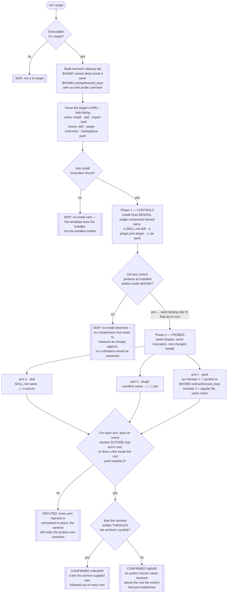

# Playbook — Agent extension installer path containment ("SkillSlip")

> **Template:** [`templates/ai/coding-agent/agent-extension-install-path-containment.sh`](../../templates/ai/coding-agent/agent-extension-install-path-containment.sh)
> **Fixture:** [`tests/fixtures/agent-extension-install-containment/`](../../tests/fixtures/agent-extension-install-containment/) · **Proof:** [`tests/prove-agent-extension-install-containment.sh`](../../tests/prove-agent-extension-install-containment.sh)
> **Class:** path traversal / symlink escape at install time · **Target kind:** `cli` · **Oracle:** `property` (post-condition against a root the target itself established) · **CWE:** CWE-22, CWE-23, CWE-59, CWE-829

---

## 1. Use case

Installing an agent extension is the most casual privileged act in the whole ecosystem. A skill is a directory someone put in a gist. A plugin is a line in a marketplace file. A pack is a tarball. People add them the way they add a browser bookmark — and the installer, in the second between "add" and "installed", takes a **name the extension's author chose** and turns it into a **path on your disk**:

```
dest = path.join(skills_root, manifest.name)
```

`join` is not a containment check. It is string concatenation with a separator, and it does exactly what it is told:

| What the author writes in the metadata | Where `join` puts it |
|---|---|
| `my-helper` | `<root>/my-helper` — the intended case |
| `../../.canary` | two directories **above** the root |
| `/etc/whatever` | the root is discarded entirely — `join` honours an absolute component |
| a `.tar` member named `keys` that is a **symlink**, followed by a member named `keys` | the link is laid down, then the next member is written **through** it, anywhere the process can write |

The last row is the sharp one. Archive member names are attacker-authored too, so the same missing check opens a second time one layer down, and this time it yields a *write primitive*: a symlink to `~/.ssh/authorized_keys`, `~/.bashrc`, or the agent's own config, written through during extraction. The normative requirement is a single line the installer skipped — **re-resolve the destination and require it to still be inside the root, refusing the entry when it is not.**

This is a shipping-agent-declined-to-fix class, not a theoretical one, and it is the classic "Zip Slip" and symlink-extraction family reappearing at a new, softer entry point: a place where users paste a URL and press enter.

### Why the artifact tells you nothing

The traversal happens **in the installer, at install time**. What it leaves behind is an ordinary-looking file at an ordinary-looking path — the very absence of a trace is the point. Read the installed skill afterwards and it is well-formed. Read the source extension and its manifest is valid JSON with a `name` field. The vulnerability lives in the *seam* between the two, and only in the second it takes to cross it.

---

## 2. Testing flow

Three arms, one nonce each, every one of them measured against a root **the target drew itself** — because "the file is not under `~/.claude/skills`" proves nothing about a tool that keeps its skills somewhere else, and "a file appeared outside a directory I guessed" is how a containment check invents findings.



Four parts of that shape carry the honesty of the check:

**The control draws the boundary, not the template.** Each arm installs a benign, ordinarily-named twin of itself first. Wherever *that* lands is the root the escape arm is judged against. The template never asserts where a tool "should" keep extensions, so it works against a tool it has never seen and cannot manufacture a finding out of an unfamiliar layout.

**No control means no verdict.** A tool with no install verb, or one whose installer this template cannot invoke, gets `skipped` with the exact missing precondition — never `refuted`. An arm whose control installed nothing is not tested, and an untested arm contributes nothing to the refutation.

**Traversal, not absolute paths.** The names are `../../` and `../../../` relative to whatever root the tool chose, because an absolute name is the case a tool may reasonably special-case on sight while still joining a relative one. Confirming on the weaker input makes the finding stronger.

**A preserved link counts, even unused.** A symlink sitting inside the extension root pointing outside it is reported as an escape whether or not anything was written through it yet — it is a write primitive already on disk. The confirmation grades itself: `critical` when the write-through to the sentinel is witnessed, `high` when only the name escaped.

### Safety

Every byte is written inside a `mktemp -d` lab removed on exit, with `$HOME` redirected into it — nested several levels down so the deepest traversal any arm can express still lands *inside* the lab. The `.ssh/authorized_keys` named throughout is a file the probe creates and seeds with an inert comment; no real key material is read, written, or reachable by any path the probe can construct. The extensions are benign: their entire content is a random nonce, and nothing they carry is ever executed.

---

## 3. Market & competitors

| Tool / project | Tests this class? | Behavioural (run-and-observe)? | What it actually does |
|---|---|---|---|
| **cxg** (this template) | **Yes** | **Yes** | Runs the agent's own install verb against three name-only-hostile extensions in a throwaway `$HOME` and reports whether the bytes left the root the tool itself established — CONFIRMED / REFUTED / SKIP, with the escaped path that proves it. |
| **Agent-skill / MCP scanners (incl. our own [`agent-skill-hidden-instruction-trust`](../../templates/ai/coding-agent/agent-skill-hidden-instruction-trust.py))** | No | Partly | Analyse the *content* of an installed or fetched skill — hidden instructions, poisoned descriptions. They read the artifact; the traversal is in the installer that placed it. |
| **Zip-slip / archive linters (Semgrep rules, `tarsafe`, CodeQL queries)** | The pattern, in source | No | Flag `extractall()` or an unchecked `path.join` **in code you have**. Useless against a shipped binary, and silent on a hand-rolled extractor that looks different from the rule. |
| **SCA / dependency scanners (Snyk, Dependabot, npm audit)** | No | No | Reason about published package versions and CVE feeds. A skill directory from a gist is not in any dependency graph, and the installer's own containment logic is not a version number. |
| **Secret scanners (gitleaks, trufflehog)** | No | No | Look for credentials in files. A manifest whose `name` is `../../../.ssh` contains no secret and is perfectly valid JSON. |
| **Endpoint / EDR file-integrity monitoring** | Detects the symptom, sometimes | Post-hoc | May notice `~/.ssh/authorized_keys` changing *on a real machine, after the fact*. That is incident response, not a pre-deployment property you can assert about a tool. |
| **Vendor patches (per-CVE)** | Per product | N/A | Each installer is fixed after its own disclosure. A fix in one agent says nothing about the next extension manager you install, and there is no re-runnable cross-tool check. |

The gap this fills: everyone in that table either **reads the artifact** — which is well-formed by construction — or **greps source you may not have**. Nobody runs the installer and proves the write left the sandbox.

---

## 4. Why behavioral wins here

A static rule can only answer a question about the **extension**. The vulnerability is a property of the **installer**.

Hand a scanner a plugin manifest whose `name` is `../../../.ssh` and, remarkably, it may well flag it — that string is suspicious on its face. But that is the easy half, and it is the half that does not matter, because a scanner that flags hostile names tells you a *specific extension* is hostile and says nothing about whether your tool would have been fooled by it. Run the same scanner over the ten extensions your team actually installed last month, all with perfectly ordinary names, and it reports nothing at all — while the installer that would have honoured `../../../.ssh` sits there, unexamined, waiting for the eleventh.

The question worth answering is inverted: **not "is this extension hostile?" but "is this installer containable?"** — and that question is unanswerable from any artifact. It is a property of a code path in a shipped binary, exercised for a few milliseconds, leaving behind a file that looks exactly like a correct install. Even reading the installer's source, where you have it, gets you a plausible answer rather than a fact: a `normpath` two lines above a `join` looks like a check and does not resolve symlinks; a `startswith` on an unresolved path passes for containment until a link is in the middle of it. The only thing that settles it is a path on disk, after the installer has run.

So the oracle here is a physical post-condition, and the root it is measured against comes from the target, not from the template. Install a benign twin; note where it lands; install its evil-named sibling; ask the filesystem where *that* went. The finding is grounded in an effect no correct installer can produce — a nonce above its own root, a sentinel file rewritten through a link the archive supplied — not in a pattern that must anticipate the attacker's encoding, their separator, or which of three source shapes they chose.

And the refutation is worth as much as the confirmation, because only this shape can produce it. When containment is present, the template prints something no signature scanner can assert: *this tool installed three benign extensions, and then held all three traversals — the skill name normalised in place, the plugin name refused, the archive's link neither followed nor preserved.* That is a positive security property of a product, established by observation, re-runnable on the next release. A static scanner cannot reach that statement; it never ran the product.

**One line:** the hostile name and the harmless one are the same three bytes of JSON — only the installer's behaviour separates them, so only behaviour can be the evidence.
