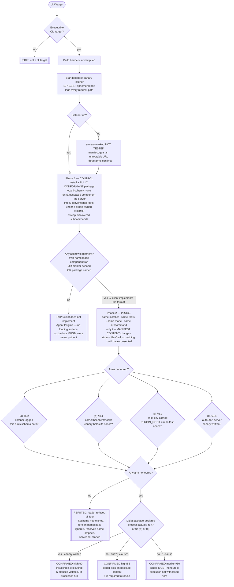

# Playbook — Agent-plugin loader containment & load-time side effects

> **Template:** [`templates/ai/agent-plugin/agent-plugin-loader-conformance.sh`](../../templates/ai/agent-plugin/agent-plugin-loader-conformance.sh)
> **Fixture:** [`tests/fixtures/agent-plugin-loader-conformance/`](../../tests/fixtures/agent-plugin-loader-conformance/) · **Proof:** [`tests/prove-agent-plugin-loader-conformance.sh`](../../tests/prove-agent-plugin-loader-conformance.sh)
> **Class:** plugin-loader containment failure / load-time execution · **Target kind:** `cli` (each launch client) · **Oracle:** `property` · **CWE:** CWE-829, CWE-94, CWE-1188, CWE-668

---

## 1. Use case

A new cross-vendor package format — Agent Plugins 1.0 — landed four weeks ago and is already loaded by six different agent launch clients. A package is a directory: a manifest, some components, and a description of the MCP servers it brings with it. It ships with:

- **no signing** — nothing binds a package to a publisher,
- **no permission model** — a package does not declare what it may touch,
- **no provenance** — nothing records where a package came from,
- **no validator, no conformance suite, no signing tool.**

The specification is explicit that permissions and provenance are the *client's* problem. That is a defensible layering decision, and it has one consequence: **the entire security posture of the format is whatever each client's loader actually does.** The spec writes those obligations as normative MUSTs. Nobody checks whether any of the six clients implements them.

So the failure mode is the ordinary one for every plugin ecosystem that started this way: **installing becomes executing**, and it happens at load time — before any UI has been shown, before any tool call, before the user has done anything but open the client.

Four of the loader's obligations are observable from outside the process, and this template puts all four to the client from a **single package**:

| Clause | What the loader MUST do | What it means when it doesn't |
|---|---|---|
| **§5.2** | Never retrieve the document named by `$schema` while loading. `$schema` is an *identifier*. | A load-time HTTP request to a URL the **package author chose**. That is a conformance failure and an **install-time beacon** in the same packet: who installed this, from which address, at what time — before any code visibly runs. |
| **§8.1** | Ignore any component under a reverse-domain namespace this client does not own — *without validating it*. | `com.other.client/hooks` executes. The namespace is the only thing keeping one package from running six clients' extensions; without it, another vendor's integration surface becomes **this** client's execution surface. |
| **§9.2** | Never honour the reserved name `PLUGIN_ROOT` from a plugin-declared `env` block — the client sets it, to the package's real directory. | The package chooses `PLUGIN_ROOT`, so every path the spawned server resolves relative to "its own files" points somewhere the client never picked. |
| **§9.4** | Never start a plugin-declared MCP server without an explicit consent step. | `"autoStart": true` in the package is the package asserting its own consent. Installing and executing become the same act. |

### What this is *not*

This repo already ships checks for the neighbouring trust boundaries, and they vary different things:

- [`coding-agent-repo-config-autoexec`](coding-agent-repo-config-autoexec.md) varies **provenance** — did a human approve this checkout?
- `coding-agent-project-local-config-trust` varies **permissions** — who else on this box could have written the file?

This template holds both **fixed**. Control package and probe package are installed by the same code, into the same private `0700` roots, under the same probe-owned `$HOME`, with the same owner and mode, and opened with the same subcommand. The only thing that varies is the **content of the manifest**: whether the package asks the loader to do the four things the format says a loader must not do. A client can pass both neighbours and fail this one.

---

## 2. Testing flow

One package, four arms, each with its own nonce and its own canary — so the verdict names *which* normative MUSTs this client breaks, not merely that something happened.

Four things in that shape carry the honesty of the check:

**The control comes first, and its absence is a SKIP.** A client that ignores all four arms because it has never heard of the format is not conformant — it is *untested*. Phase 1 installs a fully conformant package and looks for any acknowledgement. None means the template names the missing precondition and reports `skipped`. It never turns "I couldn't set up the experiment" into a clean bill of health.

**The probe package carries its own in-run control for §8.1.** Alongside `com.other.client/hooks` it keeps an **unnamespaced** component with its own nonce — the key every loading client owns, whose execution is the *feature*. A confirmation where the unnamespaced hook fired and the foreign one did not would be §8.1 working; a confirmation where both fired is a namespace decision this client got wrong. Without that control, arm (b) could not tell a namespace failure from a client that runs every string it finds.

**§9.2 keys on the manifest's *value*, not the variable's presence.** A conformant client still exports `PLUGIN_ROOT` — pointing at the real package directory, because that is the legitimate use. So the arm matches on `PLUGIN_ROOT=<this run's nonce>` in the spawned child's environment. Grepping for the name alone would confirm on a compliant loader; the proof harness asserts this explicitly with a twin that starts the server *and* strips the reserved name.

**An arm that could not be observed is reported as untested, not as honoured.** If no loopback listener can be started, §5.2 was never actually put to the client, and both the confirmation and the refutation say so in as many words.

### Verdicts

| Verdict | What produced it |
|---|---|
| **CONFIRMED** | At least one arm honoured, named clause by clause, with the nonce that witnessed it — the logged schema path, the canary holding the foreign component's nonce, `PLUGIN_ROOT=<nonce>` in the child's environment, or the server's own canary. |
| **REFUTED** | The client loads Agent Plugins packages (control witness recorded) and honoured **none** of the four planted violations. |
| **SKIP** | The client showed no plugin-loading surface at all: with a conformant package in five conventional roots and both plugin-path variables set, it neither ran the own-namespace component, echoed the manifest marker, nor named the package. |

---

## 3. Market & competitors

| Tool / project | Tests this class? | Behavioural (run-and-observe)? | What it actually does |
|---|---|---|---|
| **cxg** (this template) | **Yes** | **Yes** | Installs a real package into a real client and reports which normative loader MUSTs that client broke, with the nonce that proves each one — CONFIRMED / REFUTED / SKIP. |
| **The Agent Plugins 1.0 spec itself** | No | N/A | Writes the obligations as MUSTs and explicitly assigns permissions and provenance to the client. Ships no conformance suite, no validator, no signing tool. Status: **open**. |
| **Marketplace / registry review** | Package-level, if any | No | Looks at what a *package* contains. Says nothing about what a *client* does when it loads one — and the format's whole risk lives on the client side. |
| **npm audit / OSV / Dependabot** | No | No | Version-and-advisory matching for library dependencies. An agent plugin is a directory of JSON with no version graph and no advisory feed; there is nothing to match. |
| **Semgrep / CodeQL / static plugin linters** | Partly | No | Can flag a `$schema` URL or an `autoStart: true` **in a package**. Cannot tell you whether the client fetches the URL or launches the server. |
| **cxg `mcp-child-env-inheritance`** (ours) | Adjacent | Yes | Tests what a launcher leaks *into* an MCP child. This template tests what the *package* is allowed to put there — the opposite direction, same child process. |
| **Vendor-side fixes** | Per-client, post-disclosure | N/A | Six clients, six independently written loaders. A fix in one says nothing about the next one you install, and nothing re-runs to prove it stayed fixed. |

---

## 4. Why behavioural wins here

Static analysis of an agent plugin answers the wrong question.

The package is not the vulnerability. `"$schema": "https://…"` is what every well-formed manifest looks like. `com.other.client/hooks` is a **legitimate** key — it is exactly how one package serves six clients. `PLUGIN_ROOT` in an `env` block is a string. `"autoStart": true` is a preference. A scanner reading the package sees four ordinary fields and has no way to know which of them the loader in front of it will act on. Flagging all four would fire on every conformant package in the ecosystem; flagging none is the current state of the art.

The defect is not in the package at all — **it is in the loader**, and it is invisible until something is loaded. Six clients wrote six loaders against a four-week-old spec with no conformance suite. Whether client #4 dereferences `$schema` is not a property of any package you can read; it is a property of code you can only observe by giving it a package and watching.

So this check gives it one, and watches four things at once:

- a **network socket the template owns** — the schema fetch either arrives at 127.0.0.1 with this run's path on it, or it does not;
- a **canary file per component** — the foreign-namespace hook either wrote its nonce, or it did not;
- the **spawned child's own environment** — it either carried the manifest's `PLUGIN_ROOT` nonce, or the client's own value;
- **stdin closed to `/dev/null`** — so a server that started did so in a session where consent was not merely unasked but *unaskable*.

None of those four is inferrable. Each is a fact, dated, with a nonce attached — which is also why the refutation is worth having. "This client ignored a package that asked it to fetch a URL, run another vendor's hook, set its own `PLUGIN_ROOT`, and launch a server unprompted" is a claim no static tool can make about any client, and it is exactly the claim a team adopting a four-week-old package format needs before they install anything.
