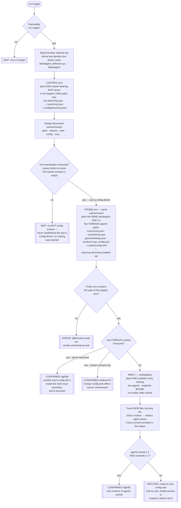

# Playbook — Cross-agent config & marketplace bleed

> **Template:** [`templates/ai/coding-agent/coding-agent-cross-tool-config-bleed.sh`](../../templates/ai/coding-agent/coding-agent-cross-tool-config-bleed.sh)
> **Fixture:** [`tests/fixtures/coding-agent-cross-tool-config-bleed/`](../../tests/fixtures/coding-agent-cross-tool-config-bleed/) · **Proof:** [`tests/prove-coding-agent-cross-tool-config-bleed.sh`](../../tests/prove-coding-agent-cross-tool-config-bleed.sh)
> **Class:** cross-tool blast radius · **Target kind:** `cli` · **Oracle:** `property` (differential over *which tool owns the file*, plus a consent-vs-agents count) · **CWE:** CWE-1188, CWE-829, CWE-441, CWE-732
> **Bundle:** `agent-posture` — runs with the rest of the local-posture set via `cxg scan --tags agent-posture`

---

## 1. Use case

A developer laptop in 2026 does not run *an* agent. It runs five. Each keeps a small configuration file, and each of those files declares **executable** things: MCP servers to launch, plugins to load, commands to pre-approve.

Those files were never designed as a shared bus. They are being read as one anyway.

| Fan-out | What it does |
|---|---|
| VS Code `chat.mcp.discovery.enabled` | Documented setting: *discover MCP servers configured in other tools on this machine* and adopt them. Claude Desktop's config, Cursor's, whatever else it finds. |
| Shared plugin marketplaces | One catalogue entry, one "install", landing in more than one agent's plugin store. |
| Convention drift | `.cursor/mcp.json`, `.vscode/mcp.json`, `.gemini/settings.json`, `~/.codex/config.toml`, `~/.codeium/windsurf/mcp_config.json` — near-identical schemas that tools increasingly read past their own name. |

The security consequence is a **blast radius nobody scoped**. Two ordinary, careful actions stop meaning what the operator thought:

- *"I audited my agent's MCP config."* You audited one file. Your agent reads five.
- *"I clicked install once."* You consented to one thing; it armed several agents, most of whose plugin stores you have never opened.

So a declaration planted where **tool A** looks — in a repository, in a shared machine account, in a marketplace listing — is honoured by **tool B**, whose own config file is clean and whose own consent was never asked. The attacker gets to pick the weakest config surface on the box and reach the strongest agent through it.

### What this is *not*

This repo already ships a family of agent-config trust checks. Each one varies exactly one thing, and this template's axis is new:

| Template | Held fixed | **Varied** |
|---|---|---|
| [`coding-agent-shared-config-trust`](../../templates/ai/coding-agent/coding-agent-shared-config-trust.sh) | provenance, ownership-by-tool | **permissions** of a machine-wide config root |
| [`coding-agent-project-local-config-trust`](../../templates/ai/coding-agent/coding-agent-project-local-config-trust.sh) | provenance, ownership-by-tool | **permissions** of the checkout (or an ancestor) |
| [`coding-agent-repo-config-autoexec`](../../templates/ai/coding-agent/coding-agent-repo-config-autoexec.sh) | permissions (both arms `0700`) | **provenance** — did a human approve this workspace |
| **this template** | permissions **and** provenance | **ownership-by-tool** — *which agent was the file written for* |

A tool can gate workspace trust perfectly, refuse every world-writable directory, and still launch the MCP server that the workspace declared **for a completely different agent**. That is a distinct failure with a distinct fix, so it needs a distinct check.

---

## 2. Testing flow

Two arms, one target. Arm 1 is a differential over file ownership-by-tool; arm 2 is a counting post-condition over consents. Either one alone is a finding, and they are reported separately because an operator remediates them in different places.

Four parts of that shape carry the honesty of the check:

**The control comes first, and its absence is a SKIP, not a pass.** A tool that reads no configuration at all would sail through a foreign-surface probe for the most boring reason there is. The template refuses to report on a target it has not already shown to be config-driven — and says which precondition was missing.

**The probe arm is asserted to contain nothing of the target's own.** Before it runs, the template checks that `.<stem>` exists nowhere in the probe workspace, `$HOME`, or XDG root. If a foreign path collided with the target's own identity (the target *is* Cursor, say), that surface is dropped from the arm and, if nothing survives, the verdict is `skipped`. Otherwise a confirmation could be the tool reading its own file under a name the template mis-attributed — the feature, not the finding.

**`chat.mcp.discovery.enabled` is planted in the probe arm.** A tool that needs the documented switch before it fans out is given it, so a refutation can never be dismissed as *the flag was missing*.

**The marketplace arm counts only files the install created.** The template plants marketplace source documents under the target's own config root, and those documents contain the marker they install. Snapshotting `$HOME` before the install and diffing after means the probe's own scaffolding cannot inflate the count — the number is agent stores that did not exist a second ago.

Grading is explicit. A canary file holding a surface's nonce means a server **launched**; a nonce merely echoed means the foreign file **took effect** but execution was not witnessed. Those are different claims and the finding says which one it holds.

---

## 3. Market & competitors

| Tool / project | Tests this class? | Behavioural (run-and-observe)? | What it actually does |
|---|---|---|---|
| **cxg** (this template) | **Yes** | **Yes** | Runs a real agent CLI against a workspace containing *only other agents' config*, and against a one-entry marketplace, and reports what it adopted and how many consents it asked — CONFIRMED / REFUTED / SKIP with the nonce that proves it. |
| **cxg `coding-agent-repo-config-autoexec`** (ours) | Adjacent | Yes | Varies *provenance* of a workspace. Says nothing about a file belonging to another tool inside an approved workspace. |
| **MCP config scanners / `mcp-scan`-class tools** | Partly | No | Enumerate `.mcp.json`-family files and flag risky server shapes. They find the *files*; they cannot tell you a second agent adopted one of them. |
| **VS Code / editor docs & settings UI** | No | N/A | `chat.mcp.discovery.enabled` is documented **as a feature**. There is no surface anywhere that reports which other tools' declarations were imported as a result. |
| **Marketplace / extension vetting (VSX, plugin registries)** | Per-entry | No | Review a listing's content. None of them model "this one consent arms N agents", because the fan-out happens on the client after the review. |
| **Secret / config scanners (gitleaks, trufflehog, Checkov)** | No | No | Look for credentials and misconfigured infra. A `.cursor/mcp.json` is a perfectly valid document to all of them. |
| **SAST / dependency scanners (Snyk, Dependabot)** | No | No | Reason about code and packages. Agent config surfaces are neither a dependency graph nor source. |
| **EDR / process telemetry** | Incidentally | Yes | Would see the child process start. Cannot attribute it to *which config file, belonging to which tool*, and produces nothing you can run in CI as a pass/fail. |

The gap this fills: everything in that table either **reads a config file** or **reviews one product**. Nobody measures the *radius* — how many agents one file, or one click, reaches. Status of the class in the wild: **open**. The fan-out is a shipped, documented feature, and no tool models blast radius across agents.

---

## 4. Why behavioral wins here

A static rule can only answer a question about the **file**. The vulnerability is a property of **the set of programs that read it**.

Point any scanner at `~/.codex/config.toml` declaring an MCP server. It has two options, both useless. Flag it — and it flags every correctly-configured Codex install on earth, because declaring your own MCP servers is the entire point of the file; muted within a week. Don't flag it — and it misses the case where the agent that launches that server is not Codex at all. There is no third answer available from the bytes, because **the same file is configuration under one tool and a delivery channel under another**, and which one you have is not written in the file. It is written in some other program's load path.

Worse, the interesting property is not visible in any single artifact. "One declaration reached two agents" and "one consent armed two agents" are statements about a *relation between programs*. There is nothing to grep. The evidence has to be a count taken after the fact — how many canaries fired, how many stores appeared — and a count requires running something.

So the oracle is a differential plus a census, never a matcher. The template plants an *obviously* benign server — `printf <nonce> > <lab-file>` — twice, into arms identical in owner, mode, workspace, `$HOME` and planting order, changing exactly one fact: **whose tool the file was written for**. Then it asks the filesystem a physical question: *did the canary appear?* For the marketplace arm it asks an arithmetic one: *did more agent stores appear than consents were requested?* Both are grounded in effects no correct implementation produces, not in a pattern that must anticipate the attacker's schema, file format, or choice of which of five surfaces to use.

And the refutation is worth as much as the confirmation. When the boundary holds, this template prints something no signature scanner can assert: *this tool launched the MCP server it found in its own config and ignored the byte-identical one in five other agents' files, with the discovery flag set; and its one install consent armed exactly the one agent it named.* That is a positive security property of a product, established by observation — reachable only by running the product.

**One line:** the config file is identical in both worlds and the blast radius lives entirely in who else reads it, so only behaviour can be the evidence.
