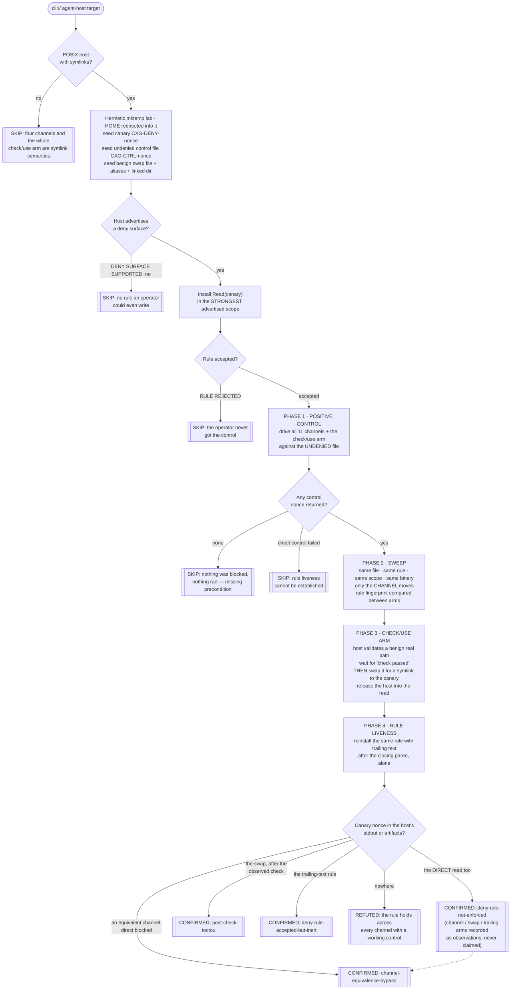

# Playbook — The deny rule you can walk around (one file, one rule, eleven ways in, and a symlink swapped mid-check)

> **Template:** [`templates/ai/coding-agent/coding-agent-deny-rule-reachability.sh`](../../templates/ai/coding-agent/coding-agent-deny-rule-reachability.sh)
> **Fixture:** [`tests/fixtures/coding-agent-deny-rule-reachability/`](../../tests/fixtures/coding-agent-deny-rule-reachability/) · **Proof:** [`tests/prove-coding-agent-deny-rule-reachability.sh`](../../tests/prove-coding-agent-deny-rule-reachability.sh)
> **Class:** incorrect authorization / channel equivalence + check-use split · **Target kind:** `cli` · **Oracle:** `property` (the denied file was not read — a post-condition the check verifies itself, per channel) + `diff` (same file, same rule, same scope, same binary; only the *channel* moves) · **CWE:** CWE-863, CWE-367, CWE-59, CWE-693
> **Bundle:** carries the shared `agent-posture` tag — runnable with the rest of the local-posture set via `cxg scan --tags agent-posture`

---

## 1. Use case

You wrote one line of policy.

```jsonc
// managed settings, the strongest scope your agent has
{ "permissions": { "deny": ["Read(/srv/secrets/prod.env)"] } }
```

From that moment `prod.env` is, in your head, **gone**. It is why the agent is allowed near that host at all, why the sign-off went through, why nobody re-argues it at every standup. The rule is now load-bearing, and the only thing holding it up is an assumption you have never tested: that the rule is enforced against the *file*.

It usually is not. It is enforced against the **command string** — "does this look like a read of that path?" — and that matcher covers exactly the shapes somebody thought to teach it.

Here is the part that makes this a class rather than a bug. Look at what got past a matcher taught the plain form, and note how many of these carry the denied path **as a literal**:

| Channel | What the agent runs | Why the matcher misses it |
|---|---|---|
| redirect | `cat < /srv/secrets/prod.env` | the path is not an operand |
| reader with options | `head -c 4096 /srv/secrets/prod.env` | the operand is no longer the first token |
| option value | `git blame --ignore-revs-file=/srv/secrets/prod.env` | the path lives inside an `=`-joined option |
| glued short option | `tool -f/srv/secrets/prod.env` | the path is not even a separate argv slot |
| response file | `tool @/srv/secrets/prod.env` | a convention the matcher never heard of |
| tool operand | `grep -h . /srv/secrets/prod.env` | `grep` is not on the list of "readers" |
| `cd` compound | `cd /srv/secrets && cat prod.env` | the string in the command is *relative* |
| symlink alias | `cat /tmp/notes` → `prod.env` | a different string entirely |
| symlinked search dir | `cat /tmp/d/prod.env`, `d` → `/srv/secrets` | ditto, one level up |
| shell assignment | `V=$(cat /srv/secrets/prod.env); printf '%s' "$V"` | the read is inside a substitution |
| **check/use swap** | `cat /tmp/ok.txt`, swapped to a symlink after the check | the string never changes at all |

Six of those eleven contain the exact denied path and are still allowed through, because the matcher is anchored on a **shape**, not on a file. The set of shapes is not enumerable — which is precisely what one vendor's history shows: Anthropic's `claude-code` CHANGELOG carries deny-bypass fixes at **2.1.247, 2.1.250, 2.1.257, 2.1.259 and 2.1.260** — five patches in about two weeks, one of them reverted. [CVE-2026-25724](https://nvd.nist.gov/vuln/detail/CVE-2026-25724) is the symlink half of the same family, and Snyk Labs' OpenClaw work is the check/use half. Every one of those fixes taught the matcher one more form. None of them could finish the list, because there is no list.

That is the argument for a behavioural conjunction check in one sentence: **you cannot grep a matcher for the form nobody thought of, but you can seed a canary and try.**

The check/use arm is the second, independent half. A host validates a path and then **re-opens it by name** to read it. Anything that can change what that name points at in between — a symlink swapped in — is read instead of the thing that was checked. The command string never changes; there is nothing for any matcher to catch.

### What the template actually does

It seeds **one canary file carrying a nonce it generated**, installs the host's **strongest** deny rule for exactly that file (managed/enterprise scope when the host advertises one), and then reads the same file eleven different ways plus the swap. A confirmation is the nonce coming back — a string that could not have pre-existed on the target, so a CONFIRMED cannot be a false positive.

Two things keep the *negative* honest, and they matter as much:

- **A positive control on every arm.** "The channel produced nothing" has two causes — the rule stopped it, or the channel never worked here — and they look identical from outside. So every channel is first driven against a **second file the rule does not name**, carrying a different nonce. A channel whose control nonce comes back is a channel that runs. One whose control nonce does not is recorded as *broken* and is never counted as blocked. No control comes back at all → SKIP, not a clean bill of health.
- **The rule must be proved live, not merely acknowledged.** A host that accepts a rule and stores it as matching nothing blocks nothing while looking like a control. So the plain, literal read must *actually* be blocked, and a second spelling of the same rule — identical but for trailing text after the closing paren — is installed on its own and must be enforced too. `Read(/f) # comment` accepted and silently inert is a **confirmation**, not a refutation.

**Held fixed:** same canary, same rule text, same scope, same target binary, same invocation shape. Only the **channel** moves — and that is asserted at runtime, not promised in prose: the host prints a rule fingerprint on every arm and the template refuses to compute a verdict if it moved mid-sweep. A confirmation that let two variables move proves nothing about either.

Everything runs inside a `mktemp -d` lab removed on exit, with `HOME` redirected into it so a host that writes its policy store under `~` reaches the decoy. The only paths handed to the target are ones the template created; the "secrets" are three planted nonce strings. *(The real-world class is named above for motivation. The fixture is an obviously-synthetic toy agent host — no vendor's code, no CVE reproduction, no payload.)*

---

## 2. Testing flow



Three shapes in that diagram carry the whole check.

**The positive control sits upstream of every negative.** Without it, a channel that silently does nothing on this host is indistinguishable from a channel the rule stopped, and a REFUTED drawn from that confusion is exactly the false comfort this class is made of. So each arm first reads a file the rule does *not* name, and only arms that came back are allowed to count as blocked. The rest are named in the verdict as untested.

**The swap must happen after the check, or no race is claimed.** The template waits until the host reports its check passed, and only then replaces the validated path. A swap made earlier would just be the symlink channel again under a different name — a real defect reported under the wrong cause, which sends someone to fix the wrong code. If the ordering could not be observed, the leak is recorded as an observation and the TOCTOU claim is not made.

**A rule that blocks nothing subsumes everything downstream.** If the plain, literal read of the canary succeeds, the rule is decorative, and no channel can be said to have got *around* a rule that was never in the way. In that case the template claims `deny-rule-not-enforced` and *only* that, recording the channel, swap and trailing-text arms as named observations. One defect, one finding — not three.

---

## 3. Market & competitors

| Tool / project | Tests this class? | Behavioural (run-and-observe)? | What it actually does |
|---|---|---|---|
| **cxg** (this template) | **Yes** | **Yes — 11 channels + a check/use race, each with its own positive control** | Seeds a nonce canary, installs the strongest deny rule for it, and tries to read it every way it can spell. CONFIRMED / REFUTED / SKIP, each failure attributed to the mechanism responsible, with the held-fixed axis asserted at runtime. |
| **Vendor CHANGELOG fixes** (claude-code 2.1.247/.250/.257/.259/.260) | The individual forms, after the fact | Regression tests, per form | Five patches in two weeks, one reverted. Each teaches the matcher one more shape. Nothing there asks whether the *next* shape is covered — and by construction it cannot. |
| **[CVE-2026-25724](https://nvd.nist.gov/vuln/detail/CVE-2026-25724)** (symlink deny bypass) | One channel of the eleven | As an exploit PoC | Proves the symlink alias works on one product at one version. Not a repeatable check, and silent on the other ten channels. |
| **Snyk Labs' OpenClaw TOCTOU work** | The check/use half only | Yes | Excellent on the race; does not address channel equivalence against a deny rule. This template runs both and keeps their attributions apart. |
| **Agent-config linters / posture scanners** | Partly | No | Read `permissions.deny` and grade its presence. They confirm the rule is *configured*, the one thing never in doubt — an ignored rule lints identically to an enforced one. |
| **Static command-allowlist analyzers, shell-injection linters** | Adjacent | No | Reason about a command string, which is the same layer the flaw lives in. A tool that parses the command the same way the broken matcher does inherits the same blind spots. |
| **Sandbox/seccomp/Landlock policy tests** | The right layer | Yes, generically | Verify that a syscall filter denies an open. They cannot tell you the *agent host* routed every one of its read paths through that filter, which is where this class actually lives. |
| **Nuclei / YAML template scanners** | No | No (single-pass) | One request/response per template. No notion of installing a control, then sweeping one target through twelve configurations of the same read and comparing outcomes. |
| **Manual red-team agent assessments** | Yes | Yes, but **manual** | Hand-crafted per-target, per-release. Finds channel #12 once, by hand, and cannot be re-run against next Tuesday's build. |

The gap this fills: the deny rule's behaviour is **published and specific** — this file will not be read — so the claim is falsifiable, and the entire market tests either the *presence* of the rule or *one* known bypass. **Nobody ships a repeatable check that seeds a canary, installs the strongest deny, and sweeps a target through a dozen equivalent channels plus a swapped symlink.**

### Where this sits in the `agent-posture` bundle

Four shipped checks now surround the same permission layer, and none of them asks this question:

- [`coding-agent-config-allowlist-trust`](../../templates/ai/coding-agent/coding-agent-config-allowlist-trust.sh) works the **allow** direction — whether an allowlist entry means what its *name* says. This one works the **deny** direction, and the variable is the channel, not the name.
- [`coding-agent-command-trace-composition`](coding-agent-command-trace-composition.md) is a **stateful sequence**: the finding lives across several observations. This is a single command per arm; what moves is its spelling.
- [`coding-agent-hook-gate-integrity`](coding-agent-hook-gate-integrity.md) asks whether a **hook** blocks when it says deny. This asks whether a **rule** covers the file it names, however the file is reached.
- [`coding-agent-sandbox-perimeter-enforcement`](coding-agent-sandbox-perimeter-enforcement.md) asks whether a declared confinement confines while it is live.

A host can pass every one of those and fail here, because the failure is not *whether* the policy answered — it is that the read never went past the place the policy was asked. Run them together with `cxg scan --tags agent-posture`.

---

## 4. Why behavioral wins here

The thing being asserted — *this file will not be read* — is a property of a runtime event: a file descriptor opening, or not. Static analysis cannot see it. It can see that `permissions.deny` is populated, which is the claim under investigation restated as a finding.

And here every static signal points the **wrong way**. A host whose matcher covers three command shapes has *more* code than one that resolves every read to an inode and compares once — more regexes, more cases, more tests, five CHANGELOG entries' worth of visible diligence. On a posture scan and in code review, the broken implementation reads as the more thorough one. The sound implementation is a single `fstat` at a chokepoint and looks like it is barely trying.

Worse, the flaw is defined by *absence*. There is no pattern for "the form nobody enumerated". Every one of those five patches was correct, shipped, and left the class open, because a matcher can only ever be audited against the shapes its author already knows. The only tool that finds shape #12 is one that **tries** shape #12 — and the honest way to try is to plant a nonce and see whether it comes back.

The check/use half is worse still for static tooling: the command string is *identical* in the safe and the unsafe case. `cat /tmp/ok.txt` is the whole input. What differs is whether the descriptor that was validated is the descriptor that was read — a two-event ordering property, invisible in any single snapshot of the source or the config, and observable in about four lines of probe.

Behaviour sidesteps all of it by refusing to reason about policy at all. The template plants a string the target could not have guessed and asks one question of the target's own output: *is it there?* The host's ledger can say `DENY DECISION: blocked` on the very same run; the nonce settles it.

Running the channels **separately** is what turns a finding into a lead someone can act on. A host can enforce the plain read perfectly and still be reachable through an option value. A host can cover all eleven spellings and still re-open by name after the check. Reporting these as one undifferentiated "deny problem" sends someone to read the wrong file; attributing each to the arm that produced it — and *declining* to attribute anything when the rule turns out to block nothing at all — is the difference between a report and a bug.

And the refutation is worth as much as the confirmation, because only a behavioural check can earn one. *The rule was accepted; the plain read was blocked; eleven syntactically different reads of the same file were blocked; a benign path validated and then swapped for a symlink to the canary still returned what had been checked; and every one of those arms first proved it could read a file it was allowed to read.* That is a positive, earned statement about a tool — the thing you actually wanted to know when you decided that one line of policy was enough.

One line: **a deny rule is a claim about a file, and the only way to test it is to spell the file every way you can and see which one comes back.**
