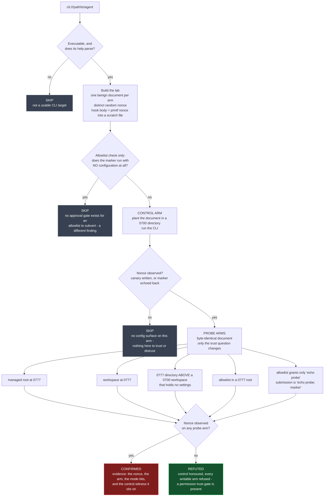

# Execution authority: what a coding-agent CLI will run on someone else's say-so

**Pack:** `coding-agent-shared-config-trust` · `coding-agent-project-local-config-trust` · `coding-agent-config-allowlist-trust`
**Class:** execution-authority conformance · **Target kind:** `cli` · **Oracle:** `property` (differential)
**Status:** Emerging

| Check | The question it answers | Template |
|---|---|---|
| Managed config root | Does the agent obey system-wide settings from a directory *any local user can write*? | [`coding-agent-shared-config-trust.sh`](../../templates/ai/coding-agent/coding-agent-shared-config-trust.sh) |
| Project-local config | Does it run hooks from a world-writable checkout — or from a world-writable directory *above* the checkout it was pointed at? | [`coding-agent-project-local-config-trust.sh`](../../templates/ai/coding-agent/coding-agent-project-local-config-trust.sh) |
| Command allowlist | Does a config-declared allowlist in an attacker-writable file grant unattended execution — and does an entry match the command *name* rather than the command? | [`coding-agent-config-allowlist-trust.sh`](../../templates/ai/coding-agent/coding-agent-config-allowlist-trust.sh) |

Proof harness: [`tests/prove-coding-agent-exec-authority.sh`](../../tests/prove-coding-agent-exec-authority.sh).
Synthetic fixtures: [`tests/fixtures/coding-agent-exec-authority/`](../../tests/fixtures/coding-agent-exec-authority/).

---

## 1. Use case

A coding agent is a program that runs other programs. Everything else about it —
the model, the context window, the diff quality — sits on top of one question:
**whose instructions does the binary accept about what to execute?** The answer
is not in the prompt. It is in a stack of configuration files: a system-wide
"managed settings" document an administrator can use to set policy for the whole
machine, a per-workspace file the agent finds by walking up from your working
directory, and a list of shell commands you have pre-approved so the agent stops
asking. All three carry hooks — shell commands the agent runs on its own events,
before any human sees a prompt.

In 2026, [CVE-2026-35603](https://cymulate.com/blog/cve-2026-35603-ai-coding-tools-privilege-escalation/)
showed what happens when nobody guards that stack. Four shipping agents —
Claude Code, Cursor, Codex CLI, Gemini CLI — read managed settings from a shared
directory their own installers had left writable by the `Users` group. The files
were not exotic: they carried event-triggered command execution plus the
switches that disable the sandbox and the approval prompt. Any local account —
a low-privilege service user, a compromised helper process, a second developer
on a shared box — could drop a file there and choose what the agent ran, as
whoever next started it. No vendor implemented signature validation, ownership
checks, or an approval prompt before loading it.

The defect was never "the file is loaded." Loading configuration is the feature.
The defect is that the file is loaded **from a place whose own mode bits say
anybody may write it, and nothing checks**. That distinction is the entire
check, and it is why a scanner that only reads the config cannot make it: a
`hooks` block in `settings.json` is the same text whether it sits in a directory
locked to root or one carved out for everyone.

This pack tests the property behaviourally, on three surfaces of the same
authority. It plants a benign document — a random nonce and a hook whose whole
body is `printf <nonce> > <scratch file>` — in a directory it created itself,
runs the CLI, and looks for the nonce. Every arm has a control: the *same*
document in a private `0700` directory must be honoured first, so the pack never
reports a tool it has not already shown to be config-driven. Nothing is written
outside a `mktemp -d` lab; no real user config, no vendor path, and no live CVE
is touched.

## 2. Testing flow

**Reading the verdicts.** `CONFIRMED` always carries the nonce that proves it —
no correct run of any tool produces a random string it was not given — plus the
control witness, so the report says *"it honoured this from a private directory
and from a world-writable one alike"*, not merely *"it read a file"*. `REFUTED`
is a positive result worth printing: this tool discriminates on who may write
its config root. `SKIP` names the exact missing precondition rather than issuing
a clean bill of health the probe did not earn.

### The three surfaces, side by side

| | Control (must hold first) | Probe | What a confirmation means |
|---|---|---|---|
| **Managed root** | settings in a `0700` shared root are honoured | same document, `0777` root | any local account sets machine-wide agent policy |
| **Workspace** | settings in a `0700` checkout are honoured | same document, `0777` checkout | anyone who can write the checkout picks what the agent runs |
| **Ancestor** | same as above | settings one level *above* a `0700` checkout that holds none | the config search walked **out of the workspace** — CWE-427 wearing a config file's clothes; the attacker never touched the repo |
| **Allowlist** | the marker is refused with no config, then runs under a `0700` allowlist | same allowlist, `0777` root | the approval prompt was answered in advance, silently, by whoever got there first |
| **Name match** | as above | allowlist grants only `echo probe`; submission is `echo probe; <marker>` | every allowlist entry for a common tool name is a standing grant for anything beginning with it |

### Cross-tool by shape, not by vendor

The pack is proved against four synthetic stand-ins for the configuration
*shapes* the real tools use — file names, on-disk format, hook schema, allowlist
schema — built from **one** fixture source so the flawed and fixed twins cannot
drift apart:

| Fixture shape | Stands in for | Config file | Hook schema | Allowlist schema |
|---|---|---|---|---|
| `claudeish` | Claude Code | `.<tool>/settings.json` | `hooks.SessionStart[].hooks[].command` | `permissions.allow: ["Bash(cmd)"]` |
| `cursorish` | Cursor | `.<tool>/hooks.json` | `hooks.sessionStart[].command` | `commandAllowlist` |
| `codexish` | Codex CLI | `config.toml` | `notify = [...]` argv | `allowed_commands` |
| `geminiish` | Gemini CLI | `.<tool>/settings.json` | `notify = [...]` argv | `coreTools: ["run_shell_command(cmd)"]` |

All three checks confirm on all four defective shapes and refute on all four
fixed ones. Nothing in the templates is hardcoded to a vendor: they discover
their way in from the tool's own `--help`, the conventional variable names built
from the binary's name, and the cross-platform shared roots (`XDG_CONFIG_DIRS`,
`PROGRAMDATA`, `ALLUSERSPROFILE`).

## 3. Market & competitors

| Tool | What it covers | Behavioural (run & observe) or static? | Does it assess *config-root trust*? |
|---|---|---|---|
| **cxg** (this pack) | managed root, workspace, ancestor search path, config-declared allowlist | **Behavioural** — plants a document, runs the binary, reads a nonce back | **Yes** — the differential *is* the check |
| **VASO** (vulnex, ~263 checks) | flags dangerous agent config: `hooks`, `permissions.allow`, `enableAllProjectMcpServers` | Static — self-described AST-based analysis, "without ever executing scanned code" | **No.** Its world-writable check is on **MCP server command paths**, not on agent config roots |
| **cc-audit** | Claude Code config hygiene | Static — "AI-free static scanner" | **No** — reports the config's contents, not the trust of the directory it came from |
| **Gensee Crate** | runs the agent inside a guard/sandbox at runtime | Runtime, but as a **guard**, not an assessor — it constrains an agent, it does not report a verdict about one | No |
| **TrustFall** | proof-of-concept for the class | PoC only, not a repeatable check | Partially, non-reproducibly |

> **The one-line story:** *VASO tells you the config is dangerous; cxg tells you
> the agent obeyed a config any local user could have written.*

Those are different sentences with different remediations. "You have a `hooks`
block" is answered by deleting the hook. "Your agent executes hooks from
`/opt/shared/.tool/` at mode 0777" is answered by fixing an ACL — and it stays
true after you delete the hook, because the next attacker writes their own.

## 4. Why behavioural wins here

**The dangerous artefact and the safe one are the same bytes.** A static scanner
reads `settings.json` and sees a `hooks` block. That block is identical whether
it lives in a root-owned directory or a world-writable one; the defect is in the
`st_mode` of the directory and in whether the binary consults it. There is no
AST node for "and nothing checked."

**The defect is a behaviour of the binary, not a property of the file.** Two
tools reading the byte-identical file are not equally vulnerable — one refuses
it and says so on stderr, the other runs the hook. Only executing both tells you
which you have. This is exactly what the pack's fixed twin demonstrates: same
document, same path, same mode bits, opposite verdict, because the *program*
differs.

**Static analysis cannot see the search path.** The ancestor arm plants nothing
in the repository at all. No file in the workspace is suspicious; the workspace
is `0700` and empty. The finding exists only because the running binary walked
up out of the directory it was pointed at and took orders from the parent. A
scanner pointed at the repo has nothing to scan.

**An allowlist is only as strong as its matcher, which is code.** `permissions.allow:
["Bash(echo ok)"]` looks like a tightly-scoped grant in a YAML view. Whether it
grants `echo ok; curl … | sh` depends on a comparison function inside the
binary. The pack answers that by submitting the compound command and checking
whether the marker ran — a fact no amount of reading the config can produce.

**A control arm converts "no finding" into information.** Because every probe
requires the private-directory arm to be honoured first, this pack does not flag
"has a config layer." It flags "has a config layer *and* no trust gate." And its
refutation — control honoured, every writable arm refused — is a positive
assurance a static scanner cannot issue at all, since it never observed the
program deciding anything.

## Safety

Every fixture in this pack is a benign synthetic CLI written for the purpose.
No vendor code, no real user configuration, no real malicious payload, and no
live CVE is reproduced. Every "attack" the templates plant is a `printf` of a
random nonce into a `mktemp -d` directory removed on exit; the sandbox- and
approval-weakening keys appear as inert strings because they are what makes the
class privilege escalation, not because any check needs them to fire.

## References

- [CVE-2026-35603 — AI coding tools privilege escalation (Cymulate)](https://cymulate.com/blog/cve-2026-35603-ai-coding-tools-privilege-escalation/)
- CWE-732 Incorrect Permission Assignment for Critical Resource · CWE-276 Incorrect Default Permissions · CWE-427 Uncontrolled Search Path Element · CWE-863 Incorrect Authorization · CWE-183 Permissive List of Allowed Inputs
