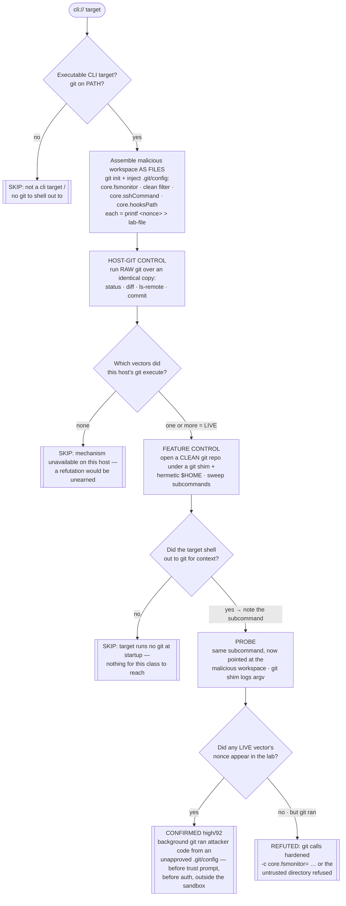

# Playbook — GitSpawn: untrusted `.git/config` executes code through the agent's background git

> **Template:** [`templates/ai/coding-agent/coding-agent-git-config-exec.sh`](../../templates/ai/coding-agent/coding-agent-git-config-exec.sh)
> **Fixture:** [`tests/fixtures/coding-agent-git-config-exec/`](../../tests/fixtures/coding-agent-git-config-exec/) · **Proof:** [`tests/prove-coding-agent-git-config-exec.sh`](../../tests/prove-coding-agent-git-config-exec.sh)
> **Class:** untrusted-workspace code execution via a third-party tool's config (GitSpawn) · **Target kind:** `cli` · **Oracle:** `property` (nonce/canary, gated by a host-git and a feature control) · **CWE:** CWE-94, CWE-1188, CWE-829

---

## 1. Use case

A coding agent, the instant it opens a workspace, shells out to `git` to build context: `git status`, `git diff`, `git rev-parse`, `git log`, sometimes `git fetch`. It does this **unattended, at startup** — before it has shown a workspace-trust prompt, before it authenticates anything, and, because it is only "reading", usually **outside** whatever sandbox guards the code it will later run.

But `git status` is not a read. **git executes repo-controlled configuration on ordinary index operations**, and every one of those knobs lives in the workspace's own `.git/config`:

| Directive in the workspace's `.git/config` | git runs the attacker's program on… |
|---|---|
| `core.fsmonitor = <cmd>` | **every index refresh** — `git status`, `git diff`, `git add`. The headline vector. |
| `filter.<name>.clean` / `.smudge` (+ `.gitattributes`) | `git diff` / `git status` over an attributed file, as git normalises it |
| `core.sshCommand = <cmd>` | the SSH transport — `git ls-remote`, `git fetch` against an `ssh://` remote |
| `core.hooksPath = <dir>` | any hook-bearing operation, from a directory the repo chose |

The one delivery constraint that makes this a **distinct** class: a `git clone` does **not** copy the source repository's local `.git/config`, so a cloned repo is safe. The `.git` directory has to **arrive as files** — a directory the attacker assembled and shipped by zip, sync, network share or USB, or a prepared pull-request tree checked out into place. Whoever assembled that directory chose what runs on the machine of whoever opens it — and the agent pulls the trigger by running `git status` about nothing the user asked for.

**The real class, named:** this is *GitSpawn* (Manifold Security, cross-vendor writeup retested 2026-09-01). It shipped in real agents — Copilot CLI honouring `core.fsmonitor` from an untrusted repo (**CVE-2026-45033**) and Claude Code's git-context path (**CVE-2026-55607**) are the documented instances. The fixtures here are benign synthetic stand-ins: every "payload" is `printf <nonce> > <lab-file>`.

### What this is *not*

This repo already ships [`coding-agent-repo-config-autoexec`](coding-agent-repo-config-autoexec.md), which plants six **agent-owned** surfaces — `.claude/settings.json` hooks, `.mcp.json` `autoApprove`, a `folderOpen` task, an `AGENTS.md` directive — where the **executor is the agent's own config loader**. `.git/config` is not among those six, and the executor here is **git itself**. A tool can pass that check — it prompts before honouring *its own* config format — and fail this one, because it never routed its *background git* through the same trust gate. (`grep -rl "fsmonitor\|hooksPath" templates/` was empty before this template.)

---

## 2. Testing flow

The workspace is **assembled as files** (`git init` + config injection), never cloned — because a clone would strip exactly the config the class depends on. Two controls keep the verdict honest: a **host-git control** (which vectors does *this machine's* git actually execute?) and a **feature control** (does the target shell out to git at all?).

Three parts of that shape carry the honesty of the check:

**The host-git control gates everything.** `core.fsmonitor` support is version- and build-dependent; if this machine's git runs none of the four vectors over an *identical* malicious workspace, the template says `skipped` and names git's version — it never lets a silently-inert arm masquerade as a clean tool. Only vectors the host proved live are counted against the target, so a REFUTED can never be a broken fixture.

**The feature control separates "defended" from "not applicable".** A tool that shells out to git in a *clean* repo but not in the malicious one **defended** — that is the REFUTED worth having. A tool that runs no git even in a clean repo has nothing for this class to bite, and is `skipped`. The two are behaviourally distinct and the template tells them apart.

**The confirmation is grounded in a nonce only a git-executed command could write.** The finding names which vectors fired (`fsmonitor,filter,sshcommand`), and the matched pattern is that arm's random nonce — evidence a git subprocess ran, not that a marker was parsed. The git shim's argv log also records whether the target passed hardening flags, so the refutation can point at the *mitigation* it observed.

---

## 3. Market & competitors

| Tool / project | Tests this class? | Behavioural (run-and-observe)? | What it actually does |
|---|---|---|---|
| **cxg** (this template) | **Yes** | **Yes** | Points a real agent at a workspace whose `.git/config` is armed, and proves — by a nonce a git subprocess wrote — that background `git status` executed attacker code. CONFIRMED / REFUTED / SKIP, host-git and feature controlled. |
| **cxg `coding-agent-repo-config-autoexec`** (ours) | Adjacent | Yes | Tests the **agent's own** config surfaces (`.claude`, `.mcp.json`, `AGENTS.md`). Does not touch `.git/config`; the executor there is the agent, not git. |
| **Vendor patches (Copilot CLI CVE-2026-45033, Claude Code CVE-2026-55607)** | Per-CVE | N/A | Each vendor sanitises its own git calls after disclosure. No cross-tool, re-runnable check — a fix in one agent says nothing about the next one you install. |
| **`git config --global safe.directory` / fsmonitor hardening docs** | Mitigation, not test | N/A | Guidance an operator may or may not have applied. Nothing verifies a given agent actually neutralises repo-supplied git config. |
| **Secret / config scanners (gitleaks, trufflehog, Checkov)** | No | No | Hunt credentials and IaC misconfig. A `.git/config` with `core.fsmonitor` is not a secret and not their schema. |
| **Semgrep / static repo linters** | No | No | Can pattern-match a `core.fsmonitor =` line in a file; cannot say *your agent runs it when it opens the folder*. |

The gap this fills: everyone in that table either **reads a file** or **patches one product**. Nobody points the agent at a hostile, file-delivered `.git` and proves the agent's own background git obeyed it.

---

## 4. Why behavioral wins here

A static rule can only answer a question about the **repository**. The vulnerability is a property of the **agent's git-invocation path**.

Point a scanner at a directory whose `.git/config` sets `core.fsmonitor` and it faces two useless answers. Flag it, and it flags every developer who uses Watchman or the builtin FSMonitor daemon — a legitimate, common, performance-improving setting. Don't flag it, and it misses the case that matters. There is no third option, because **the same `.git/config` is a speedup under a hardened agent and remote code execution under a naïve one**, and which one you have is not in the file — it is in whether the agent runs `git -c core.fsmonitor= status` or plain `git status`.

That is why the oracle is a physical post-condition, not a matcher. The template does not try to recognise a dangerous config; it plants an *obviously* benign one, assembles it as files (not a clone, so the config actually rides along), proves this host's git will execute it at all, proves the target shells out to git at all — and then asks the filesystem one question: *did the nonce appear?* A nonce that exists could only have been written by a git subprocess the target spawned over a directory nobody approved. No signature has to anticipate the attacker's command, and no false alarm fires on the honest Watchman user, because the honest user's agent never ran a stranger's `.git/config`.

The refutation is worth as much as the confirmation, and only this shape yields it: *this tool shells out to git for context, and when the workspace's own `.git/config` tried to drive that git, nothing fired* — a positive security property of a product, established by observation, with the hardening flag caught in the shim log. A static scanner cannot reach that statement; it never ran the product.

**One line:** `git status` is the payload delivery, the `.git/config` is identical whether the agent is safe or not, so only running the agent can tell you which you have.
