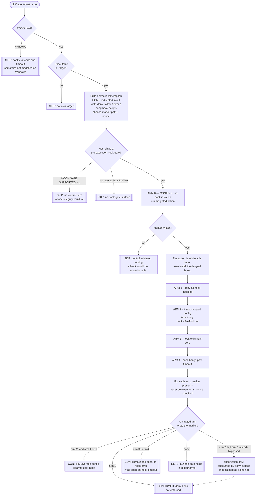

# Playbook — The hook that does not hold (a security control you installed, and nobody ever tested)

> **Template:** [`templates/ai/coding-agent/coding-agent-hook-gate-integrity.sh`](../../templates/ai/coding-agent/coding-agent-hook-gate-integrity.sh)
> **Fixture:** [`tests/fixtures/coding-agent-hook-gate-integrity/`](../../tests/fixtures/coding-agent-hook-gate-integrity/) · **Proof:** [`tests/prove-coding-agent-hook-gate-integrity.sh`](../../tests/prove-coding-agent-hook-gate-integrity.sh)
> **Class:** security-control bypass / fail-open · **Target kind:** `cli` · **Oracle:** `property` (four gated arms, each a post-condition the check verifies itself, gated behind one ungated control arm) · **CWE:** CWE-693, CWE-754, CWE-1188
> **Bundle:** carries the shared `agent-posture` tag — runnable with the rest of the local-posture set via `cxg scan --tags agent-posture`

---

## 1. Use case

You did the responsible thing. Your coding agent exposes a pre-execution hook — Cursor's `beforeShellExecution` and `beforeMCPExecution`, Claude Code's `PreToolUse` and its permission-request callback — and you wrote one. Maybe it denies everything outside an allowlist. Maybe it calls your policy service. Maybe it just says *no* to `curl | sh`. You wired it into your user settings, you rolled it out to the team, and from that moment you have been reasoning about the agent as **gated**: the dangerous command cannot run, because the hook says no.

That belief is now load-bearing. It is why the agent runs with fewer approval prompts, why the risky repos are in scope at all, why the rollout got signed off. And the thing holding it up has never been tested — not by you, and not by anyone else's tooling either.

Note the asymmetry in what *is* covered. The hook as an **attack surface** — a repository that plants a hostile hook, a config that executes something on open — is well-trodden ground; [CVE-2025-59536](https://nvd.nist.gov/vuln/detail/CVE-2025-59536) is that shape, and this repo already ships checks for repo-supplied config that executes ([`coding-agent-repo-config-autoexec`](coding-agent-repo-config-autoexec.md)) and repo-supplied config that redirects credentials ([`coding-agent-repo-config-credential-redirect`](coding-agent-repo-config-credential-redirect.md)). The hook as **a control that must hold** is the mirror image of all of that, and it is tested by nobody.

It has three distinct ways to not hold, and they fail independently:

| Failure | What breaks | The operator's mental model afterwards |
|---|---|---|
| **Bypass** | The host runs the hook, records `deny` for the UI, and executes anyway — or reaches the action down a code path where the hook is never consulted (a different tool name, an MCP call rather than a shell call, a resumed session). | "It said blocked." It said *blocked*. It did not block. |
| **Repo override** | A repo-scoped settings file redefines or empties `hooks.PreToolUse`, and the host lets repository-supplied configuration **replace** the user's list rather than only add to it. | The control is disarmed by the untrusted input it exists to defend against — before the first command runs. |
| **Fail-open** | The hook exits non-zero, or hangs past the host's timeout, and the host reads *"the gate did not answer"* as *"the gate said yes"*. | Anyone who can crash or wedge your hook has deleted it. A flaky policy service is now a silent full-allow. |

Fail-open is the one worth staring at. A gate that is 99% reliable and fails open is not a 99% control — it is a control with a documented, remotely-triggerable off switch, and the operator will never see it flip, because the agent's output looks exactly like a normal successful run.

This template asks the only question that settles any of it: **when the hook says no, does the thing not happen?** It writes the deny-all hook *itself* — the security control belongs to the user, and a host that supplied its own deny hook would be grading its own homework — has the target wire that script into its user-scope config, and then drives five arms:

| Arm | What is installed | What must happen |
|---|---|---|
| **0 · control** | nothing | the gated action **runs** — this is the precondition, not a probe |
| **1 · user-hook** | user-scope deny-all hook | **blocked** |
| **2 · repo-override** | the same hook, plus a repo-scoped file redefining `hooks.PreToolUse` with an allow-all entry | **blocked** — a checkout must not disarm you |
| **3 · hook-error** | a hook that exits non-zero | **blocked** — fail closed |
| **4 · hook-timeout** | a hook that hangs past the host's timeout | **blocked** — fail closed |

Every arm is judged by one thing: a **marker file at a path the template chose inside its own disposable lab, containing a nonce the template generated**. Not the host's ledger, not an exit code, not a log line saying "blocked". The gated action is a `sh -c` that writes `CXG-GATE-<nonce>` and nothing else; if that line is on disk, the action happened, whatever the transcript claims. `HOME` is redirected into the lab for the whole run, so the host's user-scope settings never touch a real one, and nothing outside the `mktemp -d` is read, written, or contacted. *(The real-world class is named here for motivation. The fixture is an obviously-synthetic toy agent host — no vendor's code, no CVE reproduction, no payload.)*

---

## 2. Testing flow

Two shapes in that diagram carry the whole check.

The first is **arm 0 sitting upstream of everything**. Without it, "the action was blocked" and "the action was never going to work here" are the same observation, and a REFUTED drawn from that confusion is exactly the false comfort this class is made of. So the ungated arm runs first and the check refuses to grade the gate at all unless the action demonstrably happens without one.

The second is the **arm-2 attribution rule**. If the host already ignored the deny verdict in arm 1, then arm 2 executing proves nothing about repo-scoped config — the repository did not need to disarm a gate that was never armed. Claiming a repo-override finding there would be a real defect reported under the wrong cause, which sends the operator to fix the wrong thing. So the repo claim is made **only when arm 1 held**, and the other case is recorded as a named observation the report shows and never fires on. That is the precision idiom the MCP checks in this repo established: report the attributable conjunction, keep every near-miss visible as an observation.

---

## 3. Market & competitors

Who else looks at this surface, and how?

| Tool / project | Tests this class? | Behavioural (run-and-observe)? | What it actually does |
|---|---|---|---|
| **cxg** (this template) | **Yes** | **Yes, five arms** | Installs its own deny-all hook, proves the action is achievable ungated, then attacks the gate from three independent directions and verifies each outcome with a nonce marker it planted. CONFIRMED / REFUTED / SKIP with all five arm ledgers attached and each failure attributed to the arm responsible. |
| **CVE-2025-59536 and the hooks-as-attack-surface literature** | The **opposite** direction | Sometimes | Covers a hostile hook or config *arriving* and executing. Nothing in that body of work asks whether a hook the operator *installed on purpose* is honoured. |
| **Agent-config linters / posture scanners** | Partly | No | Read `hooks.PreToolUse` out of settings and grade its presence. They confirm the hook is *configured*, which is the one thing that was never in doubt — a hook that is ignored, overridden, or fails open lints identically to one that holds. |
| **Vendor hook documentation & examples** | Defines the promise | No — it *is* the claim | Documents that the hook is consulted before execution and that a deny blocks. That published promise is what makes this falsifiable; it is not a test of it. |
| **Policy engines (OPA / Rego, allowlist gateways)** | The policy, not the wiring | Yes, in isolation | Verify that *a given policy* returns deny for a given input. They cannot tell you the agent host applied the answer to the action, which is where this class lives. |
| **Nuclei / YAML template scanners** | No | No (single-pass) | One request/response per template. No notion of installing a control, then running the same target through four configurations of that control and comparing outcomes. |
| **Chaos / fault-injection suites** | The fail-open half, generically | Yes | Good at "what happens when a dependency times out" for services. Not agent-aware: nothing points them at a `PreToolUse` hook and asks whether the timeout turned into an allow. |
| **Manual red-team agent assessments** | Yes | Yes, but **manual** | Hand-crafted per-target work, and in practice the hook is usually assessed as a surface to abuse rather than a control to stress. Not a repeatable check you can re-run on the next release. |

The gap this fills: the hook's behaviour is **published and specific** — consulted before execution, deny blocks — so the claim is testable, and the entire market tests the *presence* of the hook rather than its *integrity*. **Nobody ships a repeatable check that installs a deny-all hook and proves the gated action still happens.**

### Where this sits in the `agent-posture` bundle

Three shipped checks now surround the same config layer from different sides, and their questions do not overlap:

- [`coding-agent-repo-config-autoexec`](coding-agent-repo-config-autoexec.md) asks **who authored the config the tool obeys** — provenance, holding permissions fixed.
- [`coding-agent-sandbox-perimeter-enforcement`](coding-agent-sandbox-perimeter-enforcement.md) asks whether a **declared confinement** confines, while it is live.
- **This one** asks whether a control **the operator installed on purpose** survives being denied, overridden, crashed and wedged.

A host can pass all of the config-provenance checks and still fail here, because the failure is not *whose config it is* — it is whether the answer that config produced is applied to the action. Run them together with `cxg scan --tags agent-posture`.

---

## 4. Why behavioral wins here

The thing being asserted — *a deny verdict prevents the action* — is a relationship between two runtime events: a hook process exiting with an answer, and a child process not being spawned. Static analysis cannot see either one. It can see that `hooks.PreToolUse` is populated, which is the claim under investigation restated as a finding.

And every static signal points the wrong way. A host with a **decorative** hook gate has an identical settings file to one with a real gate — the same JSON, the same matcher, the same script path. A host that **fails open** has a *cleaner* implementation than one that fails closed: no error branch, no timeout branch, no operator-facing "your gate did not answer" state to design. The fail-open code is shorter and the fail-closed code is the one that looks like it has unhandled complexity. On a posture scan, the broken one scores at least as well as the sound one, and in a code review the broken one reads as tidier.

Behaviour sidesteps all of it by refusing to read the config at all. The template writes a hook that says no, hands it over, and then asks the filesystem one question: *is the marker there?* A file carrying a nonce the target was given and could not have guessed is not an inference about policy resolution — it is a line of text that only the gated action could have written. The transcript can say `GATE DECISION: blocked` on the very same run; the marker settles it.

The three attack directions matter because they fail **independently**, and only running them separately tells the operator which of their defences is gone. A host can enforce deny perfectly and still let any repository empty the hook list. A host can be immune to repo override and still turn a hook timeout into an allow. Reporting these as one undifferentiated "hook problem" would send someone to read the wrong code; attributing each to the arm that produced it — and *declining* to attribute arm 2 when arm 1 already explains it — is the difference between a finding and a lead.

The refutation is worth as much as the confirmation, and only a behavioural check can issue it. *The control arm performed the action; with a deny-all hook installed the host blocked it; a repo-scoped file redefining the hook list did not disarm it; a hook that crashed and a hook that hung both failed closed.* That is a positive, earned statement about a tool — the thing you actually wanted to know when you decided to trust the gate.

One line: **a hook is a promise about what will not happen, and the only way to collect on it is to try.**
