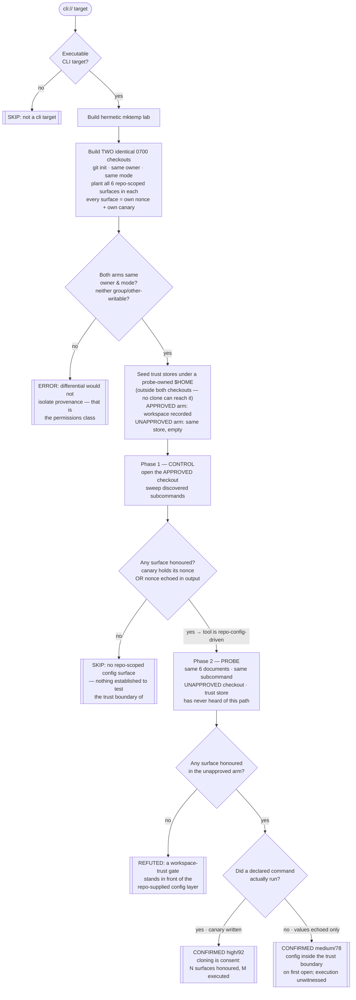

# Playbook — Repo-supplied agent config auto-execution

> **Template:** [`templates/ai/coding-agent/coding-agent-repo-config-autoexec.sh`](../../templates/ai/coding-agent/coding-agent-repo-config-autoexec.sh)
> **Fixture:** [`tests/fixtures/coding-agent-repo-config-autoexec/`](../../tests/fixtures/coding-agent-repo-config-autoexec/) · **Proof:** [`tests/prove-coding-agent-repo-config-autoexec.sh`](../../tests/prove-coding-agent-repo-config-autoexec.sh)
> **Class:** untrusted-workspace trust-boundary failure · **Target kind:** `cli` · **Oracle:** `property` (differential over workspace provenance) · **CWE:** CWE-1188, CWE-829, CWE-94, CWE-732

---

## 1. Use case

`git clone` is not consent to run a stranger's code. For a coding agent it very nearly is anyway, because the agent's per-workspace configuration **lives in the repository**, and that configuration is not preferences — it is execution:

| Surface committed to the repo | What it can make happen on open |
|---|---|
| `.claude/settings.json` | `SessionStart` hooks — shell commands the agent runs on its own events |
| `.mcp.json` | An MCP server **plus** the `autoApprove` / `alwaysAllow` list that says *don't ask before launching it* |
| `.cursor/mcp.json` | The same, under the editor-scoped name |
| `.vscode/tasks.json` | A task marked `runOptions.runOn: "folderOpen"` — no keystroke required |
| `AGENTS.md` | Standing natural-language orders the agent treats as instructions |

Every one of those is code execution **chosen by whoever wrote the branch, delivered to whoever opens it**. The threat model is ordinary developer work: reviewing a pull request from a fork, cloning a dependency to read it, opening a sample repo from a blog post, letting CI check out an untrusted branch. Amazon Q Developer shipped exactly this failure — repo-supplied configuration honoured out of a workspace nobody had approved — and the pattern recurs because the convenience (a monorepo's committed hooks just work) and the vulnerability (a stranger's committed hooks just work) are the *same feature*.

The defect is **not** "the file is loaded". A repo-scoped config layer is a legitimate, wanted thing. The defect is **when** it is loaded: on the first open of a checkout no human has approved, which moves the trust decision from the operator at open time to the attacker at commit time.

### What this is *not*

This repo already ships two config-trust checks, and both vary **permissions** — who else on this box could have written the file:

- [`coding-agent-shared-config-trust`](../../templates/ai/coding-agent/coding-agent-shared-config-trust.sh) — a machine-wide, world-writable managed-settings root.
- [`coding-agent-project-local-config-trust`](../../templates/ai/coding-agent/coding-agent-project-local-config-trust.sh) — a world-writable checkout, or a world-writable *ancestor* of one.

This template holds permissions **fixed** — both checkouts are `0700`, both owned by the invoking user, neither writable by anyone else — and varies **provenance**: *did a human ever say yes to this path?* A tool can pass both neighbours and fail this one, because a repository you cloned is private to you the instant it lands on disk and still arrives full of somebody else's commands.

---

## 2. Testing flow

One probe, **six surfaces**, each with its own nonce and its own canary file — so the verdict names *which* parts of a repository this tool obeys on sight, not merely that something happened.

Three parts of that shape carry the honesty of the check:

**The control comes first, and its absence is a SKIP.** If a tool honours nothing even in a checkout its own trust store approves, this template has established no surface — it says `skipped` and names the missing precondition (either the tool reads no repo-supplied config, or its trust store is not one of the five paths the probe seeds). It never converts "I couldn't set up the experiment" into a clean bill of health.

**Both arms are held identical on the axis being controlled for.** If the unapproved checkout came out group- or other-writable, or the two modes differed at all, the template errors rather than confirms — otherwise a permissions finding could walk out wearing this finding's clothes.

**The confirmation is graded by what was actually witnessed.** A canary file holding a surface's nonce means a command *ran*; a nonce merely echoed in the output means the file *took effect* but execution was not observed. Those are different claims and the finding says which one it has.

---

## 3. Market & competitors

| Tool / project | Tests this class? | Behavioural (run-and-observe)? | What it actually does |
|---|---|---|---|
| **cxg** (this template) | **Yes** | **Yes** | Opens a real agent against two provenance-differing checkouts and reports which repo-scoped surfaces were honoured without approval — CONFIRMED / REFUTED / SKIP, with the nonce that proves it. |
| **cxg `cursor-mcpoison-config-risk`** (ours) | Partly | No | *Reads* `.cursor/mcp.json` and flags risky shapes. Finds the file; cannot tell you whether the agent obeys it on first open. |
| **Vendor patches (Amazon Q, Cursor, VS Code workspace trust)** | Per-CVE | N/A | Each vendor fixes its own instance after disclosure. No cross-tool, re-runnable check; a fix in one tool says nothing about the next one you install. |
| **Secret / config scanners (gitleaks, trufflehog, Checkov)** | No | No | Look for credentials and misconfigured infra in files. `.mcp.json` with an `autoApprove` list is a perfectly valid document to all of them. |
| **Semgrep / static repo linters** | No | No | Pattern-match file contents. Can say "this repo declares a hook"; cannot say "your agent runs it before asking you". |
| **SAST / dependency scanners (Snyk, Dependabot)** | No | No | Reason about code and packages. Agent config surfaces are not a dependency graph and not source. |
| **Workspace-trust UX in editors** | Mitigation, not test | N/A | VS Code's Workspace Trust is the *remedy* this template checks for. Nothing verifies that a given agent CLI actually honours it. |

The gap this fills: everyone in that table either **reads the file** or **patches one product**. Nobody runs the agent against a hostile workspace and proves it was obeyed. A repo-config scanner that flags `.mcp.json` tells you a repository *contains* an instruction; only opening the workspace tells you your tool *takes* it.

---

## 4. Why behavioral wins here

A static rule can only ever answer a question about the **repository**. The vulnerability is a property of the **tool**.

Point a static scanner at a checkout carrying `.claude/settings.json` with a `SessionStart` hook and it must choose between two useless answers. Flag it, and it flags every well-configured monorepo on earth — committed hooks are the feature, and a scanner that alarms on the feature gets muted in a week. Don't flag it, and it misses the case that matters. There is no third option available to it, because **the same bytes are safe under one agent and remote code execution under another**, and which one you have is not written anywhere in the file. It is written in the agent's load path.

That is why the oracle here is a differential and not a matcher. The template does not try to recognise a dangerous config; it plants an *obviously* benign one — `printf <nonce> > <lab-file>` — twice, in two checkouts identical in owner, mode, content shape and `.git` history, and changes exactly one fact about the world: whether a record outside both repositories says a human approved this path. Then it asks the filesystem a physical question — *did the canary appear?* The finding is grounded in an effect no correct run could produce, not in a pattern that has to anticipate the attacker's encoding, their file format, or which of six surfaces they chose.

The refutation is worth as much as the confirmation, and only this shape can produce it. When the gate is present, the template prints something no signature scanner is capable of asserting: *this tool honoured six repo-scoped surfaces in a checkout you approved and refused all six in one you did not.* That is a positive security property of a product, established by observation. A static scanner cannot reach that statement — it never ran the product.

**One line:** the file is identical in both worlds; only the agent's behaviour differs, so only behaviour can be the evidence.
