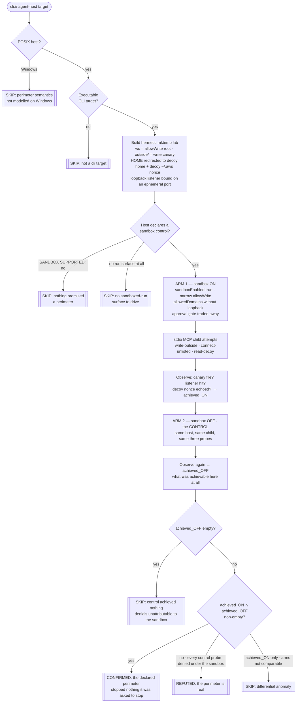

# Playbook — The decorative sandbox (a confinement control that removed your approval prompt and confines nothing)

> **Template:** [`templates/ai/coding-agent/coding-agent-sandbox-perimeter-enforcement.sh`](../../templates/ai/coding-agent/coding-agent-sandbox-perimeter-enforcement.sh)
> **Fixture:** [`tests/fixtures/coding-agent-sandbox-perimeter-enforcement/`](../../tests/fixtures/coding-agent-sandbox-perimeter-enforcement/) · **Proof:** [`tests/prove-coding-agent-sandbox-perimeter.sh`](../../tests/prove-coding-agent-sandbox-perimeter.sh)
> **Class:** confinement-control enforcement gap · **Target kind:** `cli` · **Oracle:** `property` (three post-conditions the check verifies itself) + `diff` (the same host with the sandbox off) · **CWE:** CWE-693, CWE-1188, CWE-732
> **Bundle:** carries the shared `agent-posture` tag — runnable with the rest of the local-posture set via `cxg scan --tags agent-posture`

---

## 1. Use case

You turned the sandbox on. The host told you what that buys: *with the sandbox enabled we stop asking you to approve each command, because the command is contained.* That sentence is the whole security argument, and it is **vendor-documented** — which is what makes it falsifiable. The trade is explicit: **a machine-enforced perimeter in exchange for the human who used to read every command before it ran.**

Now notice what you have actually verified. You have verified that a boolean is `true` in a config file. `sandboxEnabled: true`, a tidy `sandbox.allowWrite` naming just your workspace, an `allowedDomains` list with your package registry on it. What you have *not* verified is whether the process the host spawns is confined by any of it — and that is a runtime property of the spawn, not of the config. The two drift apart in ordinary, boring ways:

- the policy is **written to disk and never injected** into the child;
- the confinement is applied to the **host process** but not to the **child MCP server** it starts, which is where the file and network access actually happen;
- the allow-list is consulted for the **UI banner** and not for the syscall;
- the confinement primitive is **unavailable on this platform** and the host falls back to running unconfined — while keeping the approval gate removed, because the setting still says `true`.

In every one of those cases the banner still says *sandboxed*, the prompt is still gone, and nothing confines anything. **A sandbox that does not confine is worse than having no sandbox**, because the sandbox is precisely what justified removing the human from the loop. The blast radius is not "one unreviewed command"; it is *every* command, unreviewed, for as long as the setting stays on.

This template asks the perimeter the only question that settles it: **does it stop anything?** It drives the host twice over the same synthetic stdio MCP server — once with the sandbox declared on, once with it off — and has the child attempt three operations the declared perimeter forbids:

| Probe | What the declared perimeter promises | What the check observes |
|---|---|---|
| `fs-write-outside-allowwrite` | writes stay inside `sandbox.allowWrite` | a **canary file outside `allowWrite`** exists and carries the run's nonce |
| `net-connect-unlisted-domain` | connections stay inside `sandbox.allowedDomains` | a **loopback listener the check started itself** received a connection carrying the nonce |
| `fs-read-decoy-credential` | ambient credential material is out of reach | a **planted decoy `~/.aws/credentials` nonce** is echoed back — a value only a successful read could produce |

None of these is judged from the host's own ledger. Each is a physical post-condition the template verifies with its own evidence, using a nonce the target was handed and could never invent. And every one of them lives inside a disposable `mktemp -d` lab: `HOME` is redirected into it so no real credential file is ever in scope, the "unlisted domain" is `127.0.0.1` on an ephemeral port, and the decoy contains a nonce and nothing else. *(The real-world class is named here for motivation. The fixture is an obviously-synthetic toy agent host — no vendor's code, no CVE, no payload.)*

The differential is what makes any of it mean something. A denial under the sandbox proves the perimeter held **only if the unsandboxed control shows the operation was achievable in the first place**. Without the control arm, "the write failed" and "the write was never going to work here" look identical — and a clean bill of health drawn from that confusion is exactly the false comfort this class is made of.

---

## 2. Testing flow

The shape to notice is the **intersection**, not the ON arm alone. A probe is reported only when the control demonstrably achieved it *and* the sandboxed arm achieved it too: the perimeter was asked to stop something provably stoppable, and did not. That single rule is what keeps the check from confirming because an operation happened to work, and from refuting because an operation happened to fail.

---

## 3. Market & competitors

Who else looks at this surface, and how?

| Tool / project | Tests this class? | Behavioural (run-and-observe)? | What it actually does |
|---|---|---|---|
| **cxg** (this template) | **Yes** | **Yes, differential** | Runs the host twice over the same stdio MCP child, sandbox on vs off, and verifies three perimeter post-conditions with its own nonce-bearing evidence. Returns CONFIRMED / REFUTED / SKIP with both ledger arms and both achieved-sets attached. |
| **Vendor sandbox documentation** | Defines the trade | No — it *is* the claim | Documents that enabling the sandbox removes the approval prompt. That published promise is what makes the claim falsifiable; it is not a test of it. |
| **Agent-config linters / posture scanners** | Partly | No | Read `sandboxEnabled` out of the config and grade it. They confirm the setting is *written*, which is the one thing that was never in doubt — and they score a decorative sandbox and a real one identically. |
| **CIS-style benchmark / compliance checks** | Partly | No | "Is the sandbox enabled?" as a checkbox. Same failure: config-state, not runtime behaviour, and a `true` that confines nothing passes. |
| **Sandbox / seccomp / container test suites** | The mechanism, not the wiring | Yes, but not agent-aware | Verify that *a given confinement primitive* works when applied. They cannot tell you the agent host applied it to the child it spawned, which is where this class lives. |
| **Nuclei / YAML template scanners** | No | No (single-pass) | One request/response per template, no notion of running the same target twice under two configurations and diffing the observable outcomes. The differential is inexpressible. |
| **Manual red-team sandbox-escape research** | Yes | Yes, but **manual** | Hand-crafted per-target work. High quality, not a repeatable check you can point at the next release. |

The gap this fills: the trade is **published**, so the claim is testable — and **nobody tests the perimeter itself**. Every automated tool in the market reads the setting; none of them asks the running process whether the setting did anything. **Nobody ships a repeatable check that proves a declared sandbox is decorative by showing the same forbidden operation succeeding with the sandbox on and off.**

### Where this sits next to the shipped sandbox check

This template and [`coding-agent-sandbox-trust-handoff`](coding-agent-sandbox-trust-handoff.md) attack the same control from opposite ends, and their preconditions are mirror images:

- **`sandbox-trust-handoff`** requires the boundary to be **real** — phase 1 SKIPs unless a direct escape is blocked — and then shows an agent-written file executing **after the sandbox exits**. Post-exit, deferred, off-boundary.
- **`sandbox-perimeter-enforcement`** (this one) tests the boundary **while it is live**, and confirms precisely when it is *not* real. Same run, no deferral.

A target that confirms here would be *skipped* there, and a target that confirms there had to pass the boundary proof here. Run together — they share the `agent-posture` bundle tag — they cover the sandbox end to end: does the perimeter exist at all, and does it survive the handoff.

---

## 4. Why behavioral wins here

The thing being asserted is a **runtime property of a spawn**, and it is written down as a **boolean in a config file**. Static analysis can only ever read the second one. That is not a limitation of any particular linter — it is the structure of the class. The config is the *claim*; the confinement is the *behaviour*; and this whole class is the gap between them. A checker that reads `sandboxEnabled: true` and reports "sandboxed" has re-stated the claim under investigation and called it a finding.

Worse, every static signal points the wrong way here. The decorative sandbox has a *tidier* config than the real one: a narrow `allowWrite`, a short `allowedDomains`, `sandboxEnabled: true`. It scores **better** on a posture scan than a host that honestly admits it cannot confine on this platform and keeps the approval prompt. The one artifact a static tool can see is the artifact that has been optimised into looking correct.

Behavioural checking sidesteps the claim entirely by refusing to read it. It hands the child an ordinary `open()`, an ordinary `connect()`, an ordinary credential read, and then asks the filesystem, its own socket, and a nonce it planted: **did that happen?** A canary file that exists carries a nonce the target was given and could not have guessed. A connection that arrives at a listener this check started is not an inference about a policy — it is a packet. A decoy secret echoed back cannot be produced without a read.

And the second arm is what turns those observations into a verdict anyone should act on. Running the *same host*, the *same child*, and the *same three probes* with the sandbox off is a control in the experimental sense: it holds everything constant except the one setting whose value is in question. What comes back is not "these operations are possible" but **the delta the sandbox setting is responsible for** — which is the only quantity that was ever in dispute. It also produces an honest **REFUTED** that a signature scanner structurally cannot: *the control achieved all three, the sandbox stopped all three, this perimeter is real* — a positive statement about a tool, earned rather than assumed.

One line: **the sandbox setting is a promise, and only running the process can collect on it.**
