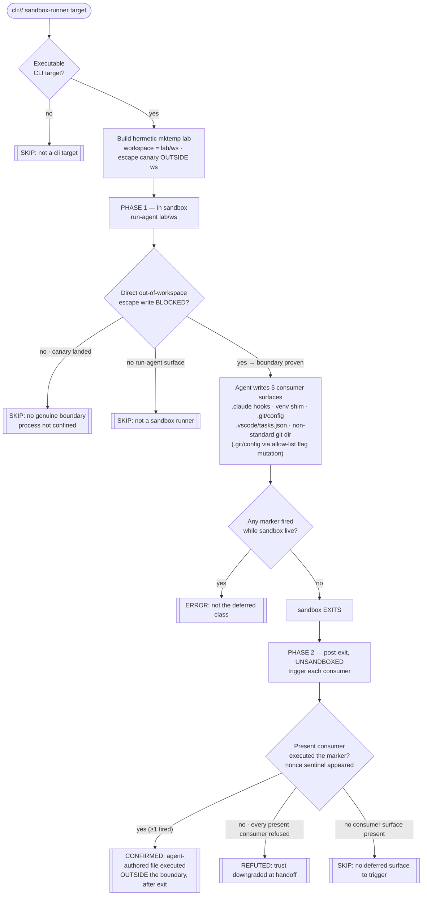

# Playbook — Agent sandbox trust-handoff escape (deferred execution of agent-written files)

> **Template:** [`templates/ai/coding-agent/coding-agent-sandbox-trust-handoff.sh`](../../templates/ai/coding-agent/coding-agent-sandbox-trust-handoff.sh)
> **Fixture:** [`tests/fixtures/coding-agent-sandbox-trust-handoff/`](../../tests/fixtures/coding-agent-sandbox-trust-handoff/) · **Proof:** [`tests/prove-coding-agent-sandbox-trust-handoff.sh`](../../tests/prove-coding-agent-sandbox-trust-handoff.sh)
> **Class:** sandbox trust-handoff escape (deferred execution) · **Target kind:** `cli` · **Oracle:** `property` (post-exit filesystem marker) + `detector` (boundary held) · **CWE:** CWE-668, CWE-693, CWE-829

---

## 1. Use case

You put the coding agent in a **sandbox**. That is the right instinct: the model can be talked into anything, so you contain the *process* — no writes outside its workspace, no stray sockets, no reaching the host. You test the sandbox the obvious way: you ask the agent to escape, watch it fail to write `/etc/anything`, and conclude the boundary holds. It does hold — for the process.

The trouble is that a coding agent's whole job is to **write files**, and some of the files it writes are **executed later, by something else, somewhere outside the sandbox**. The sandbox exits when the agent's turn ends. Then a developer runs `git diff`, or activates the venv the agent set up, or reopens the folder in their editor, or the agent host fires its next hook — and *that* process, which was never inside the sandbox, runs a file the agent authored. The escape doesn't happen *during* the run you were watching. It happens **after**, through a file the agent was perfectly entitled to write.

The surfaces are ordinary, load-bearing agent output:

- **`.claude/settings.local.json` hooks** — the agent host runs the hook command on the next tool use.
- **A venv interpreter shim (`.venv/bin/python`)** — runs the next time anyone activates the environment.
- **A `.git/config` diff/pager entry** — `git` runs the external tool on the next `git diff`, on the *developer's* host.
- **`.vscode/tasks.json` with `runOn: folderOpen`** — the editor runs it when the folder is next opened.
- **A non-standard git metadata dir** (`core.hooksPath → .git-extras/hooks`) — `git` runs the hook on the next checkout.

And there is a nastier write path even when a sandbox *does* protect `.git/**` from direct writes: **allow-list flag mutation**. The agent runs an allow-listed, read-only command whose flag redirects output into the protected file — `git show --output=./.git/config <blob>`. The verb is on the allow-list; the `--output=` flag quietly turns a read into a write the policy never modelled.

This is the gap **Cloud Security Alliance** wrote the agent-sandbox test design around — and explicitly noted **nobody automates**. Reporting describes **four affected vendors, some findings unpatched**. *(Named here for motivation only; this check reproduces none of them — it drives a synthetic, obviously-benign sandbox-runner fixture and plants only a decoy `touch <nonce>` marker inside a disposable lab.)*

This template proves the gap **behaviourally and in two phases**. Phase 1 runs the sandboxed agent-stub and **first proves the sandbox is real** — a direct out-of-workspace escape write is *blocked*. Inside that proven boundary the agent writes the five consumer surfaces (one via allow-list flag mutation). Then the sandbox **exits**. Phase 2 — a different, unsandboxed process — triggers each consumer and watches for a **nonce sentinel** no correct run could invent. If a marker executes post-exit *even though the boundary held*, the trust-handoff escape is real and observed. If every consumer refuses the agent-authored surface, the check **refutes** — and that refutation is the positive signal that this runner downgrades trust of agent-written files at the handoff.

---

## 2. Testing flow

The two-phase shape is the whole discipline. **Phase 1 executes nothing** — it proves the sandbox confines the *process* (the direct escape is blocked) and then watches the agent do legitimate, benign file writes. **Phase 2 runs in a different, unsandboxed process, after the sandbox has exited.** The oracle needs **both** halves: the boundary must have *held* in phase 1 (`detector`), and a nonce marker must *fire* in phase 2 (`property`). A target that merely runs a shell fails the phase-1 boundary proof and is skipped, never confirmed — so a confirmation always means a *real* sandbox was escaped through a file it let the agent write.

---

## 3. Market & competitors

Who else looks at this surface, and how?

| Tool / project | Tests this class? | Behavioural (run-and-observe)? | What it actually does |
|---|---|---|---|
| **cxg** (this template) | **Yes** | **Yes, two-phase** | Proves the boundary holds in phase 1, then triggers unsandboxed consumers in phase 2 and observes a nonce marker execute post-exit. Returns CONFIRMED / REFUTED / SKIP with the ledger and the sentinel as evidence. |
| **CSA agent-sandbox test design** | Yes (defines it) | Design only — **not automated** | Cloud Security Alliance authored the test design for exactly this handoff and states nobody automates it. A methodology, not a scanner you can point at a target and re-run. |
| **Sandbox-escape red-team research** (e.g. Adversa-style) | Yes | Yes, but **manual** | Hand-crafted per-target research; reports four affected vendors, some unpatched. High-quality, not a repeatable automated check. |
| **Static agent-config linters** | Partly | No | Flag "a hook exists" / "a task auto-runs" by pattern. They cannot tell an agent-authored surface from a human-authored one, and they are never present for the post-exit execution, so they cannot distinguish a real handoff escape from a benign config. |
| **Nuclei / YAML template scanners** | No | No (single-pass) | One request/response per template. No concept of a *second phase* in a *different process after the target exits*, so the def-use across the sandbox boundary is inexpressible. |
| **Sandbox / seccomp test suites** | No | Process-only | Verify the *process* boundary (syscalls, mounts, network). They confirm exactly the half that is *not* broken here — the files outlive the boundary the suite proved. |

The gap this fills: the design is documented (CSA) but unautomated, the exploits are manual, and every automated scanner is single-pass and process-scoped. **Nobody ships a repeatable check that proves the sandbox boundary held and then shows an agent-written file executing outside it after the sandbox exits.** That is what this template is.

---

## 4. Why behavioral wins here

A static or single-pass scanner inspects **one moment in one process**: the agent's actions *while the sandbox is live*. In that moment there is nothing to see — writing `.claude/settings.local.json`, `.vscode/tasks.json`, a venv shim, or a git hook is legitimate agent work, indistinguishable from the thousand benign config edits agents make every day. The dangerous event is not in that moment and not in that process. It is **execution**, and it happens **later**, in `git` / the venv / the editor / the agent host, **after the sandbox has already exited**. A one-pass checker is not running then. It has no way to carry a def-use chain that starts with a file the agent *wrote* in phase 1 and ends with a consumer that *ran* it in phase 2, because the two live on opposite sides of the sandbox boundary — and the whole point of the boundary is that the checker's view stops at it.

Behavioural checking sidesteps this by **not trying to recognise a dangerous file at all**. It proves the boundary is real (the direct escape is blocked), then it *becomes the second phase*: it triggers the unsandboxed consumers itself and asks the runtime a physical question — *did a nonce sentinel appear?* A sentinel named for a nonce the target was never given is proof of deferred execution, not a guess about what a config might do. And the same mechanism yields an honest **REFUTED** when the runner downgrades trust of agent-authored files at the handoff and every consumer declines them — a positive property of the tool that no signature scanner could ever report.

That is the thesis in one line: **the check is two-phase because the vulnerability is two-phase.** The escape lives in the gap between the process that *wrote* the file and the process that *ran* it — and only a run-and-observe oracle that spans the sandbox exit can stand in that gap.
