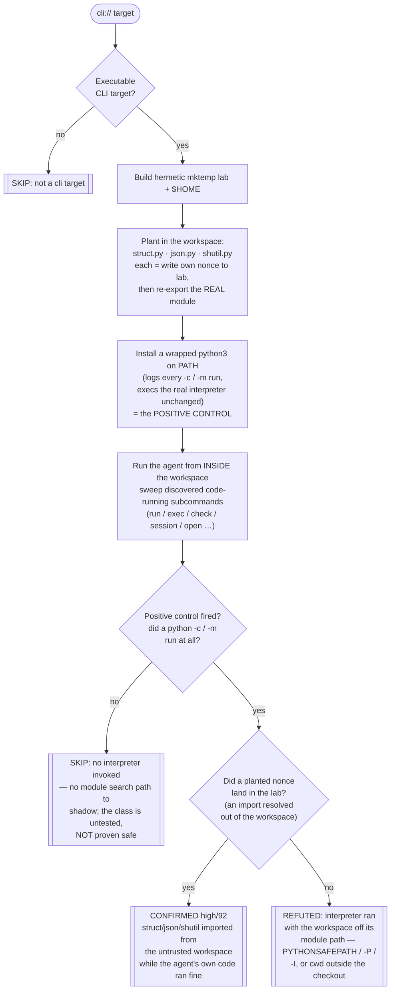

# Playbook — Interpreter search-path shadowing in an untrusted workspace

> **Template:** [`templates/ai/coding-agent/coding-agent-workspace-interpreter-shadowing.sh`](../../templates/ai/coding-agent/coding-agent-workspace-interpreter-shadowing.sh)
> **Fixture:** [`tests/fixtures/coding-agent-workspace-interpreter-shadowing/`](../../tests/fixtures/coding-agent-workspace-interpreter-shadowing/) · **Proof:** [`tests/prove-coding-agent-workspace-interpreter-shadowing.sh`](../../tests/prove-coding-agent-workspace-interpreter-shadowing.sh)
> **Class:** untrusted-workspace interpreter module-resolution hijack · **Target kind:** `cli` · **Oracle:** `property` (post-condition against a positive control) · **CWE:** CWE-427, CWE-426, CWE-829, CWE-94

---

## 1. Use case

A coding agent's core loop is *running interpreters over the code in front of it* — `python3 -c` to check a value, `python3 -m` a helper, `node -e` a snippet — and it runs them **from the workspace directory**, because that is where the code it is reasoning about lives. That single, ordinary habit is the vulnerability.

Every mainstream interpreter puts the working directory **early on its module search path**:

| Interpreter | How the workspace lands on the search path |
|---|---|
| CPython `python -c` | `''` (the current directory) is prepended to `sys.path` |
| CPython `python script.py` | the **script's own directory** is prepended to `sys.path` |
| Node.js | `node_modules` is resolved by walking **up from cwd**; `NODE_PATH` is honoured |
| Ruby | historically `.` on `$LOAD_PATH`; `-I.` and cwd-relative requires |

So a file the workspace author dropped next to the code — `struct.py`, `json.py`, `shutil.py` — is imported **in place of the standard library** the instant anything does `import struct`. And "anything" includes the standard library *itself*: the stdlib `zipfile` module opens with `import struct`, so even agent code that never mentions the shadowed name triggers the swap.

The load-bearing property is that **the shadowing step is 100% deterministic**. There is no race, no probabilistic model behaviour, no prompt to win. The agent is not tricked into running attacker code — it runs its **own** benign code in good faith, and a mechanical `sys.path` lookup hands control to the planted file *before* the first line of the agent's snippet executes. Opening or cloning the repository is the whole exploit.

> **Real-world anchor.** Johann Rehberger demonstrated this against Claude Code on 2026-08-28: a workspace `struct.py` executed when the agent ran Python in the project directory. Anthropic classified it **Informative** — a known, one-flag-mitigable interaction — and pointed at `PYTHONSAFEPATH`. That "won't-fix, one flag fixes it" posture is exactly why a **behavioural** check that proves whether a given agent build actually sets the flag is worth shipping: the fix is real, cheap, and routinely not applied.

### What this is *not*

This repo already ships [`cli-baseline-b07-path-hijack`](../../templates/cli-baseline/cli-baseline-b07-path-hijack.sh), which is **`$PATH`** shadowing — an *executable* named like a command, found earlier on `$PATH`, run instead of the real one. This is **module** resolution, a different search path entirely:

| | `cli-baseline-b07-path-hijack` | this template |
|---|---|---|
| Search path abused | `$PATH` (process execution) | `sys.path` / `NODE_PATH` (module import) |
| Planted artifact | an executable program | a plain `.py` source file |
| Needs `$PATH` entry? | yes | **no** |
| Needs the executable bit? | yes | **no** |
| Trigger | agent shells out to a command name | agent runs *any* interpreter in the dir |

A tool can sanitise `$PATH` completely and still `import struct` out of its own working directory. `grep -rl "PYTHONSAFEPATH\|sys\.path\|NODE_PATH" templates/` matched no coding-agent template before this one.

---

## 2. Testing flow

Plant three benign stdlib look-alikes, drive the agent to run **its own** interpreter path in the workspace, and read the result against a positive control that proves the interpreter actually ran.

### Why each verdict is honest

- **CONFIRMED** rests on a **nonce written by construction**: each planted module writes a per-run random string (`CXG-SHADOW-STRUCT-<salt>`) only if *it* answered the import. A finding cannot be a false positive — the string in the canary is proof an import resolved out of the workspace, and it is the finding's `matched_pattern`.
- **REFUTED** is never a silently-broken arm. The wrapped `python3` records every `-c`/`-m` invocation *before* execing the real interpreter, so a clean lab is only reported as "defended" when the control proves an interpreter genuinely ran with the workspace off its module path. Without that proof the template returns **SKIP**, not a clean bill of health.
- **SKIP** distinguishes "this tool runs no interpreter here" from "this tool ran one safely" — the two look identical in the lab, and conflating them would report untested as safe.

The planted modules **re-export the genuine module** (they drop their own directory from `sys.path` and re-import), so `json`'s submodules resolve, `struct.pack` works, and `shutil.which` works — the agent's good-faith code completes with no visible failure. That fidelity is the point: in the real class the victim never notices, because nothing breaks.

---

## 3. Faithful mechanism, not a toy trip

The fixture agent-stub ([`agentstub.py`](../../tests/fixtures/coding-agent-workspace-interpreter-shadowing/agentstub.py)) is one source compiled to a flawed/fixed twin:

- **`agentstub_defective.py`** runs `python3 -c <benign self-check>` with the workspace as cwd and nothing removed from `sys.path`. Its snippet imports `json`/`struct`/`shutil` **and** builds a `zipfile` (whose stdlib source itself does `import struct`) — the agent's own code, no workspace input consumed. → **CONFIRMED**.
- **`agentstub_fixed.py`** is the *same program, same snippet*, with `PYTHONSAFEPATH=1` in the child environment — the one-flag mitigation Anthropic cited. The cwd leaves `sys.path`; no workspace file can answer an import. → **REFUTED** (control proves it ran).

A real agent with this flaw would be CONFIRMED by the identical code path; the fixture exercises the genuine `sys.path` resolution, not a shortcut that trips the oracle.

---

## 4. Market / competitor landscape

| Who | What they test | Static or behavioural | Catches workspace module shadowing? |
|---|---|---|---|
| **This template** | Does the agent's own interpreter import from an untrusted cwd? | **Behavioural** — plants modules, runs the agent, reads a nonce | **Yes**, with a positive control separating "defended" from "untested" |
| Bandit / Semgrep (Python SAST) | AST patterns (`eval`, `subprocess`, hardcoded secrets) | Static | No — the danger is *where the interpreter runs*, invisible in the agent's source |
| `pip-audit` / OSV / Dependabot | Known-CVE dependency versions | Static (manifest) | No — a workspace `struct.py` is not a dependency and has no CVE |
| `$PATH`-hijack scanners (incl. `cli-baseline-b07`) | Executable shadowing on `$PATH` | Behavioural | No — wrong search path; no exe bit, no `$PATH` entry involved |
| Sandbox/policy tools (Landlock, seccomp, container cwd) | Filesystem/syscall confinement | Runtime policy | Partially, and only if the agent's interpreter is actually confined — orthogonal to the module-path flag |
| Python interpreter itself | `PYTHONSAFEPATH` / `-P` / `-I` | Config flag | It *is* the fix — but nothing tells you a given **agent build** sets it |

### Why behavioural wins here

Static analysis reads the agent's source and sees `subprocess.run(["python3", "-c", ...])` — completely benign. The vulnerability is not in any line of code; it is in the **ambient state** of the directory the interpreter is launched in and whether a single environment flag is set on that launch. Only *running* the agent against a workspace that carries a planted module, and observing whether the import resolved locally, answers the real question: **for this build, today, does opening a stranger's repo hand it the interpreter?** The `PYTHONSAFEPATH` fix is trivial — which is precisely why a check that verifies it is applied, rather than assuming it, is the durable shape for this class.
