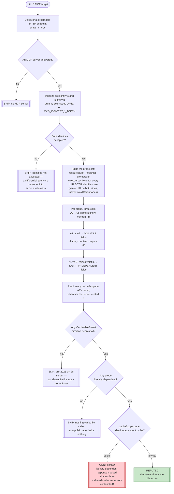
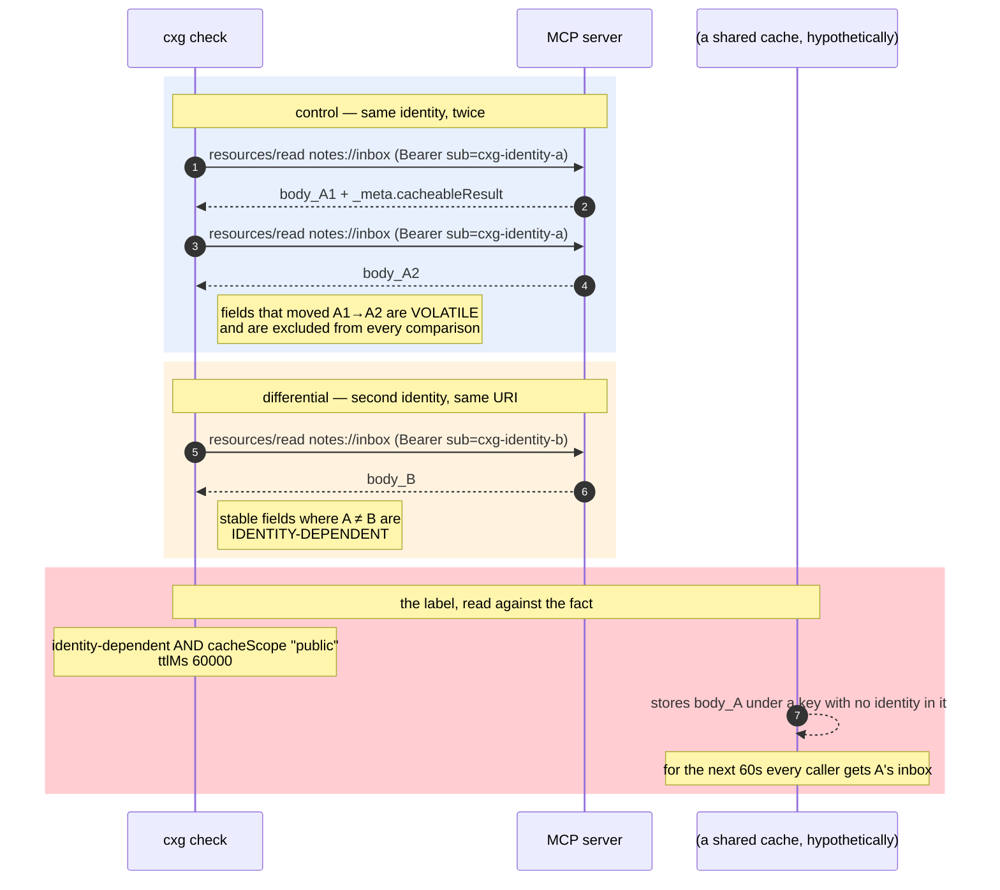

# Playbook — MCP `CacheableResult` cross-identity leak (`cacheScope: "public"` on an identity-dependent response)

> **Template:** [`templates/ai/mcp/mcp-cache-scope-identity-leak.py`](../../templates/ai/mcp/mcp-cache-scope-identity-leak.py)
> **Fixture:** [`fixtures/mcp-cache-scope-identity-leak/`](../../fixtures/mcp-cache-scope-identity-leak/) · **Proof:** [`fixtures/mcp-cache-scope-identity-leak/prove.sh`](../../fixtures/mcp-cache-scope-identity-leak/prove.sh)
> **Class:** cache-scope identity leak · **Target kind:** `http` · **Oracle:** `property` + `diff` (two identities, plus a same-identity control) · **CWE:** CWE-524, CWE-200 · **Severity:** high

---

## 1. Use case

The 2026-07-28 MCP revision gave a result a way to say *how long it stays good and who it stays good for*: **`CacheableResult`**, a `ttlMs` and a `cacheScope` of `"public"` or `"private"`. It is a small, sensible addition — resource listings and shared documents are read constantly by agent runtimes, and caching them is exactly right.

`"public"` is not a hint. It is an instruction to every **shared** intermediary on the path — an MCP gateway, a multi-tenant proxy, a team's agent runtime with a result cache in front of it — that this response is **not tied to the caller** and may be replayed verbatim to whoever asks next.

So here is the whole bug, in one sentence:

> A server marks `notes://inbox` — *your* inbox, with *your* items in it — `cacheScope: "public"`, and the gateway in front of it hands your inbox to the next person who asks.

Nothing is malformed. No authentication is missing. The server checked the token, resolved the caller, and returned **the right answer to each of them**. The response body never says "public" anywhere; only the directive does. The leak happens **one hop away**, in a cache that did precisely what it was told.

Which is why this is so easy to ship. `cacheScope: "public"` is the correct, desirable value for most of a server's surface — the tool list, the resource listing, the changelog, the schema. A developer adds it once at the response-envelope layer, or copies a handler that already had it, and one identity-scoped route inherits it. The diff that introduces the vulnerability is a single word, and it is the same word that is already correct three lines above.

*(The real-world class is **web cache deception / shared-cache identity leakage** — [CWE-524](https://cwe.mitre.org/data/definitions/524.html), and in HTTP terms the [RFC 9111 shared-cache rules](https://www.rfc-editor.org/rfc/rfc9111.html#name-storing-responses-in-shared) that `Cache-Control: private` exists to enforce. This check reproduces none of it against anything real: it drives a benign synthetic MCP server on loopback whose "inbox" is a planted canary string, `CXG-CANARY-A-9f31d0`, with dummy self-issued tokens and no egress. See the [fixture README](../../fixtures/mcp-cache-scope-identity-leak/README.md).)*

---

## 2. Testing flow

Two identities read the **same** resource — and, crucially, identity A reads it **twice**, so "differs because of who asked" is never confused with "differs because it always differs".

### The three calls, and why there are three

---

## 3. Precision — what the check refuses to report

Every MCP check in this pack reports a **structural conjunction** and records the near misses instead of firing on them. Here that conjunction is *identity-dependent* **AND** *`public`* — and the fixture ships two decoys that satisfy exactly one half each, in **both** the confirming and the refuting run:

| Decoy | `cacheScope` | Differs A vs B? | Verdict | Why |
|---|---|---|---|---|
| `clock://now` | `public` | yes | **observation** | it also differs between two reads by the *same* identity — volatile, not identity-dependent |
| `docs://changelog` | `public` | no | **observation** | byte-identical for everyone; publicly cacheable and correctly so |
| `resources/list` | `public` | no | **observation** | same listing for both callers |
| `ttlMs` with no `cacheScope` | — | — | **observation** | an incomplete directive is not a wrong one |
| an unrecognised scope string | — | — | **observation** | never guessed into `public` |

`clock://now` is the one that matters. Drop the same-identity control probe and the check **confirms on the fixed twin** — a false report against a server that got this exactly right. `prove.sh` asserts that it does not.

And the skips are three distinct facts, never collapsed:

| Situation | Verdict | Why not `refuted` |
|---|---|---|
| server emits no `CacheableResult` at all | `skipped` | a field that does not exist cannot be correct |
| nothing varies by caller | `skipped` | a `public` label with nothing behind it leaks nothing |
| both identities rejected | `skipped` | the differential never ran |

---

## 4. Market — who else tests this

| Who | What they do about it | Static or behavioural | Installable? |
|---|---|---|---|
| **Equixly** | names cache-scope / cached-response leakage in its MCP risk write-ups | commentary + hosted probing | no — hosted service |
| **One hosted MCP scanner** | flags `cacheScope: "public"` on responses as a risk signal | static: reads the field, not the response | no — hosted |
| `mcp-scan`, MCP-Scanner, and the open-source MCP linters | tool-description poisoning, rug pulls, prompt injection | static over the manifest | yes — but no cache checks |
| Web/API scanners (Burp, ZAP, Nuclei) | HTTP `Cache-Control` misuse, web cache deception | HTTP-header level; no MCP JSON-RPC awareness | yes — but blind to `CacheableResult` |
| **This template** | reads the same resource as two identities with a same-identity control and compares the **fact** to the **label** | behavioural differential | yes — one file, stdlib only |

**Status: Emerging.** The field is weeks old. The two vendors that name it are hosted, and neither ships something you can run in CI. Nothing installable tests it at all — which is the gap this fills.

---

## 5. Why behavioural wins here

A static rule has exactly one thing it can look at: the string `"public"`. And that string is **correct on most of the surface it appears on** — listings, schemas, changelogs, tool inventories. A scanner that flags every `cacheScope: "public"` produces a page of findings on a healthy server, and the one real leak is indistinguishable from the twenty correct ones sitting beside it.

The signal is not in the field. It is in the **relationship between the field and the body**, and that relationship is invisible from one response:

- **One identity** cannot see it. A single caller's answer is just an answer; nothing about it says whether the *next* caller would get a different one.
- **The manifest** cannot see it. `notes://inbox` and `docs://changelog` have the same shape, the same mime type, the same directive structure. Only running them tells you one is per-caller.
- **Reading the source** barely helps. The directive is usually set in a shared response envelope, several layers from the handler that decided the body — which is precisely how it gets inherited by the wrong route.

Two identities turn a label into a **testable claim**: *"this response is not tied to the caller."* Read it twice as A, once as B, and the server has either kept that promise or broken it. The same-identity control then keeps the answer honest, separating "differs by caller" from "differs every time" — the distinction a header-level cache scanner has no way to draw, and the one that decides whether a finding is real.
