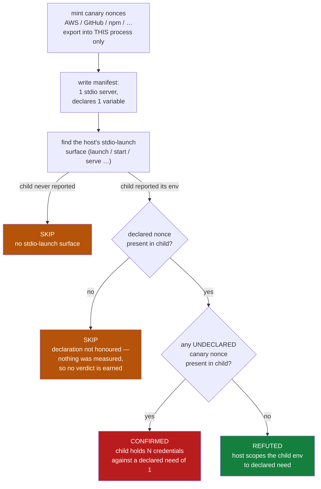

# MCP child-process credential blast radius

**Template:** [`templates/ai/mcp/mcp-child-env-inheritance.sh`](../../templates/ai/mcp/mcp-child-env-inheritance.sh)
**Class:** over-broad privilege inheritance · **Target:** `cli` (MCP host that spawns stdio servers) · **Oracle:** `property` · **Severity:** high

---

## The use case, in plain language

You add an MCP server to your editor. The manifest entry looks innocent:

```json
{
  "mcpServers": {
    "weather": {
      "command": "npx",
      "args": ["-y", "weather-mcp"],
      "env": { "WEATHER_API_KEY": "wk_live_..." }
    }
  }
}
```

That `env` block is the server's **declaration of need**. It needs one API key.

What it *receives* is your shell. The conventional host implementation is one line:

```python
subprocess.Popen(argv, env={**os.environ, **declared})
```

so the weather server is handed `AWS_SECRET_ACCESS_KEY`, `AWS_SESSION_TOKEN`,
`GITHUB_TOKEN`, `NPM_TOKEN`, your cloud-CLI and registry tokens, whatever your
`direnv` just loaded — every credential your terminal happens to hold. Declared
need: 1 variable. Actual grant: 70-plus.

This is the step nobody measures, and it is the reason the recent agent /
editor-extension incidents escalated the way they did. The execution bug was the
first half — an attacker gets code running inside the agent's process tree. The
inherited environment was the second half, and it is the half that turns *"an
attacker ran code in your repo"* into *"an attacker holds your cloud account."*
No credential file is read. No prompt is shown. Nothing appears in the host's
tool-call log, because reading `os.environ` is not a tool call.

The industry tests the first half. This template measures the second.

---

## How the probe works

The template makes itself the developer whose environment is at stake. It mints
**canary credentials** — real-looking names, values that are nonces drawn from
`/dev/urandom` this second — exports them into its own process, and then asks
the host under test to launch a synthetic stdio MCP server whose manifest
declares a need for exactly **one** variable. The server is a shim that reports
the environment it actually received (its report path arrives on `argv`, never
through the environment — a shim that could only be told where to write via an
env var would be useless against a host that scrubs the environment).

Two halves make the differential honest:

| half | variable | exported into the host process? | in the manifest? | what it proves |
|---|---|---|---|---|
| **declared** | `CXG_MCP_DECLARED_TOKEN` | no | yes | the host really launched *this* server and honours declarations — without it, nothing was measured |
| **undeclared** | `AWS_SECRET_ACCESS_KEY`, `AWS_SESSION_TOKEN`, `GITHUB_TOKEN`, `NPM_TOKEN`, `ANTHROPIC_API_KEY`, `SLACK_BOT_TOKEN` | yes | no | a nonce reaching the child can only have crossed the spawn boundary |



### Why it is zero-false-positive

The oracle is set containment over **values**, not names. Every canary value was
minted from `/dev/urandom` moments before the launch and exists nowhere but this
process' environment: not in a config file, not in a cache, not in a vendor
default, not in a previous run. A value that shows up in the child was inherited
across the spawn boundary a second ago. There is no benign path to the
observation, so there is nothing for a "well, maybe…" to attach to.

The `prove.sh` harness asserts this directly: two consecutive confirmations must
carry **different** nonces, which is what demonstrates the check keys on a fresh
value rather than on a name it expected to find.

### Why the second SKIP branch matters

The `nodecl` fixture twin spawns the child and leaks all six canaries — but
never applies the manifest's `env`. A sloppier check would confirm there. This
one declines: if the declared half never arrived, the host may not be launching
the server this manifest describes at all, and a confirmation would be
unearned. The template also never records a value it did not itself mint — the
evidence carries variable **names** and its own nonces, so a scan report cannot
become the credential leak it is reporting.

---

## Proof

Three twins built from one source
([`tests/fixtures/mcp-child-env-inheritance/`](../../tests/fixtures/mcp-child-env-inheritance/)),
driven by
[`tests/prove-mcp-child-env-inheritance.sh`](../../tests/prove-mcp-child-env-inheritance.sh):

| twin | the one line that differs | verdict |
|---|---|---|
| `mcplaunch_flawed.py` | `env = {**os.environ, **declared}` | **CONFIRMED** (6 canaries, 77 vars vs. declared need of 1) |
| `mcplaunch_fixed.py` | `env = {minimal base} + declared` | **REFUTED** (17 vars, zero canaries) |
| `mcplaunch_nodecl.py` | spawns, ignores `declared` | **SKIP** (declaration not honoured) |
| `git` | no stdio-launch surface at all | **SKIP** (no surface) |

The harness runs both through the raw probe contract and through a real
`cxg scan`, because the two agree about nothing unless you look.

---

## Who else tests this

| tool | what it looks at | catches this? |
|---|---|---|
| MCP-scan / mcp-shield / similar MCP linters | tool descriptions, prompt-injection and tool-poisoning strings, manifest hygiene | ✗ — never spawns the server, so never observes what env it got |
| SAST / semgrep rules on host code | can pattern-match `env={**os.environ` **if you own the host source** | partially, and only for hosts you can read |
| npm audit / SBOM / supply-chain scanners | the dependency graph of the server package | ✗ — orthogonal; answers "is the code bad", not "what can the code reach" |
| Secret scanners (gitleaks, trufflehog) | secrets committed to disk | ✗ — nothing is written to disk here |
| Container/runtime least-privilege tooling | capabilities, mounts, syscall policy | ✗ — stdio MCP servers are local child processes, not containers |
| **`mcp-child-env-inheritance`** | the environment the child **actually received**, measured with fresh nonces | ✓ |

Static analysis of the *server* is a crowded field. Behavioural measurement of
the *host's spawn policy* is empty.

---

## Why behavioural wins here

The vulnerable code is a dict merge. It is four tokens long, it is idiomatic, it
is spread across every host implementation and every language, and it is
frequently not in code you can read — it is inside a closed-source editor
extension. Even where you *can* read it, the merge is often several layers away
from the manifest parsing, behind a config object and a platform shim, so a
grep-shaped rule either misses it or fires on every `Popen` in the tree.

More to the point, the static question is the wrong question. "Does this line
merge `os.environ`?" is a proxy. The question an operator actually has is **"if
this server is compromised on Monday, what does the attacker hold on Tuesday?"**
— and that is a property of the running system: this host, this manifest, this
workstation's actual environment, this platform's actual spawn semantics. You
answer it by spawning the child and reading what it got.

Doing that with nonces makes the answer binary. There is no confidence score to
argue with, no allowlist to tune, and no way to explain the observation away: a
random value minted one second ago is sitting in a process that declared it did
not need it.
