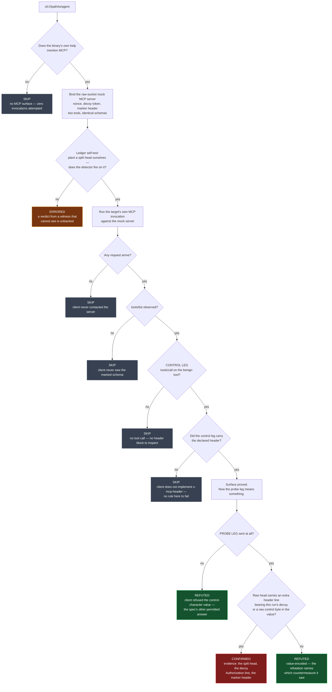

# The model writes a header line: `x-mcp-header` value encoding on the client

**Template:** [`mcp-client-header-value-encoding`](../../templates/ai/mcp/client-conformance/mcp-client-header-value-encoding.py)
**Sub-pack:** MCP client conformance (`mcp-client-conformance`) · alongside [`mcp-client-oauth-issuer-binding`](../../templates/ai/mcp/mcp-client-oauth-issuer-binding.py)
**Class:** client-side HTTP header injection · **Target kind:** `cli` (the agent as MCP client) + a synthetic mock server · **Oracle:** `property`
**Status:** Open (narrow) — the spec names the risk and imposes the rule; nobody tests the countermeasure.

Proof harness: [`tests/prove-mcp-client-header-value-encoding.sh`](../../tests/prove-mcp-client-header-value-encoding.sh).
Synthetic fixtures: [`tests/fixtures/mcp-client-header-value-encoding/`](../../tests/fixtures/mcp-client-header-value-encoding/).

---

## 1. Use case

The MCP 2026-07-28 revision added a small, genuinely useful extension to tool
schemas (SEP-2243). A tool may mark one of its **parameters** with
`x-mcp-header`, and the client then puts that parameter's value into a named
HTTP header on the `tools/call` request:

```jsonc
"inputSchema": {
  "type": "object",
  "properties": {
    "trace_id": { "type": "string", "x-mcp-header": "X-Trace-Id" }
  }
}
```

That is how a tool asks for a correlation id, a tenant selector, a routing hint —
something the *transport* needs rather than the tool body. It is also a data path
with an unusual shape, and it is worth being precise about it:

- the **header name** is chosen by the server, in the schema;
- the **header value** is chosen by the **model**, at call time;
- the value is placed into the **HTTP header block** by the **client**;
- nothing a human typed has to be involved anywhere in that chain.

A header value is terminated by CR LF. A value that *contains* CR LF therefore
does not stay one header — it ends the current line and begins however many new
ones the value wanted. That is CWE-93 / CWE-113, thirty years old, and it is now
reachable from a tool description that a model read.

The spec sees this coming and puts the countermeasure exactly where it belongs:
**on the client**, which must encode the value (or refuse the request) before it
reaches the head. Which is where the problem starts, because every shipping MCP
scanner points at *servers*. The rule is written, the risk is documented, and
whether any given agent implements it is unverified in the field.

It is also not answerable by reading source. The code that assembles the request
head in a real agent is usually a hand-rolled HTTP writer several layers under
the MCP client, chosen precisely because it wants control of the head — which is
the same reason the HTTP library's own header validation is not there to save it.
The only way to know is to look at the bytes.

**What a confirmation actually costs the operator.** The agent's outgoing tool
requests are, at that point, writable by whoever influenced the model's choice of
one parameter: a malicious or compromised MCP server, a poisoned tool
description, a document the agent summarised. An attacker who can write header
lines into an agent's requests can forge an `Authorization:` header at whatever
gateway sits in front of the tool endpoint, override `Host` or routing headers,
desync a proxy's view of the request, or poison a shared cache keyed on headers
the origin never saw.

## 2. Testing flow

The check binds a synthetic MCP server that reads **raw bytes off the socket**
rather than a parsed HTTP request — a head that has been split by an unencoded
CR LF is only visible *before* parsing, because parsing is exactly the step that
turns the injected text into ordinary, innocent-looking headers.

It offers two tools whose schemas are byte-identical apart from one string: a
**control leg** whose `x-mcp-header` parameter defaults to a benign value, and a
**probe leg** whose default carries CR LF, a marker header and a decoy
`Authorization:` bearing this run's nonce. The control leg is what makes the
verdicts honest — without it, "no injected header appeared" cannot be told apart
from "this client does not implement `x-mcp-header` at all."



**Reading the verdicts.**

| Verdict | What it means | What it carries |
|---|---|---|
| **CONFIRMED** | the client spliced model-chosen text into its own request head | the raw head, the injected `Authorization:` and marker lines as *separate* header lines, and the nonce this process minted seconds earlier |
| **REFUTED** *(encoded)* | the header went out and stayed one header | the countermeasure observed by name — percent-encoded, backslash-escaped, or stripped |
| **REFUTED** *(refused)* | the control leg went out; the probe leg was declined | the spec's other permitted answer, and the proof the extension is implemented |
| **SKIPPED** | one named precondition was missing | which one — never a clean bill of health the run did not earn |

**Precision.** A finding fires only on an artefact of *this* run: a header line
carrying a nonce minted seconds ago. Near misses are recorded and never fire —
the client's own `Authorization:` header (no canary), a percent-encoded value, a
value that was merely truncated. The refutation names them; the finding cannot.

## 3. Composes with `mcp-method-desync`

Same header block, opposite side of the wire.

| | [`mcp-method-desync`](../../templates/ai/mcp/mcp-method-desync.py) | `mcp-client-header-value-encoding` (this one) |
|---|---|---|
| Side | **Server** (`http` target) | **Client** (`cli` target) |
| Question | may an intermediary *believe* the `Mcp-Method` header, given the origin dispatches on the body? | may the model *write* header lines into the request in the first place? |
| Confirms | request smuggling / gateway authz bypass | client-side header injection |

Run together they cover one request head end to end: **who is entitled to write
it**, and **who is entitled to believe it**. A deployment that fails both has a
gateway making authorization decisions on headers an MCP server can dictate
through a tool schema.

## 4. Market & competitors

| Tool | What it covers | Behavioural or static? | Does it test client-side `x-mcp-header` encoding? |
|---|---|---|---|
| **cxg** (this template) | drives the client, reads raw wire bytes, control leg + probe leg | **Behavioural** — runs the binary, inspects the head before parsing | **Yes** — this is the check |
| **MCP spec / SEP-2243** | states the rule normatively | Prose | Names the risk, imposes the MUST; ships no test |
| **mcp-scan (Invariant Labs)** | tool poisoning, rug pulls, cross-origin escalation | Mostly static over tool descriptions, plus a proxy mode | No — server-side surface; the proxy parses HTTP, so a split head is normalised before it is seen |
| **mcp-shield / mcp-audit-style scanners** | scores server tool descriptions | Static | No — never drives a client |
| **Semgrep / CodeQL rules for CRLF injection** | flags unencoded values reaching header APIs *in code you have* | Static, source-required | No — the agent binary is usually not yours to scan, and the writer is hand-rolled |
| **Generic web CRLF fuzzers (Burp, ZAP)** | header injection in *server* request handling | Behavioural, but aimed the wrong way | No — they test what a server does with your headers, not what a client emits |

> **The one-line story:** *the spec says clients must encode this value; no one
> has ever checked whether yours does, because checking it means being the
> server and looking at the bytes.*

## 5. Why behavioural wins here

**The defect is bytes on a wire, and parsing destroys the evidence.** An
injected header line, once parsed, is just a header. Any tool that reads the
request through an HTTP library — a proxy, a logging middlebox, a mock server
built on `http.server` — has already normalised the split away before it can
form an opinion. This check reads the socket raw for exactly that reason, and
its self-test plants a split head of its own to prove the ledger can still see
one before any verdict is taken.

**The vulnerable code is the code you cannot read.** The header writer in an
agent is typically hand-rolled beneath the MCP client, precisely so it can
control streaming and custom headers — which is also why the standard library's
header validation never runs. Static analysis of the MCP layer sees a tidy
`headers[name] = value` and no defect; the defect is two layers down, in another
package, possibly not in a language you have source for.

**"No header appeared" has three completely different causes.** It encodes;
it refuses; or it never implemented `x-mcp-header` at all. Those are a pass, a
pass, and *not a test*. Only running a control leg with a benign value first
tells them apart — and the fixture set proves all three branches are reachable,
including the one where the answer is honestly "I have nothing to report."

**A fixed twin and a flawed twin are the same program.** The fixtures differ by
one function: pass the value through, or percent-encode it. Same transport, same
handshake, same schema, same parameter, opposite verdict. No static property of
either file distinguishes them at the MCP layer; the running program does.

**The reachability claim is only credible when demonstrated.** "A model could
choose a header value carrying CR LF" is a sentence. A recorded request head
with `Authorization: Bearer cxg-decoy-token-<nonce>` sitting on its own line, in
a request the agent sent because a *schema default* told it to, is an argument
that ends the meeting.

## Safety

Everything is synthetic and local. The mock MCP server binds `127.0.0.1` on an
ephemeral port; the fixture client talks only to the URL it is handed, writes
only under a redirected `$HOME` inside a `mktemp -d` lab, and spawns nothing. The
only credential anywhere is a decoy string minted by the template for that run,
whose whole purpose is to be recognised coming back. No real MCP server, no real
identity provider, no vendor binary, no CVE reproduction, and no real payload of
any kind appears in this pack.

## References

- [MCP 2026-07-28 — Transports](https://modelcontextprotocol.io/specification/2026-07-28/basic/transports)
- [MCP 2026-07-28 — Security best practices](https://modelcontextprotocol.io/specification/2026-07-28/basic/security_best_practices)
- [RFC 9110 §5.5 — Field Values](https://www.rfc-editor.org/rfc/rfc9110.html#section-5.5)
- CWE-93 Improper Neutralization of CRLF Sequences · CWE-113 HTTP Request/Response Splitting
