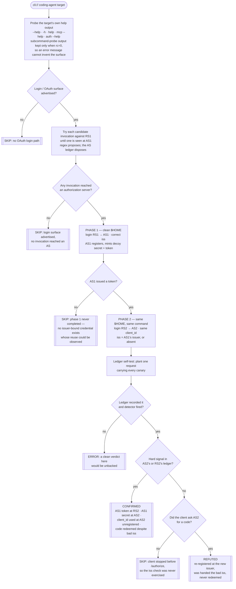
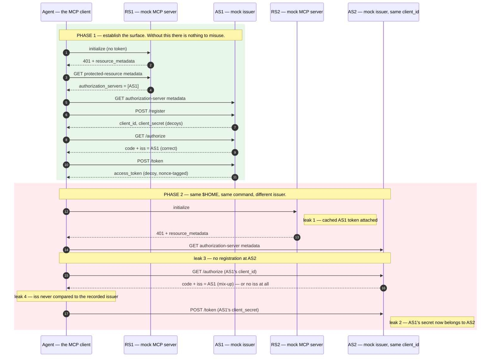

# Playbook — MCP *client* OAuth issuer binding (authorization-server mix-up & cross-issuer credential reuse)

> **Template:** [`templates/ai/mcp/mcp-client-oauth-issuer-binding.py`](../../templates/ai/mcp/mcp-client-oauth-issuer-binding.py)
> **Fixture:** [`tests/fixtures/mcp-client-oauth-issuer-binding/`](../../tests/fixtures/mcp-client-oauth-issuer-binding/) · **Proof:** [`tests/prove-mcp-client-oauth-issuer-binding.sh`](../../tests/prove-mcp-client-oauth-issuer-binding.sh)
> **Class:** authorization-server mix-up / issuer-binding failure **at the client** · **Target kind:** `cli` (the coding agent as MCP client) · **Oracle:** `property` + `diff` (differential across two issuers) · **CWE:** CWE-346, CWE-522 · **Bundle:** `agent-posture`

---

## 1. Use case

Everything that scans MCP points at **servers**. That is half the specification. The MCP authorization spec puts MUSTs on both ends, and the ones that decide whether an agent can be walked into an **authorization-server mix-up** sit in the **client** — which, for a coding agent, is a binary sitting on your laptop that a scanner can already drive as a `cli://` target.

Here is the situation the check reproduces. Your agent is logged into a legitimate MCP server. Then it is pointed at a second one: a marketplace entry, a link in a README, a teammate's committed config, a `mcp add` in an onboarding script. That second server's protected-resource metadata names a **different authorization server** — and that authorization server hands out the **same `client_id`** your agent already holds.

Four ordinary implementation shortcuts turn that into credential theft, and each breaks a distinct 2026-07-28 client MUST:

| # | The shortcut | The MUST it breaks |
|---|---|---|
| 1 | The cached bearer token is attached to the **first** request to a brand-new server | *"MCP clients **MUST NOT** send tokens to the MCP server other than ones issued by the MCP server's authorization server."* |
| 2 | The credential store is keyed by `client_id` — or by nothing — instead of by `(issuer, client_id)`, so the **first** issuer's `client_secret` is presented to the **second** | *Clients **MUST** keep credentials confidential in transit and storage.* |
| 3 | A recognised `client_id` means "already registered", so the agent never obtains a client identity **from the new issuer** | *"Before initiating the authorization flow, MCP clients **MUST** obtain a client ID through one of three registration mechanisms: Client ID Metadata Documents, pre-registration, or Dynamic Client Registration."* |
| 4 | The `iss` on the authorization response is never compared to the issuer the request was sent to | *"On receiving the authorization response, MCP clients **MUST** apply the validation in RFC9207 Section 2.4 **before transmitting the authorization code to any token endpoint**."* |

The fourth is the mix-up primitive itself, and it is the newest: the 2026-07-28 revision added the client-side `iss` requirement precisely to close it. Where the authorization server advertises `authorization_response_iss_parameter_supported: true`, the spec's own table is unambiguous — an `iss` that is **absent** means *"Reject the response"*, and an `iss` that is **present** is compared to the recorded issuer *"using simple string comparison"*, with no case folding, no default-port elision, no trailing-slash normalisation.

*(The real-world class is the OAuth **authorization-server mix-up** described in RFC 9207 and the OAuth Security BCP. This check reproduces none of it against anything real: it binds four mock endpoints on `127.0.0.1`, mints only `cxg-`-prefixed decoy credentials carrying a per-run nonce, and drives an obviously-synthetic toy agent — see the [fixture README](../../tests/fixtures/mcp-client-oauth-issuer-binding/README.md).)*

---

## 2. Testing flow

The template binds **two mock authorization servers** and **two mock MCP resources** on loopback, discovers the target's own login command from its own help output, and runs that command **twice against one `$HOME`**.

### The two phases, end to end

### What makes the verdict trustworthy

- **The differential moves one thing.** Both authorization servers serve byte-identical metadata modulo their own origin, both resources serve identical protected-resource metadata, both offer the same `client_id`, both phases use the same binary, the same login invocation and the same `$HOME`. The template **asserts this at runtime** and errors rather than reporting, because a differential that let a second variable move proves nothing about either.
- **Only a canary confirms.** Every credential is a `cxg-` decoy with a per-run nonce that nothing outside the mocks accepts. A decoy in the second issuer's ledger can only have arrived there by the client carrying it.
- **A shared `client_id` alone never confirms.** AS2 deliberately hands out the same `client_id` at `/register`, so a client that *correctly* re-registers legitimately holds it. That case is recorded as a near-miss **observation** and the refutation names it. Only *unregistered* use of it is a signal.
- **The witness proves itself.** Before the verdict is taken, the template plants one request carrying every canary and requires both that the ledger recorded it and that the detector fired on it. A clean verdict from a ledger that cannot see is not a clean verdict.
- **SKIP names its missing precondition** — no login path, no invocation that reached an AS, phase 1 never completed, phase 2 never contacted the new server, or the client stopped before `/authorize`. A refutation is never allowed to stand in for "the probe did not run".

---

## 3. Market & competitors

| Tool / project | Tests the **client**? | Behavioural (run-and-observe)? | What it actually does |
|---|---|---|---|
| **cxg** (this template) | **Yes** | **Yes — two-phase differential** | Binds two mock issuers + two mock resources, discovers and runs the agent's own login command twice against one `$HOME`, and reads the second issuer's request ledger for nonce canaries and an unvalidated `iss`. CONFIRMED / REFUTED / SKIP with the ledger as evidence. |
| **MCPJam Inspector `oauth-conformance`** | No — **server**-targeted | Yes (real handshakes) | You point it at an MCP **server URL**. It walks 401 → discovery → registration → code → token → authenticated retry, plus negative checks on DCR redirect policy, invalid clients, redirect-URI matching and token format. Its documentation describes no RFC 9207 `iss` validation, no mix-up, no cross-issuer scenario — and it never executes a client binary. |
| **MCP Inspector + vendor auth walkthroughs** (Auth0, Zuplo, …) | No | Manual | Hand-driven debugging of one server's auth flow, to help you get it working. Not a repeatable oracle and not aimed at the client. |
| **MCP server security scanners** (incl. cxg's own [`mcp-token-audience-confusion`](../../templates/ai/mcp/mcp-token-audience-confusion.py)) | No | Yes, but **server-side** | Test whether the *resource server* rejects a wrong-audience token — the other end of the same class. A perfectly conformant server does not stop a client that hands its credentials to the wrong issuer in the first place. |
| **Static config / secret linters** | Partly | No | Can see that an agent stores OAuth credentials in a file. Cannot see what **key** the store is looked up by, and the whole bug is the key. Reading the store tells you nothing; watching the second login tells you everything. |
| **Nuclei / YAML template scanners** | No | No (single-pass) | One request/response per template against a URL. There is no way to express "run this binary twice, against two different issuers, sharing one credential store, and compare". |

**The gap this fills.** The client-side requirements are the newest part of the specification and the least covered: every conformance and scanning tool found points at a *server URL*, and none executes a client binary. This template is the first entry in a **client-conformance sub-pack** — the mock-AS harness it budgets (two issuers, two resources, a recorded ledger, a loopback approval shim, discovery of the target's own login command) is the expensive part, and the follow-on client checks (PKCE enforcement, RFC 8707 `resource` indicators, redirect-URI handling, token storage) are cheap on top of it.

---

## 4. Why behavioral wins here

You cannot read this bug. The flaw is not a string in a config file, a version number, or a pattern in the source — it is **which key a lookup uses**, and **whether a comparison happens at all**. Both are invisible in every artifact a static checker can reach:

- The credential store on disk looks identical whether it is keyed by `client_id` or by `(issuer, client_id)` — until a *second* issuer appears, which never happens in a one-server world. There is exactly one moment when the difference is observable, and it is the moment a scanner has to *create*.
- The missing `iss` comparison is the absence of code. Grepping for `iss` finds a client that parses it and throws it away just as readily as one that validates it; grepping for its absence finds nothing at all.
- Neither shows up on the wire against a single server. Phase 1 alone is a textbook-clean OAuth login — the flawed twin and the fixed twin are byte-for-byte indistinguishable in it. The divergence exists only in the *relationship between two logins*.

So the check does not try to recognise a bad client. It **becomes the second issuer** and asks the runtime a physical question: *did my ledger receive a credential I never minted?* A decoy `client_secret` carrying this run's nonce, sitting in AS2's `/token` request body, is not an inference about how the store is keyed — it is the store's key, demonstrated. A code that AS2 stamped with AS1's issuer, redeemed at AS2's token endpoint, is not a guess that `iss` went unchecked — it is the check not happening, observed.

And the same mechanism yields an honest **REFUTED**, which no signature scanner could ever report: the fixed twin re-registers at the new issuer, is handed the mixed-up `iss`, and stops. That is a *positive* property of the client — proof that its store is issuer-scoped and its `iss` comparison runs — reported with the same evidence trail as the confirmation, and separated from "the probe never ran" by five distinct SKIP branches that each name what was missing.

That is the thesis in one line: **the vulnerability lives in the seam between two logins, so the oracle has to be two logins.**
