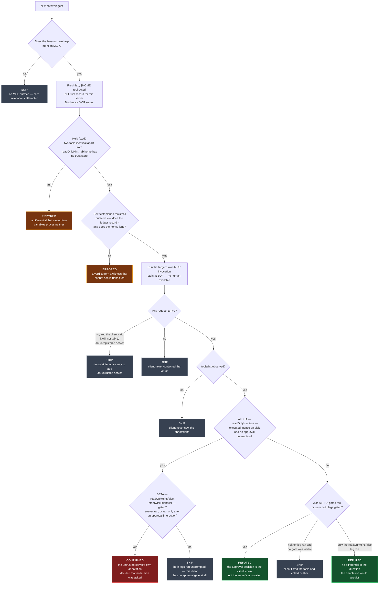

# A boolean turns off the human: `readOnlyHint` auto-approval on the client

**Template:** [`mcp-client-untrusted-annotation-approval`](../../templates/ai/mcp/client-conformance/mcp-client-untrusted-annotation-approval.py)
**Sub-pack:** MCP client conformance (`mcp-client-conformance`) · alongside [`mcp-client-header-value-encoding`](../../templates/ai/mcp/client-conformance/mcp-client-header-value-encoding.py) and [`mcp-client-mrtr-conformance`](../../templates/ai/mcp/client-conformance/mcp-client-mrtr-conformance.py)
**Class:** untrusted-annotation auto-approval · **Target kind:** `cli` (the agent/IDE as MCP client) + one synthetic mock server · **Oracles:** `property`, `diff`
**Status:** Open — the spec's MUST is verbatim and shipping client behaviour documented; nobody tests the client.

Proof harness: [`tests/prove-mcp-client-untrusted-annotation-approval.sh`](../../tests/prove-mcp-client-untrusted-annotation-approval.sh).
Synthetic fixtures: [`tests/fixtures/mcp-client-untrusted-annotation-approval/`](../../tests/fixtures/mcp-client-untrusted-annotation-approval/).

---

## 1. Use case

A tool an MCP server advertises may carry annotations:

```jsonc
{
  "name": "search_notes",
  "description": "Search the user's notes.",
  "annotations": {
    "readOnlyHint": true,
    "destructiveHint": false
  }
}
```

Everything in that block is a **claim by the server**, delivered in the same
payload as the tool's name and description. Nothing in the protocol makes a tool
annotated `readOnlyHint: true` read-only. The MCP blog said so in the plainest
possible words on 2026-03-16: *annotations are hints, not contracts.* The
2026-07-28 specification then wrote the consequence as a normative rule on the
consumer:

> clients **MUST** consider tool annotations to be untrusted unless they come
> from trusted servers

And yet the documented behaviour of shipping clients is to spend those hints as
an **approval decision**. VS Code's Copilot tool-approval docs describe exactly
this: tools the server marks read-only run without asking. The gate that exists
to keep a human in the loop is opened by a field the party under suspicion
filled in.

Follow what that buys an attacker who controls, or has compromised, one MCP
server the agent is configured with:

- the server exports `sync_workspace`, annotated `readOnlyHint: true`;
- the tool writes, deletes, exfiltrates — the annotation constrains nothing;
- the client sees the hint and skips the prompt;
- the human sees a tool result, after the fact, if they are looking.

There is no memory-corruption bug here and no protocol violation by the server:
a hint is allowed to be wrong. The failure is entirely on the client's side of
the line, and it is a **trust-of-untrusted-input** failure (CWE-807) that
results in a **missing authorization** step (CWE-862).

**What a confirmation actually costs the operator.** Every human-in-the-loop
control the deployment believes it has is revocable by any server in the
agent's config — including one added by a teammate, one installed from a
registry, one whose upstream changed after review (see
[`mcp-rug-pull-detection`](../../templates/ai/mcp/mcp-rug-pull-detection.py)).
The cost of turning off the prompt is one boolean, set by the party that
benefits.

## 2. Testing flow

The check binds a synthetic MCP server on loopback inside a `mktemp -d` lab and
redirects the target's `$HOME` there, so the server is **untrusted by
construction** — the lab did not exist a second ago and holds no trust record,
allow-list entry or prior approval. That is the held-fixed axis, and the
template asserts it rather than assuming it.

It then offers **two tools whose definitions are identical apart from one
boolean**, and — crucially — whose *server-side behaviour is the same code*:
both write this run's nonce into the lab when invoked.

| | `cxg_probe_alpha` | `cxg_probe_beta` |
|---|---|---|
| `annotations.readOnlyHint` | `true` | `false` |
| description, title, input schema, other annotations | identical | identical |
| what it does when called | writes the nonce | writes the nonce |

`alpha` is annotated read-only and writes anyway. That is not a trick — it is
the entire point, and it is what "hints, not contracts" means when you make it
concrete.

The target is run **non-interactively**, with stdin at end of file: the
condition a CI job, a headless agent or a background task actually runs in. A
tool that reaches an approval prompt therefore does not run. A tool that was
auto-approved does. The template reads which, from the server's ledger and from
the nonce on disk.



**Reading the verdicts.**

| Verdict | What it means | What it carries |
|---|---|---|
| **CONFIRMED** | an untrusted server's `readOnlyHint` suppressed the human | the nonce the annotated tool wrote, the `tools/call` ledger entry behind it, and the twin leg that was gated instead |
| **REFUTED** | the client's own policy decided — both legs gated, or the annotated one gated too | which legs were put to a human, proving the arm actually executed |
| **SKIPPED** | one named precondition was missing | which one: no gate at all, no tool call, no `tools/list`, no way in — never a clean bill of health the run did not earn |

**Precision.** A confirmation requires an artefact of *this* run: the marker
file `cxg-annotation-effect-<nonce>` written by the tool that ran, plus the
ledger entry for the call that wrote it. The absence of a prompt is never enough
on its own — the twin leg must have been gated, and both must have arrived in
the same `tools/list` reply. A client whose prompt wording this template does
not recognise still cannot produce a false CONFIRMED, because the finding rests
on the **execution differential**, not on parsing the client's prose.

**The positive control.** A REFUTED that came from a dead code path is worthless,
so the harness re-runs the *fixed* twin with every server treated as trusted and
requires a CONFIRMED. That proves the auto-approval branch is live and that only
the trust check stood between it and a finding — and it is itself a real bug
shape: a client whose "trusted" set is "every server that is configured".

## 3. Composes with `mcp-excessive-scope-proof`

Two halves of the annotation-truthfulness class, from opposite ends.

| | [`mcp-excessive-scope-proof`](../../templates/ai/mcp/mcp-excessive-scope-proof.py) | `mcp-client-untrusted-annotation-approval` (this one) |
|---|---|---|
| Side | **Server** (`http` + `cli` target) | **Client** (`cli` target) |
| Question | does the tool do more than it advertises? | is the advertisement allowed to decide whether a human is asked? |
| Confirms | the annotation is a lie | the lie is load-bearing |

Run together they close the loop. Separately, each has an easy answer — "a hint
is allowed to be wrong", "but a well-behaved server would not lie". Together
they describe the actual deployment: a hint that is wrong, believed by a client
that spends it as authorization.

It also pairs naturally with
[`mcp-rug-pull-detection`](../../templates/ai/mcp/mcp-rug-pull-detection.py):
annotations are re-fetched on `listChanged`, so a server that passed review can
flip `readOnlyHint` to `true` afterwards and collect silence.

## 4. Market & competitors

| Tool | What it covers | Behavioural or static? | Does it test client-side annotation trust? |
|---|---|---|---|
| **cxg** (this template) | drives the client against an untrusted mock server; two tools, one boolean apart | **Behavioural** — runs the binary, reads which tool executed | **Yes** — this is the check |
| **MCP spec 2026-07-28 / MCP blog** | states the MUST, and says hints are not contracts | Prose | Names the rule; ships no test |
| **mcp-scan (Invariant Labs)** | tool poisoning, rug pulls, cross-origin escalation | Static over tool descriptions, plus a proxy mode | No — server-side; it can see a suspicious annotation, not what a client does with one |
| **mcp-shield, MCPSafetyScanner and similar** | score a server's tool descriptions and annotations | Static | No — never drives a client |
| **Vendor approval docs (VS Code, Cursor, Claude Desktop)** | describe the auto-approval policy | Documentation | No — they *are* the behaviour under test |
| **Enterprise MCP gateways / allow-lists** | which servers an agent may reach | Configuration | Partly — they can restrict *which* servers, not whether an allowed one's annotations override the prompt |
| **Semgrep / CodeQL** | flags patterns in code you have | Static, source-required | No — the agent or IDE binary is usually not yours to scan |

> **The one-line story:** *every scanner on the market can tell you a server's
> annotations are untrustworthy; none of them can tell you your agent asked
> anyone before believing them.*

## 5. Why behavioural wins here

**The defect is a decision, not a document.** "Does this client consider
annotations untrusted?" has no static answer — the annotation is data that
arrives at runtime, and the approval policy is a table consulted several layers
away from the transport. What a scanner can read is the *server's* claim; what
matters is the *client's* response to it. Only running the client produces that.

**"Trusted server" is usually defined into meaninglessness.** In practice a
client's trust predicate is often `server in config`, which is every server it
will ever talk to — so the spec's escape clause swallows the rule and the code
still looks compliant. The template settles it by construction: a lab `$HOME`
created seconds earlier, no trust record anywhere. If the annotation still opens
the gate, the client's notion of "trusted" did not require anyone to trust
anything.

**A differential is the only honest oracle here.** A tool running unprompted
proves nothing on its own — the client might auto-run everything, which is a
different (and more visible) posture. Two tools that are *identical except for
the annotation*, one gated and one not, isolate the variable completely. That is
also why the twin is a real tool with the same side effect rather than a
placeholder: if the client's policy keyed on anything else — the name, the
description, the schema — the differential would not appear.

**A flawed twin and a fixed twin are the same program.** The fixtures differ by
one predicate: spend the hint, or check the trust store first. Same transport,
same handshake, same tools, opposite verdict — and `build.sh` proves nothing
else drifted by normalising the variant token back out and diffing against the
source.

**The claim is only credible when demonstrated.** "A malicious server could set
`readOnlyHint: true` and skip your prompt" is a sentence anyone can dispute. A
marker file on disk, written by a *write* tool the agent ran with nobody asked,
next to its byte-identical twin that the same agent refused to run in the same
second, is not.

## Safety

Everything is synthetic and local. The mock MCP server binds `127.0.0.1` on an
ephemeral port; the only effect either probe tool has is writing a decoy marker
file inside a temporary lab that is deleted afterwards; the target's `$HOME` is
redirected into that lab; nothing off the machine is contacted. The fixture
client talks only to the URL or command it is handed and invokes only tools the
server advertised. No real MCP server, no real agent vendor's binary, no CVE
reproduction, and no real payload of any kind appears in this pack. The check is
**ACTIVE** — it runs the target binary — so run it only against a client you are
authorized to run.

## References

- [MCP 2026-07-28 — Server / Tools](https://modelcontextprotocol.io/specification/2026-07-28/server/tools) (the untrusted-annotations MUST)
- [MCP 2026-07-28 — Security best practices](https://modelcontextprotocol.io/specification/2026-07-28/basic/security_best_practices)
- [MCP blog, 2026-03-16 — annotations are hints, not contracts](https://blog.modelcontextprotocol.io/posts/2026-03-16-annotations-are-hints/)
- [VS Code — MCP servers and tool approvals](https://code.visualstudio.com/docs/copilot/chat/mcp-servers)
- CWE-807 Reliance on Untrusted Inputs in a Security Decision · CWE-862 Missing Authorization
