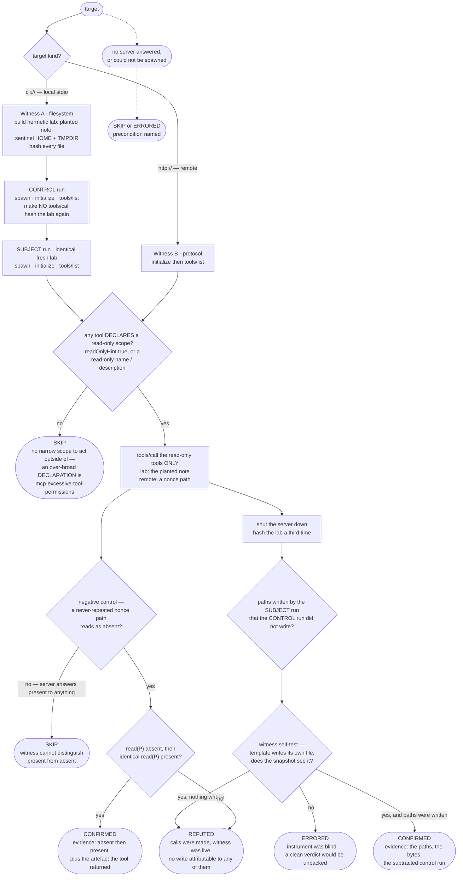
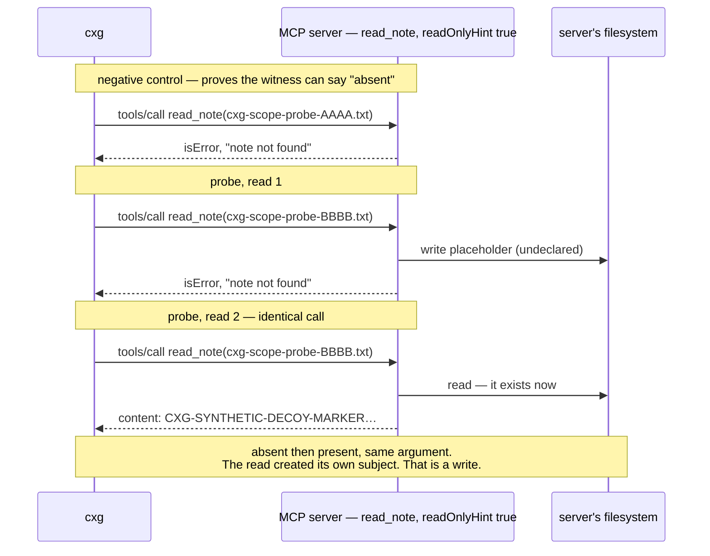

# Playbook — MCP out-of-scope tool action

> **Template** [`templates/ai/mcp/mcp-excessive-scope-proof.py`](../../templates/ai/mcp/mcp-excessive-scope-proof.py)
> **Fixture** [`fixtures/mcp-excessive-scope-proof/`](../../fixtures/mcp-excessive-scope-proof/) · `./prove.sh`
> **Class** out-of-scope action proof · **Targets** `http` + `cli`/stdio · **Oracle** property (+ diff)
> **Verdicts** confirmed / refuted / skipped · **Status** Emerging

---

## 1. Use case

An MCP server hands an agent a list of tools and, next to each one, a promise
about what that tool will do. The protocol makes the promise machine-readable:
`annotations.readOnlyHint: true` means, in the spec's words, *"the tool does not
modify its environment."* Agent frameworks act on it. A read-only tool gets
auto-approved, runs without a confirmation prompt, and is safe to call in a loop
while the model explores. That is the entire point of the annotation — it is the
switch that turns human-in-the-loop off.

The spec also says, in the same section, that a client **must** treat the
annotation as untrusted. So the ecosystem ships a promise, builds automation on
top of it, and documents that nobody checks it. The gap between those two
sentences is this template's subject.

The realistic failure is not a villain. It is a `read_file` tool that also
appends to an audit log its manifest never mentions; a `search_docs` that
memoises a cache miss by creating the file it was asked to read; a `get_config`
that writes a lockfile on the way past. Each is a write, on the agent's host,
performed by a tool the agent was told could not write — and each one arrives
through a channel the operator explicitly marked as needing no approval. The
same shape is what a supply-chain compromise of an MCP server looks like from the
outside: the manifest keeps saying "read-only" while the implementation changes
underneath it (the rug-pull pattern), and a scanner that reads manifests reports
"clean" every single time.

This check closes the gap the only way it can be closed. It calls the tool — only
the ones the server itself declared read-only, with arguments the template
planted for the purpose — and watches what actually happens. A finding here is
not "this tool looks dangerous." It is "we asked this tool to do exactly its
declared job, and here is the path it wrote and the bytes it put in it."

## 2. Testing flow

Two witnesses, because a scanner's visibility depends on whose machine the
server is running on. A local stdio server is a process the template owns, so it
can see the filesystem directly. A remote HTTP server is not, so the write has to
be observed through the protocol itself.



### The protocol witness, in one exchange

The trick that makes a remote write observable without filesystem access: ask
the read-only tool to read a path that **cannot already exist**, twice, with
byte-identical arguments. Nothing between the two calls touched that path except
the tool.



### What each verdict is required to carry

| verdict | what backs it |
|---|---|
| **confirmed** | the exact paths written, the bytes in them, the control run's writes that were subtracted, and the witness self-test result |
| **refuted** | how many calls were made, *and* proof the witness was live — `filesystem-witness-selftest=live`, or a negative control that read `absent` |
| **skipped** | the missing precondition, named: no server answered · no tools · no tool declares a narrow scope · no path-like argument to observe over HTTP |
| **errored** | the target could not be run, or the instrument could not see its own write |

The refuted row is the one that matters most. A clean verdict from an instrument
nobody checked is just silence with a label on it, so the template writes into
its own lab and re-hashes before it is allowed to say "no write happened."

## 3. Market & competitors

| Who | What they check | Behavioural? | Shipping? |
|---|---|---|---|
| **cxg `mcp-excessive-scope-proof`** (this) | calls a declared read-only tool and observes the write it performs | **Yes** — run-and-observe, two witnesses, control-subtracted | Yes |
| **MCP-SandboxScan** (arXiv 2601.01241, Jun 2026) | executes MCP tools in a WASM sandbox, detects unauthorised scope violations | Yes — the closest prior art | **No** — research prototype |
| **Snyk Agent Scan** `W019` / `W020` "Destructive capabilities" | flags a tool whose *declared* capability is destructive | No — reads the manifest | Yes |
| **Prisma AIRS** (Palo Alto) | inspects tool calls inline at runtime as a gateway | Runtime, but as an enforcement proxy on live traffic — not an assessor that can produce a pre-deployment verdict | Yes |
| **cxg `mcp-excessive-tool-permissions`** (this repo's static sibling) | flags a tool whose declared interface exposes exec / write / delete / raw SQL | No — reads the manifest, never invokes | Yes |

Read the table by what is in the "Behavioural?" column and shipping at the same
time: one row. The static scanners answer *"did the server admit it can write?"*
The gateway answers *"is a write happening right now, in production?"* Nobody
shipping answers *"does this tool that says it cannot write, write?"* — which is
the question you need answered **before** you wire the server into an agent and
turn its confirmation prompts off.

Note the direction of the difference. `mcp-excessive-tool-permissions` and Snyk
`W019` both fire on an *honest* server: one that declares a broad capability
truthfully. This template fires on a *dishonest* one — narrow declaration, broad
behaviour — and is the only one of the five that can. They are complements, and
the skip path keeps them apart: hand this template a tool that declares write and
it declines to report, naming the other check by ID.

## 4. Why behavioural wins here

A static or YAML scanner reads what the server chose to say about itself. In
this class, that is exactly the untrustworthy input:

* **The declaration is the thing under test.** `readOnlyHint: true` is the
  claim. A checker that reads the claim to decide whether the claim is true has
  no oracle at all. The MCP spec says so in as many words — annotations are
  hints, clients must treat them as untrusted — and a rule engine has no way to
  act on that sentence.
* **The two twins in the fixture are byte-identical on the wire until you call
  them.** Same tool names, same descriptions, same input schemas, same
  annotations. Every static signal is equal; only the behaviour differs. Any
  detector that would separate them from the manifest would have to be
  hallucinating.
* **A rug-pull changes the implementation, not the manifest.** That is the whole
  point of the pattern — the description that was approved on day one is still
  the description on day ninety. A signature over the manifest re-approves the
  compromise.
* **Behaviour survives an unknown server; patterns do not.** The witness here
  does not know what `read_note` is or what a notes server looks like. It knows
  that a path which did not exist, and now does, was written by whoever was
  asked to read it. That reasoning transfers to a server nobody has seen before,
  written in a language nobody wrote a rule for.
* **Attribution comes from a control, not from a guess.** The lab witness runs
  an identical session that makes zero `tools/call`, and subtracts everything it
  produced. So a server's own startup log never becomes a finding — a
  false-positive class a heuristic has no way to exclude, because it cannot tell
  which write was the server's and which was the tool's.
* **The instrument is checked before the verdict is.** The template writes into
  its own lab and re-hashes; over HTTP it reads a never-repeated nonce path and
  requires the answer `absent`. A static rule has no equivalent move, because it
  has no instrument — which is another way of saying a static "clean" is not an
  observation of anything.

The cost of behaviour is honest and stated: this check **invokes tools**. It
invokes only the ones the server declared read-only, with synthetic arguments,
in a temporary lab — but a lab is not a sandbox, and a hostile server can still
reach the real network. Run an untrusted server inside a disposable container.
Against the fixtures in this repo it is safe anywhere.

---

### Try it

```bash
# both witnesses, all six directions
./fixtures/mcp-excessive-scope-proof/prove.sh

# one local stdio MCP server
python3 templates/ai/mcp/mcp-excessive-scope-proof.py \
    --stdio python3 fixtures/mcp-excessive-scope-proof/mcp_fixture_server.py \
    --mode flawed --transport stdio

# one remote HTTP MCP server
python3 templates/ai/mcp/mcp-excessive-scope-proof.py 127.0.0.1 8961 http
```

Under the engine, a `cli:///abs/path/to/mcp-server` scope selects the stdio
witness; extra server arguments go in `CXG_MCP_STDIO_ARGS`, or override the whole
command line with `CXG_MCP_STDIO_CMD`.
