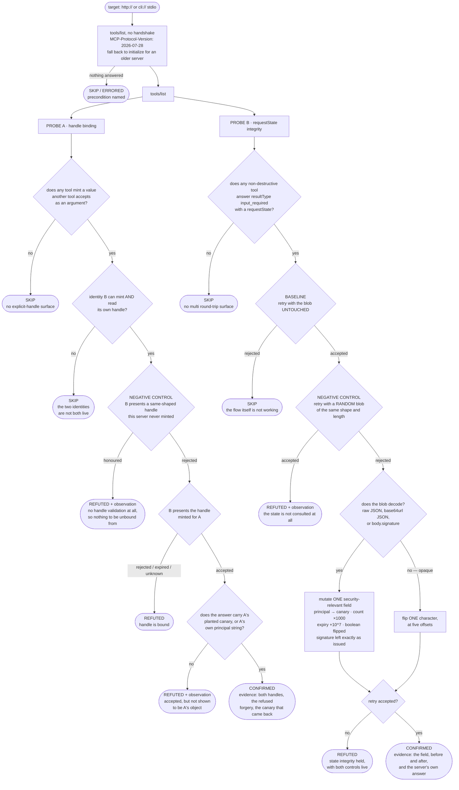
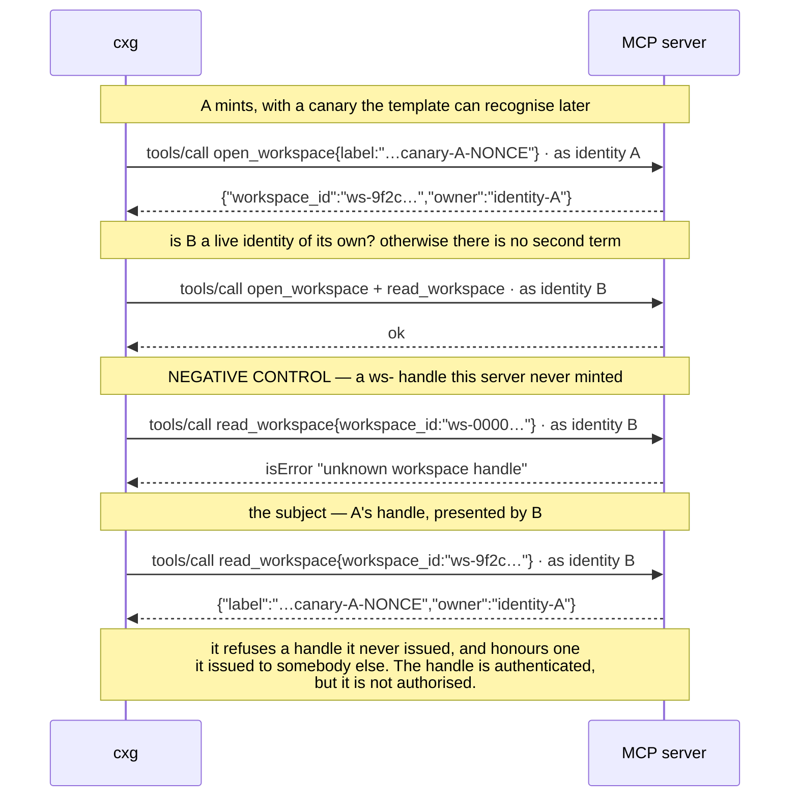
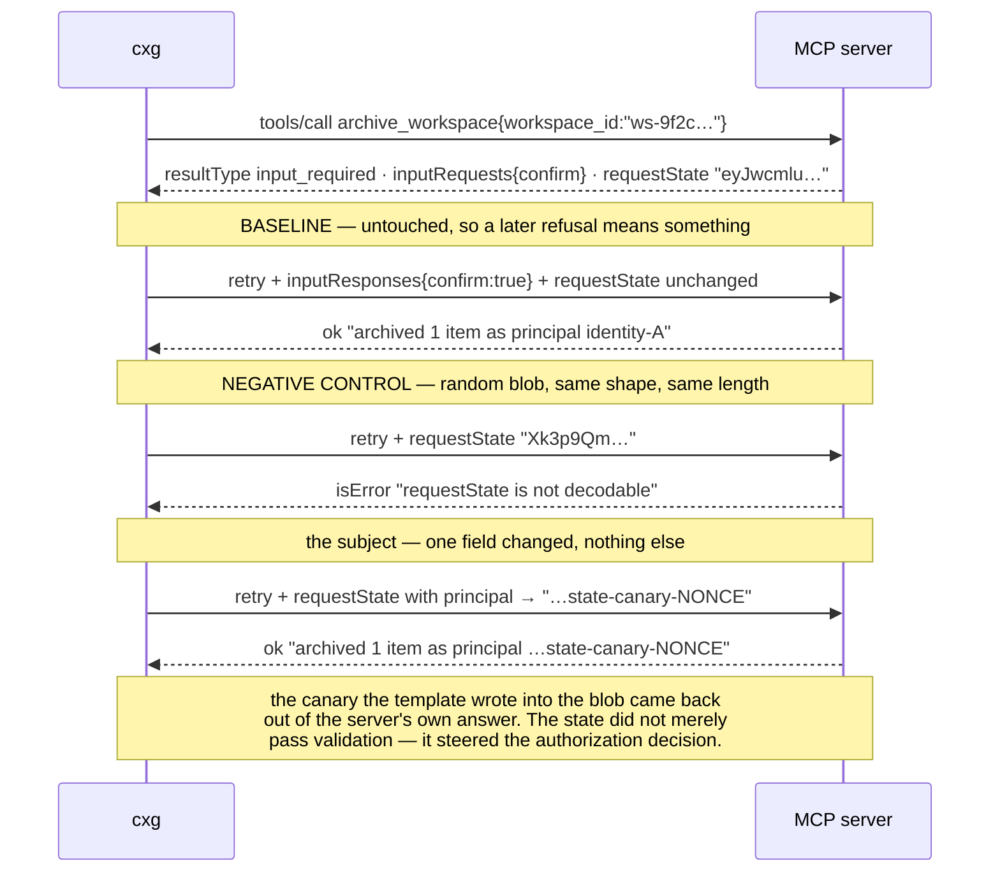

# Playbook — MCP handle binding and `requestState` integrity

> **Template** [`templates/ai/mcp/mcp-handle-binding-integrity.py`](../../templates/ai/mcp/mcp-handle-binding-integrity.py)
> **Fixture** [`fixtures/mcp-handle-binding-integrity/`](../../fixtures/mcp-handle-binding-integrity/) · `./prove.sh`
> **Class** handle / state integrity · **Targets** `http` + `cli`/stdio · **Oracle** property — two identities and one mutation
> **Verdicts** confirmed / refuted / skipped · **Status** Emerging

---

## 1. Use case

On 28 July 2026 the MCP core became stateless. The `initialize`/`initialized`
handshake went away, `Mcp-Session-Id` went away, and every request now carries
its own protocol version, client info and capabilities. It is a good change:
requests stop being sticky, so a server can be load-balanced, restarted and
scaled like any other HTTP service.

But state did not disappear — it moved. The spec gives servers two replacements,
and both of them hand state to somebody else to hold.

**The explicit handle.** *"If your server needs to carry state across calls,
mint an explicit handle from a tool and have the model pass it back as an
argument."* A `basket_id`, a `workspace_id`, a `browser_id`. That identifier is
no longer a transport-layer secret the client holds and the model never sees.
It is a **tool argument**, which means it is text in the model's context window:
printed in a tool result, quoted in the transcript, summarised into a memory
file, shared in a multi-agent handoff, and — this is the part that matters —
**writable by anything that can put text into that context**. A poisoned tool
result that says *"continue in workspace `ws-a41f…`"* is an instruction the
model has every reason to follow. If the server does not check that the handle
was minted for the principal now presenting it, one user's identifier is
another user's access.

**The echoed `requestState`.** When a tool needs input mid-execution it answers
`{"resultType": "input_required", "inputRequests": {…}, "requestState": "…"}`.
The client collects the answers and re-issues the *same* call with
`inputResponses` and the echoed blob. Because the blob carries everything needed
to resume, the retry can land on a completely different server instance — which
is exactly the point. It also means the blob spends its life on the other side
of a trust boundary. The specification is blunt about the consequence:

> The `requestState` a server attaches to an `input_required` result
> round-trips through the client. That makes it attacker-controlled input, so
> you must integrity-protect it, bind it to the principal and the originating
> request, and give it an expiry before letting it influence authorization.

Four obligations, and a base64 string that looks completely normal whether you
met them or not. The canonical example in the spec release notes decodes to
`{"step":1,"files":["a","b","c"]}` — plain, unsigned JSON. Change `files` to
something else, or `approved_amount` from 10 to 9999, or `principal` from
`alice` to `bob`, and hand it back. A server that unpacks it and acts on it has
let the client rewrite its own authorization decision between the question and
the answer.

The realistic failure here is not an attacker in the network path. It is a team
that migrated a working stateful server to the stateless core in an afternoon,
kept its session object, base64'd it, and shipped. Everything works. Every test
passes. The manifest is identical to the version that was secure. Two
independent analyses — [Backslash](https://www.backslash.security/blog/new-mcp-spec-opens-new-attack-surfaces)
and [Equixly](https://equixly.com/blog/2026/08/05/stateless-mcp/) — named this
class within days of the spec landing, and both named it as a *migration*
hazard rather than an exotic attack.

This check answers the two questions that separate a correct migration from a
plausible-looking one: **is a handle bound to the principal who minted it**, and
**is an echoed state blob still the one the server issued?**

## 2. Testing flow

Two probes, each a differential, each with its own negative control — because
"the server said yes" is only a finding if the server was capable of saying no.



### Probe A, in one exchange



### Probe B, in one exchange



### What each verdict is required to carry

| verdict | what backs it |
|---|---|
| **confirmed** | both handles, the refused forgery, and A's canary in B's answer — *or* the mutated field with its before/after, the accepted untouched retry, and the refused random blob. Never one observation on its own. |
| **refuted** | the property held **and** proof the instrument was live: `forged-handle-control=rejected`, `untouched-retry=accepted`, `random-blob-control=rejected` |
| **skipped** | the missing precondition, named: no server answered · nothing mints a handle another tool consumes · nothing returned `input_required` · the second identity was not live · the untouched retry did not work. A pre-stateless-core server lands here with both named. |
| **errored** | the target could not be reached or the stdio server could not be run |

The two `REFUTED + observation` branches are the ones worth reading twice. A
server that honours a handle it never minted, and a server that accepts a random
blob, will both say "yes" to the subject probe — and neither says anything about
*binding* or *integrity*, because neither has any validation for the binding to
be missing from. The template records each as an `observations` entry, names it
in the refutation detail, and emits **no finding**. That is the same precision
idiom the other MCP checks in this repo use: report a structural conjunction or
an observed marker, never a bare success.

## 3. Market & competitors

| Who | What they check | Behavioural? | Installable? |
|---|---|---|---|
| **cxg `mcp-handle-binding-integrity`** (this) | mints a handle as A and presents it as B; mutates one field of an echoed `requestState` — both against negative controls | **Yes** — two identities, one mutation, four controls | **Yes** — a file in this repo, http + stdio |
| **MCP Security Scanner** (mcpplaygroundonline.com) | 35+ checks incl. a `requestState` integrity check built for 2026-07-28 | Yes — it calls tools | **No** — hosted web form; you paste a URL, it scans, nothing to run in CI or against a stdio server |
| **Backslash** — *"New MCP Spec Opens Three New Attack Surfaces"* | names handle hijacking and `requestState` tampering as attack surfaces | — analysis | No — a blog post |
| **Equixly** — *"Stateless MCP: what 2026-07-28 changes for security"* | names the same class and states the four obligations | — analysis | No — a blog post |
| **AAIF** — *"Designing requestState for MRTR"* | design guidance for implementers writing the state blob | — guidance | No |
| `mcp-scan`, Snyk Agent Scan, Semgrep MCP rules, and the rest of the manifest scanners | tool descriptions, declared permissions, transport and auth config | No | Yes |

Two things fall out of that table.

**Nothing open-source or installable tests this class.** The one tool that does
is a hosted web form: you give it a public URL. That excludes every stdio server
(the majority of local MCP deployments), every server behind an ingress, every
pre-release build in CI, and the entire pre-deployment moment where this finding
is cheap to fix. It is also the moment that matters, because the failure is a
migration bug and migrations happen on a branch.

**The two analyses that named the class are analyses.** Backslash and Equixly
both described the shape correctly and neither shipped a probe. That is the
normal life-cycle of an emerging class, and it is where a behavioural check has
the most leverage: the class is understood, the guidance exists, and there is no
way to find out whether *your* server got it right.

And nobody at all runs the **handle-binding** differential. A `requestState`
check needs one identity; a binding check needs two, plus a forged-handle
control to tell "unbound" apart from "unvalidated". That is a harder harness to
build than a tamper check, and it is the half of the class that a poisoned tool
result reaches directly.

## 4. Why behavioural wins here

* **The two twins are byte-identical on the wire until you call them.** In the
  fixture, `flawed` and `fixed` publish the same `tools/list`, the same schemas,
  the same annotations, and both return a `workspace_id` and a base64-ish
  `requestState` of similar length. Every static signal is equal. A detector
  that separated them from the manifest would be guessing.
* **The obligations are invisible by construction.** "Bound to the principal",
  "bound to the originating request", "has an expiry" are properties of code
  paths on the server, not of anything it emits. A signed manifest, an SBOM and
  a config review all pass a server that forgot every one of them.
* **A source-code rule cannot see the server you are actually pointed at.** Most
  MCP servers an agent talks to are somebody else's — a vendor endpoint, a
  container from a registry, a binary on the host. There is no repository to
  grep. The only interface is the protocol, and the only oracle is what it does.
* **This is a migration bug, and migration bugs pass tests.** The server works.
  The happy path is green. The bug is a check that used to be implied by the
  session and is now nobody's job. Behaviour catches the *absent* check; nothing
  static catches an absence.
* **Attribution comes from controls, not from confidence.** Two of the four
  controls exist purely to *prevent* findings: a forged handle that is honoured,
  and a random blob that is accepted, both make the corresponding witness
  unusable and turn a would-be confirmation into a refutation with a named
  observation. That is the difference between a probe and a guess, and it is why
  the `noguard` twin exists in the fixture at all.
* **The evidence is the server's own words.** When the mutated `principal` comes
  back inside the server's answer — `archived 1 item as principal
  cxg-hb-probe-state-canary-…` — there is nothing left to argue about. A
  heuristic produces a score; this produces the string the template wrote into
  the blob, quoted back by the system under test.
* **It survives a server nobody has seen before.** The probe does not know what
  a workspace is. It knows that a value one tool emitted and another tool
  accepts is a handle, that two identities are different, and that a blob it
  changed is not the blob that was issued. That reasoning transfers to any
  stateless-core server in any language.

The cost is stated honestly: this check **invokes tools**, and completing a
confirmation flow completes the action behind it. It therefore calls only tools
that do not declare `destructiveHint: true` and carry no destructive verb in
their name or description, unless `CXG_MCP_MRTR_INCLUDE_DESTRUCTIVE=1` is set.
The mutation probe re-issues an already-approved call, so an idempotent action
may run more than once. Against the fixtures in this repo it is safe anywhere;
against a system you do not own, get authorisation first.

---

### Try it

```bash
# twelve directions, both transports, every verdict
./fixtures/mcp-handle-binding-integrity/prove.sh

# one local stdio MCP server
python3 templates/ai/mcp/mcp-handle-binding-integrity.py \
    --stdio python3 fixtures/mcp-handle-binding-integrity/mcp_fixture_server.py \
    --mode flawed --transport stdio

# one remote HTTP MCP server
python3 fixtures/mcp-handle-binding-integrity/mcp_fixture_server.py \
    --mode flawed --transport http --port 8971 &
python3 templates/ai/mcp/mcp-handle-binding-integrity.py 127.0.0.1 8971 http
```

Under the engine, a `cli:///abs/path/to/mcp-server` scope selects the stdio
path; extra server arguments go in `CXG_MCP_STDIO_ARGS`, or override the whole
command line with `CXG_MCP_STDIO_CMD`. Real credentials for the two identities
go in `CXG_MCP_IDENTITY_A` and `CXG_MCP_IDENTITY_B` — they are sent as
`Authorization: Bearer …` over HTTP and as
`params._meta["io.modelcontextprotocol/principal"]` over stdio, which
`CXG_MCP_PRINCIPAL_META_KEY` can rename for a server that namespaces it
differently.
