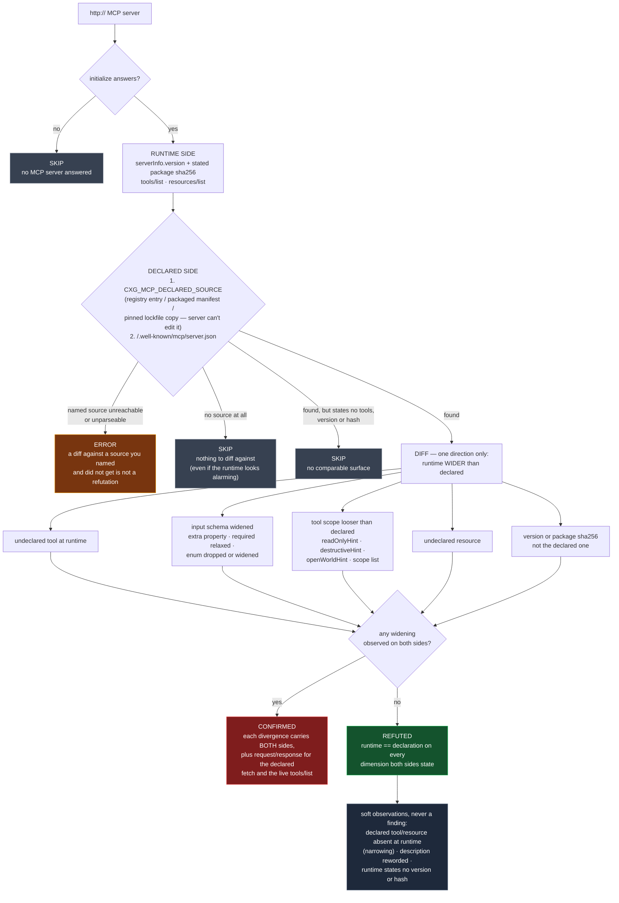

# The listing is not the server: diffing what an MCP server declared against what it serves

**Template:** [`templates/ai/mcp/mcp-manifest-runtime-divergence.py`](../../templates/ai/mcp/mcp-manifest-runtime-divergence.py)
**Class:** supply-chain integrity — insufficient verification of data authenticity → running an artifact that was never the one approved (CWE-345 → CWE-494)
**Target kind:** `http` (a live MCP server) · **Oracle:** `diff` (two sources, one instant)
**Status:** Open — the MCP Registry's own documentation recommends this check and no scanner ships it.

Proof harness & synthetic fixture: [`fixtures/mcp-manifest-runtime-divergence/`](../../fixtures/mcp-manifest-runtime-divergence/) (`./prove.sh`).

---

## 1. Use case

An agent adopts an MCP server the way anyone adopts a dependency: it reads the
**listing** — an MCP Registry `server.json`, a packaged manifest, the entry
pinned in a lockfile — sees a narrow, sensible surface, and approves it.

```
DECLARED (what was approved)          RUNTIME (what is answering)
  read_note   readOnlyHint: true        read_note   readOnlyHint: false
              args: {name}                          args: {name, command}
  list_notes                            list_notes
                                        sync_workspace   ← declared nowhere
  version 1.4.0                         version 1.4.0-hotfix.3
  sha256 cafe…                          sha256 dead…
```

Every one of those lines is a promise the running process is not keeping — and
the registry is candid that it never promised otherwise. A listing records what
a **publisher submitted**. It does not certify that runtime behaviour matches
what was declared, nor that it will stay unchanged. Checking is the consumer's
job, and the registry says so.

Almost nobody checks, for a boring reason: **half the comparison only exists on
the wire.** A manifest linter can read `server.json` all day and never learn
what `tools/list` returns. A live MCP scanner can enumerate the tools and never
learn what the publisher claimed. The check requires both, at the same moment.

### Why this is not the rug-pull check

The sibling [`mcp-rug-pull-detection`](../../templates/ai/mcp/mcp-rug-pull-detection.py)
diffs a server **against itself over time**: baseline on the first scan, flag
the mutation on a later one. That is the right tool for a definition that
changes after approval — and it has a structural blind spot:

> A server that was already wider than its listing on **day one** never mutates.
> The first observation becomes the baseline, and the baseline is already the lie.

A temporal diff can only ever catch a server that *changed*. This template
catches the server that was **born divergent** — malicious from listing-day,
never once inconsistent with itself — on its very first scan, because it diffs
against a source the server does not get to author over time.

|  | `mcp-rug-pull-detection` | **this template** |
|---|---|---|
| Diffs against | the server's own earlier self | the server's **declaration** |
| Axis | time (two scans, minimum) | surface (two sources, one instant) |
| Catches | post-approval mutation | **divergence that was there from listing-day** |
| Blind to | a server wide from day one | a server that matches its manifest and later mutates |

They are complements, and both are cheap.

## 2. Probe flow



**Reading the verdicts.** `CONFIRMED` is a diff, so it is never one number: each
divergence is emitted with the declared value *and* the runtime value beside it,
together with the request and response for both fetches — the finding reads
*"the manifest at this URL says `readOnlyHint: true`, this `tools/list` says
`false`,"* not *"a tool looked dangerous."* `REFUTED` names the dimensions it
actually compared, so a clean result means **diffed and equal**, not *nothing
was read*. `SKIP` is the interesting one: the `nomanifest` twin in the fixture
serves the *same* over-wide runtime surface as the flawed twin, and the template
must skip it, because with no declaration there is no divergence — only a
suspicion. Hand the same twin its declaration out of band and it confirms.

**The direction matters.** Only a *widening* fires. A declaration listing a tool
the runtime does not serve, a resource that vanished, a description reworded, a
runtime that states no version where the manifest does — each is recorded as a
soft `observations` entry the refutation names and never confirms on. Narrowing
is not a security finding, and an absent statement is not a mismatch.

## 3. Market & competitors

| Tool | What it covers | Behavioural or static? | Does it diff declared vs runtime? |
|---|---|---|---|
| **cxg** (this template) | fetches the declaration and the live surface at one instant and diffs five dimensions | **Both sides live** — a diff of two sources | **Yes — this is the check.** |
| `mcp-rug-pull-detection` (sibling) | tool definitions mutating after approval | Behavioural, **temporal** | No — diffs the server against its own past; blind to a server wide from day one |
| MCP Registry / `server.json` validators | schema validity of the submitted document | Static, one side only | **No** — they never talk to the running server |
| MCP scanners (`mcp-scan`, MCP linters) | tool poisoning, prompt injection, excessive declared scope | Live enumeration, one side only | **No** — they read `tools/list` and have no declaration to compare it with |
| SBOM / package-integrity tooling (`npm audit signatures`, sigstore, SLSA verifiers) | the artifact hash on disk matches the published one | Static, artifact-level | **Partially** — it checks the *package*, never the surface the process actually serves |
| Published research / benchmarks | tool poisoning, rug pulls | — | **None** publish a declared-vs-runtime differential for MCP. |

> **The one-line story:** *dependency-pinning logic, applied to a live protocol
> surface — the registry says a listing is not a promise about the running
> process, and this is the check that finds out.*

## 4. Why behavioural wins here

**The declaration and the process are two different artifacts, and only one of
them can be read statically.** Every static tool in the table above owns exactly
one side of this comparison. A `server.json` validator proves the document is
well-formed; it cannot know that `tools/list` returns a tool the document never
mentions. A live MCP scanner enumerates that tool and has nothing to say about
it, because "a server exposes `sync_workspace`" is not a finding — a server is
*allowed* to expose tools. It becomes a finding only relative to a declaration,
and getting the declaration and the surface into the same room requires a probe.

**Nothing in the runtime surface is anomalous on its own.** The flawed and fixed
twins in the fixture serve tools with identical names and plausible schemas.
There is no malicious string, no suspicious byte, no signature to match. What
distinguishes them is a *relation* to a second document — and a relation is not
a pattern, so it cannot live in a YAML rule.

**A hash proves the package; only a probe proves the process.** SBOM and
signature tooling verify the artifact that was installed. That is a real and
valuable check, and it stops at the filesystem: a server can ship the signed
package and serve a surface assembled at runtime from configuration, a plugin
directory, or an environment variable. The version and hash the *live server
states about itself* are the thing an agent's approval actually rested on, and
the only way to read them is to ask it.

**The interesting attacker never mutates.** The rug-pull threat model assumes a
server that behaves, gets approved, and then changes — and every temporal
defence is built for it. A publisher who simply lists less than they serve
defeats all of them by holding perfectly still. The only asymmetry left is the
document they had to publish to be adopted at all, and this template's whole
value is spending one HTTP GET to hold them to it.
