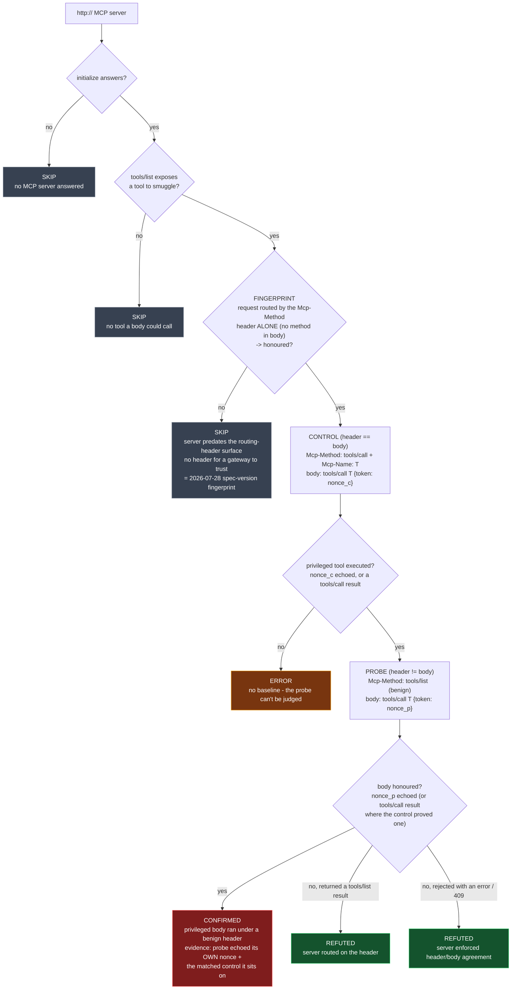

# Routing-header desync: when the gateway and the server read different requests

**Template:** [`templates/ai/mcp/mcp-method-desync.py`](../../templates/ai/mcp/mcp-method-desync.py)
**Class:** request smuggling → gateway authorization bypass (CWE-444 → CWE-863)
**Target kind:** `http` (an MCP server, especially one behind an authorizing gateway) · **Oracle:** `property` (two observations of one server)
**Status:** Open / highest-novelty — the surface is five weeks old and no scanner, benchmark, or paper covers it yet.

Proof harness & synthetic fixture: [`fixtures/mcp-method-desync/`](../../fixtures/mcp-method-desync/) (`./prove.sh`).

---

## 1. Use case

The MCP **2026-07-28** revision added two request headers to the streamable-HTTP
transport, `Mcp-Method` and `Mcp-Name`. They exist for one reason: to let an
intermediary — an API gateway, an authorizing proxy, an egress filter — decide
*"is this caller allowed to make this call?"* **without parsing the JSON-RPC
body.** Parsing bodies at the edge is expensive and fragile, so the spec lets
the gateway read a header instead:

```
POST /mcp HTTP/1.1
Mcp-Method: tools/call          <-- the gateway authorizes on THIS
Mcp-Name:   delete_workspace

{"jsonrpc":"2.0","id":7,"method":"tools/call",
 "params":{"name":"delete_workspace", ...}}     <-- the server dispatches on THIS
```

That split is safe only if the header and the body can never disagree — so the
spec makes it a `MUST`: an origin server has to reject any request whose header
and body name different methods. **Header-based authorization is worth exactly
as much as that one rule is enforced.**

This is textbook HTTP request smuggling, moved onto a brand-new surface. When two
components on a request path parse the same message differently, an attacker
writes a request that each reads its own way. Here the two readings are one
header line apart:

```
Mcp-Method: tools/list          <-- gateway: "a harmless listing, allow it"
                                    (tools/list is low-privilege, often
                                     unauthenticated)

{"method":"tools/call",         <-- server: "a privileged call, run it"
 "params":{"name":"delete_workspace"}}
```

If the origin dispatches on the body and never checks that the header agrees, the
gateway waved through what it believed was `tools/list` and the server executed
`tools/call delete_workspace`. Every authorization decision the gateway makes on
`Mcp-Method` is bypassable. The defect is not "the server ran a tool" — running
tools is the job. The defect is that **the component enforcing policy and the
component doing the work read two different requests out of one HTTP message.**

## 2. Probe flow

The oracle cannot live in one observation: "the server ran the body's method"
is only a vulnerability *relative to* what the header claimed and *given* that a
header surface exists at all. So the template sends a matched **control** and a
mismatched **probe** to the same server, and gates both behind a spec-version
fingerprint.



**Reading the verdicts.** `CONFIRMED` carries the probe's *own* nonce echoed
back — a random string the server could only have produced by executing the
body it was sent — alongside the matched control, so the finding reads *"the
same privileged call ran both when the header agreed and when the header lied,"*
not merely *"a tool ran."* `REFUTED` is a result worth printing: the server
either routes on the header or rejects the mismatch, so header authz holds — and
because the control executed, the quiet probe means *rejected*, not *inert*.
`SKIP` names the missing precondition; the header-only fingerprint in particular
doubles as a **2026-07-28 stateless-core version detector** — a server that
predates the header surface has no header for a gateway to trust, so the class
does not apply even though such a server *would* run the mismatched body.

## 3. Market & competitors

| Tool | What it covers | Behavioural or static? | Does it test the `Mcp-Method`/`Mcp-Name` desync? |
|---|---|---|---|
| **cxg** (this template) | sends a matched control + a mismatched probe, reads which the server ran | **Behavioural** — two live calls, nonce-bound observation | **Yes — this is the check.** |
| Classic HTTP smuggling scanners (Burp *HTTP Request Smuggler*, `smuggler.py`) | CL.TE / TE.CL desync on `Content-Length` / `Transfer-Encoding` | Behavioural, but on the HTTP *framing* layer | **No** — they know nothing of MCP's application-layer routing headers |
| MCP scanners (`mcp-scan`, generic MCP linters) | tool-poisoning, prompt injection, excessive scope, auth on the endpoint | Mostly static manifest analysis | **No** — none model a gateway/origin split or the 2026-07-28 headers |
| API-gateway authz tests | whether the gateway enforces a policy | Behavioural, gateway-side | **No** — they test the gateway in isolation; the desync is a disagreement *between* gateway and origin |
| Published research / benchmarks | — | — | **None as of 2026-09.** The header surface shipped 2026-07-28; no paper, CVE, or benchmark covers it. |

> **The one-line story:** *classic request-smuggling logic, pointed at a
> five-week-old MCP surface that no smuggling scanner knows exists and no MCP
> scanner models.*

## 4. Why behavioural wins here

**The vulnerable server and the safe server are byte-identical on the wire until
you make them disagree.** Both advertise the same tools, the same capabilities,
the same 2026-07-28 support. Nothing in a manifest, a capability list, or a
single well-formed request distinguishes an origin that enforces header/body
agreement from one that does not. The `MUST` is a claim about behaviour on a
*malformed* request, and the only way to read behaviour is to send that request
and watch.

**The defect lives in the gap between two components, so no single artefact
holds it.** A static scan of the gateway config shows a correct policy. A static
scan of the server shows a normal tool. The vulnerability is that the two parse
one message into two different requests — a property of the *pair*, visible only
when you send the message that forces them apart. That is exactly what a matched
control and a mismatched probe do, and why the finding is a property of an
observed run rather than a pattern in a file.

**A nonce makes the confirmation unforgeable.** The probe's privileged body
carries a fresh random token; a `CONFIRMED` requires that exact token to come
back. A server that routed on the benign header (returning a listing) or
rejected the mismatch can never produce it — so the verdict rests on an
observation the server could not have made without executing the smuggled body.
