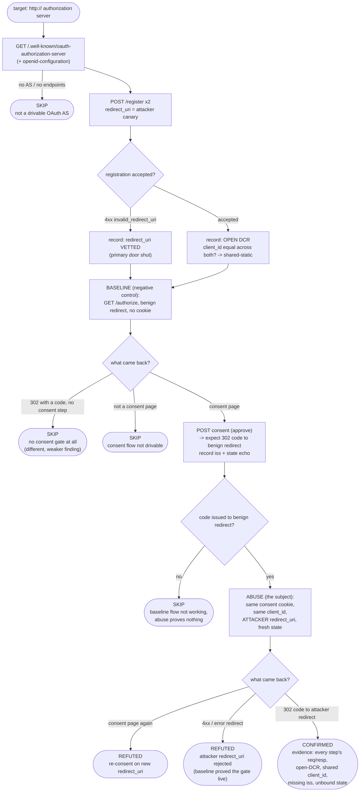
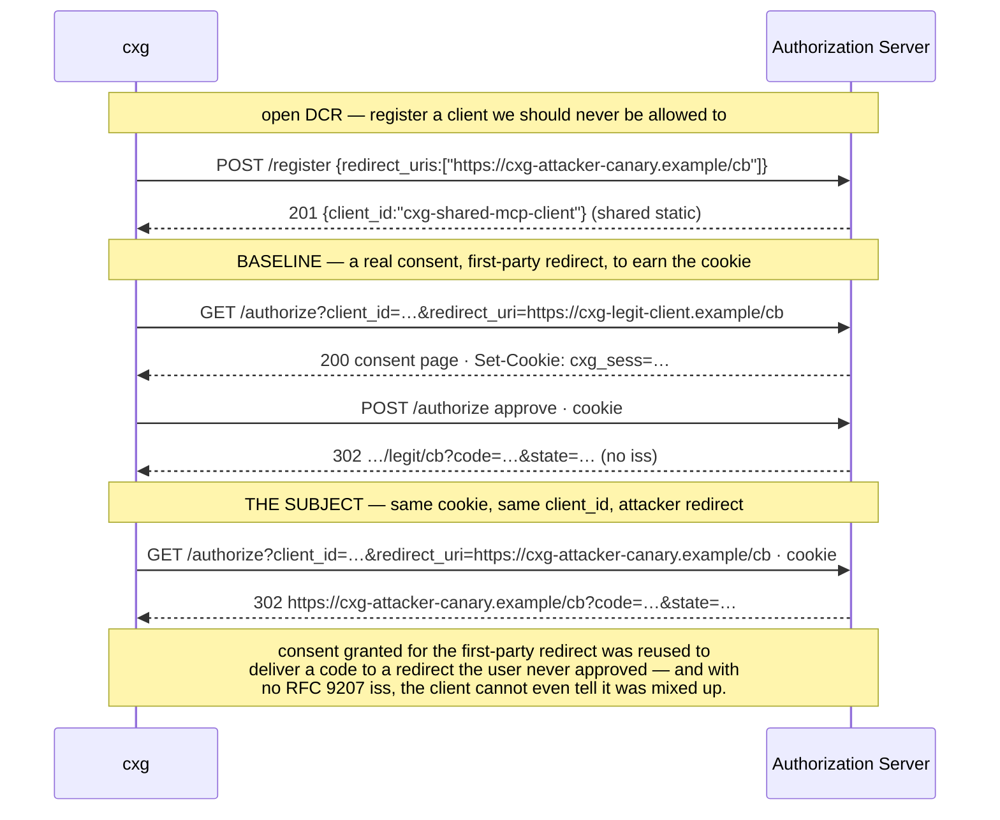

# Playbook — MCP OAuth consent-layer confused deputy via open DCR

> **Template** [`templates/ai/mcp/mcp-oauth-consent-dcr-abuse.py`](../../templates/ai/mcp/mcp-oauth-consent-dcr-abuse.py)
> **Fixture** [`fixtures/mcp-oauth-consent-dcr-abuse/`](../../fixtures/mcp-oauth-consent-dcr-abuse/) · `./prove.sh`
> **Class** OAuth consent + registration integrity · **Target** `http` (authorization server) · **Oracle** property — a multi-step observed run
> **Verdicts** confirmed / refuted / skipped · **Status** Emerging

---

## 1. Use case

The MCP authorization spec puts an OAuth 2.1 authorization server (AS) at the
centre of the trust model, and it tells clients to bootstrap with **Dynamic
Client Registration** when they have no pre-registered `client_id`:

> Before initiating the authorization flow, MCP clients MUST obtain a client ID
> through one of three registration mechanisms: Client ID Metadata Documents,
> pre-registration, or **Dynamic Client Registration**.

DCR is convenient — a new agent points at a new MCP server and self-registers,
no human in the loop. That convenience is also the opening. An AS that stands up
DCR "so agents just work" and then takes three ordinary shortcuts turns its own
consent screen into a **confused deputy**:

* **(a) open DCR** — `/register` accepts any client and never vets its
  `redirect_uri`;
* **(b) a shared static `client_id`** — every registrant gets the same id ("one
  client for the gateway"), so an attacker-registered client is
  indistinguishable from the real one at `/authorize`;
* **(c) consent reused without re-prompt** — the consent decision is keyed by
  `client_id` (or by the session alone), not by the `redirect_uri`.

Compose them and the attack needs no phishing page and no stolen token. The
victim has already logged into a legitimate MCP client and granted consent, so a
consent cookie exists. The attacker registers a client via open DCR with a
`redirect_uri` they control, gets handed the *same* `client_id`, and drives
`/authorize` with that `client_id`, their own `redirect_uri`, and (in a browser
CSRF-style delivery) the victim's cookie. The AS sees "consent already granted
for this `client_id`", **skips the consent screen**, and 302-redirects the
authorization **code to the attacker's callback**. The attacker redeems it and
holds a token that every downstream check — audience, issuer — will accept,
because the token is genuine. [RFC 6749 §10.6](https://www.rfc-editor.org/rfc/rfc6749.html#section-10.6)
names the root cause in one line: consent (and the code) must be bound to the
`redirect_uri`, not just the client.

**Why this is not the token checks.** `mcp-token-audience-confusion` asks whether
a *resource server* rejects a token whose `aud` is not itself.
`mcp-client-oauth-issuer-binding` asks whether a *client* refuses a code whose
RFC 9207 `iss` is wrong. Both examine a token that already exists. This check
looks one layer up, at the *consent + registration* layer that decides **who the
code is delivered to in the first place**. It also folds in the two adjacent
authorization-response signals that decide whether the client could even notice
the theft: is RFC 9207 `iss` returned, and is `state` bound?

## 2. Testing flow

The oracle is a property of an observed run: **the consent decision must be bound
to the `redirect_uri`.** The template speaks OAuth to the AS and watches what it
does, as a differential with two negative controls — because "the server issued
a code" is only a finding if the server was *capable of refusing*, and only this
finding if a consent gate exists at all.

### The abuse, in one exchange

### What each verdict is required to carry

| verdict | what backs it |
|---|---|
| **confirmed** | every step's request/response, **and** the conjunction: a consent gate exists (baseline showed and approved one) **and** a code reached the attacker `redirect_uri` with no re-consent. Amplifying signals recorded: open DCR, shared static `client_id`, missing RFC 9207 `iss`, unbound `state`. |
| **refuted** | the property held **and** the instrument was proved live: the baseline flow issued a code to the benign redirect (with `iss` present and `state` bound), while the attacker `redirect_uri` was vetted at registration, re-consented, or rejected at `/authorize`. |
| **skipped** | a named missing precondition: no OAuth AS answered discovery; no registration/authorization endpoint; **no consent gate at all** (immediate code); or the baseline consent flow could not be completed. |
| **errored** | the target could not be reached at all. |

The **no-consent-gate → skipped** branch is the one worth reading twice. An AS
that hands out a code with no consent screen will happily "deliver a code to the
attacker redirect" too — but that says nothing about consent *binding*, because
there is no consent decision to be unbound. The template records it and emits
**no finding**, the same precision idiom the other MCP checks in this repo use:
report a structural conjunction, never a bare success.

## 3. Market & competitors

| Who | What they check | Behavioural? | Installable? |
|---|---|---|---|
| **cxg `mcp-oauth-consent-dcr-abuse`** (this) | registers an attacker client via open DCR, reuses a real consent cookie, and observes whether a code is delivered to an unvetted `redirect_uri` without re-consent — against a live-gate control | **Yes** — a multi-step observed OAuth run with two negative controls | **Yes** — a file in this repo, drives any `http` AS |
| **cxg `mcp-token-audience-confusion`** | does a *resource server* reject a wrong-`aud` token | Yes | Yes — but a different layer (the token, not consent) |
| **cxg `mcp-client-oauth-issuer-binding`** | does a *client* refuse a code with the wrong RFC 9207 `iss` | Yes | Yes — the client side, not the AS consent layer |
| **mcp-scan / Snyk Agent Scan / Semgrep MCP rules** | tool descriptions, declared scopes, transport/auth config in the manifest | No | Yes |
| **Generic OAuth scanners** (e.g. OAuth misconfig linters) | discovery-document flags, PKCE-supported, `redirect_uri` wildcard *strings* | Mostly static | Yes — but they read metadata, they do not drive a consent + DCR flow |
| **Descope / Aaron Parecki write-ups on MCP DCR risk** | name open DCR + shared `client_id` as an attack surface | — analysis | No — a blog post |

Two things fall out of that table. **The token layer is covered and the consent
layer is not** — every existing MCP OAuth check inspects a credential that
already exists; none drives the registration + consent machinery that decides
who the credential is minted *for*. And **the static OAuth scanners read the
discovery document** — they can flag "DCR is enabled" or "a wildcard
`redirect_uri` is registered", but neither tells you whether *your* AS reuses a
consent decision across redirect_uris, because that is a code path, not a field.

## 4. Why behavioural wins here

* **The two twins are byte-identical until you drive them.** In the fixture,
  `flawed` and `fixed` serve the same discovery document shape, the same
  `/register` and `/authorize` endpoints, and both show a consent page on the
  first cookie-less request. Every static signal is equal. A detector that
  separated them from metadata would be guessing.
* **The obligation is invisible by construction.** "Consent is bound to the
  `redirect_uri`" is a property of what the AS *does* with the second
  `/authorize` request, not of anything it advertises. A discovery-document
  review, an SBOM, and a config lint all pass a server that forgot it.
* **The three mistakes only compose at runtime.** Open DCR alone is a design
  choice; a shared `client_id` alone is a smell; consent reuse alone may be fine
  for a single redirect. It is the *sequence* — register → earn consent → replay
  with a new redirect — that turns them into a code-theft, and only an observed
  run can walk it.
