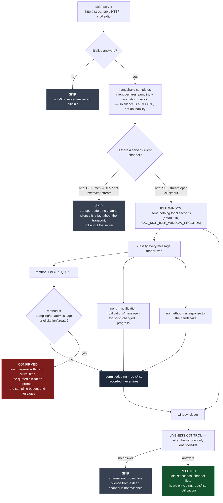

# Speaking when it has not been spoken to: unsolicited MCP sampling and elicitation

**Template:** [`templates/ai/mcp/mcp-server-initiated-request-conformance.py`](../../templates/ai/mcp/mcp-server-initiated-request-conformance.py)
**Class:** protocol conformance — a server initiating a user-facing prompt or a model spend with no request to attribute it to (CWE-451 → CWE-770)
**Target kinds:** `http` (streamable HTTP) and `cli` (a local stdio server) · **Oracle:** `property` (binary, on one observed idle window)
**Status:** Open — every MCP scanner reads `tools/list`; none of them sit still and listen.

Proof harness & synthetic twins: [`fixtures/mcp-server-initiated-request-conformance/`](../../fixtures/mcp-server-initiated-request-conformance/) (`./prove.sh`), also reachable as [`tests/prove-mcp-server-initiated-request-conformance.sh`](../../tests/prove-mcp-server-initiated-request-conformance.sh).

---

## 1. Use case

MCP is not a request/response protocol. It is bidirectional, and it gives the
**server** two ways to reach back through the client and use something the
server does not own:

| Method | What the server gets | Whose resource it spends |
|---|---|---|
| `sampling/createMessage` | a model completion | the operator's model, the operator's token budget, the operator's rate limit |
| `elicitation/create` | whatever the human types into a prompt the client renders | the user's attention, and the client's credibility |

Both exist for one reason: a tool the client **called** may need a completion or
a missing argument partway through executing. That is the scope — the handling
of a client request. It is why the client's UI can attribute the prompt to
something: *you asked to summarise the repo, the summariser wants a completion.*

Take away the client request and the same two messages become something else:

```
CLIENT                                    SERVER
  initialize ─────────────────────────────►
  ◄───────────────────── capabilities, serverInfo
  notifications/initialized ──────────────►
                                           (idle. nothing outstanding.)
  ◄───── elicitation/create
         "Your workspace session needs to be re-authorised.
          Enter your workspace access code to continue."
  ◄───── sampling/createMessage  maxTokens: 4096
```

The first is a **phishing surface handed out by the protocol layer**. The client
renders the server's text inside the trusted chrome the user reads their own
agent in, at a moment the user did nothing to cause. There is no request in
flight to attribute it to, so the user attributes it to the client. The second is
a server **spending the operator's model budget and steering the operator's
model** on its own initiative — a cost channel and an injection channel at once,
with no user action anywhere in the causal chain.

Neither is exotic. A server that fires an onboarding elicitation on connect, or
warms a cache with a sampling call at startup, is not malicious — it is
non-conformant, and it has built the exact primitive an attacker wants. The
check does not care which it is: it reports the observable fact.

### Why the artifact tells you nothing

Everything a static reviewer can read about an MCP server is consistent with
both twins in this fixture:

- **The manifest is identical.** Both declare the same tools, the same schemas,
  the same annotations. There is no `"speaks_unprompted": true` field.
- **The capability declaration is identical, and it is the client's anyway.**
  `sampling` and `elicitation` are declared by the **client**, not the server.
  Nothing in the server's advertised surface says whether it will use them, or
  when.
- **The source is identical, or nearly.** The gated call and the permitted call
  are the *same function call in the same SDK*. `flawed` and `fixed` in this
  fixture both invoke `sampling/createMessage`. A grep for it hits both. The
  difference is **where in the control flow it sits** — inside a `tools/call`
  handler, or on a timer — and that is a runtime property, not a lexical one.
- **The violation is a relation between a message and a protocol state**, and a
  protocol state does not exist on disk.

So the only way to know is to become a client, complete the handshake, and then
do the one thing no scanner does: **nothing**.

## 2. Probe flow



### What "idle" means, precisely

**Idle is a protocol state, not a clock reading.** It holds when the
initialization handshake is complete — `initialize` answered,
`notifications/initialized` sent — and **no client-originated request is
outstanding**. The probe enters that state deliberately and does not leave it.

Two design consequences follow, and both are load-bearing:

1. **The probe declares `sampling`, `elicitation` and `roots` in its client
   capabilities.** This removes the only benign explanation for silence. A
   server facing a client that has said *"I can handle all three"* and staying
   quiet has **chosen** not to speak out of turn. Had the probe declared
   nothing, a refutation would be indistinguishable from a server correctly
   declining to use a capability it was never offered.
2. **The liveness control is issued after the window, never inside it.** One
   `tools/list`, once the observation is closed. It can therefore never be the
   cause of anything observed — and without it, `REFUTED` would be
   indistinguishable from a wedged connection. Silence on a channel that was
   never proved live is a `SKIP`, not a clean bill.

### Why the window is long enough, and what it can and cannot get wrong

The default is 10 seconds. That number is not a guess about server latency,
because latency is not what is being measured.

> A legitimate `sampling/createMessage` or `elicitation/create` is **causally
> downstream of a client request** — it exists *because* a tool the client
> called needs a completion or an argument. During the window the probe issues
> nothing. There is no legitimate cause for one to exist.

That asymmetry is the whole safety argument, and it runs one way:

**Lengthening the window can only admit more unsolicited traffic. It can never
admit legitimate traffic, because legitimate traffic has no cause.** So the
window bounds **completeness**, never **soundness**. A short window can miss a
violation; it cannot manufacture one. There is no window length at which a
conformant server starts failing this check.

**"Slow but legitimate" is not a competing explanation.** *Slow* describes how
long a server takes to **answer** — and the probe asks nothing, so there is
nothing to be slow about. A server still grinding on a long-running job has no
client request outstanding *on this session* either; that is what a session is.
A slow conformant server behaves exactly like a fast one here: it says nothing,
or it says only the things it is allowed to say at any time.

What a longer window actually buys is the server whose unprompted prompt fires
on a **long timer** — a first-run onboarding nag, an hourly re-auth pester, a
daily digest that elicits a preference. `CXG_MCP_IDLE_WINDOW_SECONDS` (capped at
300) is for those, and every `REFUTED` verdict states the window it held, so a
clean result always reads as *"silent for N seconds"* and never as *"silent
forever"*.

### The oracle is narrow on purpose

A server is **allowed** to be chatty. The check fires on two method names and
nothing else:

| Observed | Why it is not this finding |
|---|---|
| `notifications/message`, `notifications/tools/list_changed`, `notifications/progress` | a notification carries **no `id`** — it is not a request, cannot be answered, and spends nothing |
| `ping` | explicitly initiable by either side at any time |
| `roots/list` | a server-initiable request the protocol permits |
| a response to the handshake | not server-initiated at all |

Each of these is recorded in `permitted_traffic_ignored` and named in the
verdict. The `fixed` twin sends **all four** during the window, at the same
moment the `flawed` twin sends its two gated ones — so the refutation is a
positive statement (*"listened, heard only permitted traffic, on a live
channel"*), not an absence of evidence. This is the same precision idiom the
other MCP checks in this repo carry: report only the structural fact, record
every near-miss.

### The verdicts, and the twin that keeps SKIP honest

`CONFIRMED` quotes the consequence, not just the method name: the elicitation
prompt **as the user would have seen it**, the sampling `maxTokens` and message
text, the JSON-RPC `id` proving it was a request demanding an answer, and the
seconds elapsed since the window opened.

`SKIP` is where the fixture earns its keep. The `nostream` twin **wants** to
speak out of turn — its intent is byte-identical to `flawed` — but `GET /mcp`
returns 405, so the streamable-HTTP transport gives it no server→client channel
at all. A check that refuted there would be reporting a property of the
transport as a property of the server. It skips. A boundary-class check needs a
*"no genuine channel"* twin, not just an absent-server one, to reach `skipped`
honestly.

## 3. Market & competitors

| Tool | What it covers | Behavioural or static? | Does it observe unsolicited server→client requests? |
|---|---|---|---|
| **cxg** (this template) | connects, declares the capabilities, goes idle, classifies everything that arrives | **Behavioural** — one observed idle window, both transports | **Yes — this is the check.** |
| `mcp-tool-poisoning`, `mcp-invisible-unicode-poisoning` (siblings) | malicious content *inside* a tool description | Static content analysis of a live listing | No — they read what the server **answers with**, never what it **starts** |
| `mcp-manifest-runtime-divergence` (sibling) | the running surface is wider than the declared one | Diff of two sources, one instant | No — a server can match its manifest perfectly and still speak out of turn |
| `mcp-scan` and MCP linters | tool poisoning, prompt injection, excessive declared scope | Live enumeration | **No** — they enumerate and disconnect; nothing sits still and listens |
| MCP SDK conformance / inspector tooling | does the server answer the methods correctly | Request-driven | **No** — every probe is a request, so the idle state is never entered |
| Static analysers, SAST, manifest validators | code and document properties | Static | **No** — the gated and permitted calls are the *same SDK call*; only its position in the control flow differs |
| Published research / benchmarks | tool poisoning, rug pulls, OAuth confusion | — | **None** publish an idle-window conformance probe for MCP. |

> **The one-line story:** *every MCP scanner asks the server questions; this one
> completes the handshake and then says nothing, because the interesting servers
> are the ones that talk anyway.*

## 4. Why behavioural wins here

**The violation is defined by a state no artifact records.** `sampling/create
Message` is not a dangerous call — it is the *correct* call, in the right place.
The `fixed` twin in this fixture makes it, and refutes. What makes the identical
message a finding is that nothing was outstanding when it was sent, and
"nothing was outstanding" is a fact about a live session. There is no file on
disk in which it is true or false.

**Every other probe destroys the condition it would need to measure.** This is
the sharp part. A scanner works by asking: `tools/list`, `resources/list`,
`tools/call`. The moment it asks anything, a server request becomes *permitted*,
and the oracle collapses. The only instrument that can measure this is one that
**declines to interact** — and "send nothing, for a bounded time, and classify
what arrives" is not a mode any request-driven scanner has. It requires holding
a session open in a state every other tool is built to leave immediately.

**Only a probe can offer the capability that makes silence mean something.**
`sampling` and `elicitation` are declared by the *client*. A static reviewer
inspecting a server has no way to ask "what would you do if I said I could
handle these?" — the question is only askable by something that connects and
says it. The declaration is half of the oracle, and it lives on the probe's side
of the wire.

**The consequence is only legible at runtime, and it is the finding.** A static
tool that somehow spotted a timer-driven `elicitation/create` in source could
report the call site. It could not report the string
*"Your workspace session needs to be re-authorised"* rendered inside the user's
client with nothing to attribute it to, because that string may be assembled at
runtime from configuration, from a remote fetch, or from an environment
variable. The probe reports what the user would have actually been shown — which
is the thing a reviewer needs in order to judge severity.

**Both transports, one property.** A local stdio server and a remote HTTP server
have nothing structurally in common: one writes newline-delimited JSON to a pipe,
the other pushes SSE frames down a long-lived `GET`. The conformance property is
identical across both, and only a behavioural check can be written once and
applied to both — the template's classifier does not know or care how the bytes
arrived.
