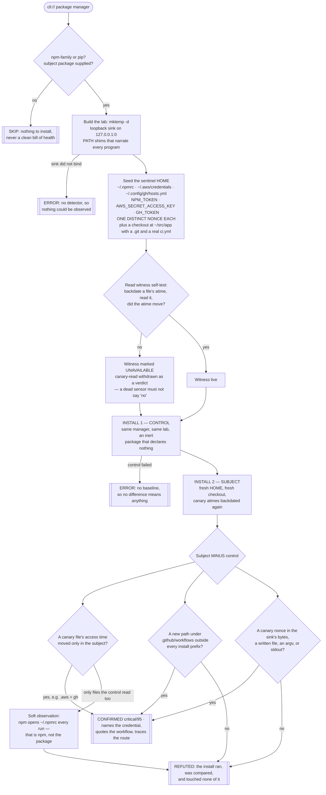

# Playbook — Install-time credential access and workflow planting

> **Template:** [`templates/tooling/supply-chain/supply-chain-install-credential-access.sh`](../../templates/tooling/supply-chain/supply-chain-install-credential-access.sh)
> **Fixtures:** [`tests/fixtures/tooling/supply-chain-credential-access/`](../../tests/fixtures/tooling/supply-chain-credential-access/) · **Proof:** [`tests/prove-supply-chain-install-credential-access.sh`](../../tests/prove-supply-chain-install-credential-access.sh)
> **Class:** self-propagating install-time credential theft — Shai-Hulud (npm, Sep 2025 and Nov 2025), CHAINDROP / TrapDoor (npm + PyPI + crates.io) · **Target kind:** `cli` · **Oracle:** `property` + `diff` + per-source canary detector · **CWE:** CWE-522, CWE-506, CWE-829, CWE-200
> **Sibling:** [`supply-chain-install-hook-behavior`](../../templates/tooling/supply-chain/supply-chain-install-hook-behavior.sh) — the generic question this one specialises

---

## 1. Use case

A worm needs two things that an ordinary malicious package does not.

It needs **credentials with publishing rights**, because the only way to become
the next version of a popular package is to be able to publish it. And it needs
**something that keeps running after the laptop is closed**, because a
`postinstall` fires once and a developer's machine goes to sleep.

Shai-Hulud found both in places every developer already keeps them:

| It reads | Because that file holds |
|---|---|
| `~/.npmrc` | the npm registry token — the ability to publish the *next hop* |
| `~/.aws/credentials` | long-lived cloud keys, usable from anywhere with no MFA |
| `~/.config/gh/hosts.yml` | the `gh` CLI's GitHub OAuth token — repo write, and therefore CI write |
| `NPM_TOKEN` / `GITHUB_TOKEN` in the environment | the same secrets, as a CI runner holds them |

and then it **writes a GitHub Actions workflow into the checkout**. That is the
part people underrate. The install hook runs once; the workflow runs on every
future push, on GitHub's infrastructure, under an identity CI is *supposed* to
have, long after the developer has forgotten which dependency they added. It
survives `rm -rf node_modules`. It survives the machine being reimaged. It gets
committed, reviewed as "CI config", and pushed to everyone.

```
   npm install some-dep
          │
          ▼
   postinstall ──reads──► ~/.npmrc          ──┐
                          ~/.aws/credentials   ├──► attacker
                          ~/.config/gh/hosts.yml ─┘
          │
          └──writes──►  .github/workflows/x.yml
                              │
                              ▼
                        every future push, forever,
                        from inside your CI identity
```

**The testing scenario.** You are triaging a dependency: a bump a bot opened, a
transitive package a lockfile diff just introduced, a candidate you are about to
vendor. You do not want to read its minified `postinstall`, and you should not
trust yourself to. You want one question answered before it goes anywhere near a
machine holding real tokens: *if I install this, which of my secrets does it
open, and does it leave anything behind in CI?*

### What this is *not*

| Neighbour | Asks | Answers with |
|---|---|---|
| [`supply-chain-install-hook-behavior`](../../templates/tooling/supply-chain/supply-chain-install-hook-behavior.sh) | does the install spawn a process, escape its prefix, or open a socket? | *something* happened, across install / interpreter-startup / first-import |
| **this template** | **which secret did it read, and did it plant CI?** | the credential **named**, the workflow file **quoted**, the exfil route **traced** |

They overlap on purpose and they answer different pages of the incident report.
The sibling tells you a package is misbehaving. This one tells you **which token
to rotate and which branch to rewrite** — and it is a much narrower net, because
"read a credential" and "wrote CI" are things a build step has no honest reason
to do, while "ran a subprocess" is something thousands of honest packages do.

---

## 2. Testing flow

One package manager, two installs of two packages into two identical labs, and
six canary secrets that exist nowhere else in the world.



Four decisions in that shape carry the honesty of the check.

**One nonce per source, not one nonce per lab.** Six independent random values,
one in each credential the worm family goes for. A single lab-wide nonce can
only ever report "a credential leaked"; six report *which*. Every route in the
evidence — a byte on the socket, a line in a planted workflow, an argv in the
shim ledger — is attributed back to the exact file or environment variable it
could only have come from.

**The read witness is tested before it is trusted.** Access time answers "was
this opened" only on a filesystem that maintains one, and `noatime` mounts and
some container overlays maintain nothing. So the template backdates a file,
reads it, and checks the clock moved. If it did not, `canary-read` is
**withdrawn as a confirming observable** and the metadata says so — because a
dead sensor quietly reporting "no credential was read" is worse than no check.

**npm reading `~/.npmrc` can never be the finding.** `npm` opens its own config
on every single invocation, and the control install proves it. That read lands
in the evidence as *"credentials read by the package manager too"*, named in the
finding's prose, and it never fires on its own. The same differential subtracts
every temp file, cache write and `sh` invocation the package manager performs.

**The severities are earned separately.** A read with nothing else is `high` —
the install opened a secret it has no business opening, and the probe has not
yet shown it went anywhere. A workflow planted, or a canary on the wire, is
`critical`.

### Safety

The template **executes the package's install code**. That is the point, and it
is also the risk: the lab makes effects *visible*, it does not contain them.
Everything it creates lives in one `mktemp -d` and is removed on exit, and every
credential it plants is a random nonce — but a hostile package can still reach
the real network and the real filesystem. Point it at an untrusted package only
inside a disposable container or VM with no route out.

The fixtures are benign synthetic packages written for this repo. The flawed
twin's "exfiltration" is a `curl` to a host under `.invalid` (RFC 2606), which
no resolver will ever answer; its planted workflow is an `echo`; and it carries
an explicit guard that **refuses to write anywhere but a temporary directory**,
so a reader who runs it by hand cannot have it touch a real repository.

---

## 3. Competitors

Everyone shipped something for Shai-Hulud. Almost all of it describes the wave
that already happened.

| Approach | What it actually knows | Where it stops |
|---|---|---|
| Registry IoC feeds and advisories (GHSA, npm's own takedowns) | the exact name@version list from the last wave | a republished package under a new name is invisible until someone reports it |
| Static reputation scanners (`postinstall` present? obfuscated? new maintainer?) | the *shape* of the manifest | a `postinstall` is not a finding — thousands of honest packages build things — and the interesting code is usually fetched at runtime, so there is nothing to read |
| Lockfile / SBOM diffing | that a dependency changed | says nothing about what the new one *does* |
| `npm install --ignore-scripts` as policy | prevention, and a good one | it is a mitigation, not an oracle: it cannot tell you whether the package you are about to allow scripts for is safe, and it does not cover PyPI build backends |
| EDR / runtime agents on the developer laptop | real syscalls, in production | fires **after** the token has left, on a machine that held real credentials |
| **this template** | which seeded credential this install opened, what CI it wrote, and where the value went | requires actually running the install — in a lab, against nonces, by design |

The distinction that matters: every row above except the last is *retrospective*
or *structural*. An IoC list is a description of variant N. A canary is a trap
for variant N+1, because the mechanic — read the token file, write the workflow
— is the part the attacker cannot drop without giving up propagation.

---

## 4. Why behavioural testing wins here

**The manifest is not the payload.** Modern install-time droppers fetch their
real code at install time, or hide it behind a base64 blob, or rewrite their own
`package.json` clean afterwards. Reading the hook's source is reading a decoy.
This template never looks at it — it installs the package for real and watches
what the install *did*.

**The observable is the attacker's requirement, not their implementation.** A
worm can obfuscate its code, change its C2, rename its package and move
ecosystems. It cannot stop reading a credential file, because a token it never
read cannot publish the next hop; and it cannot stop writing CI, because a
payload that runs once is not a worm. Those two are load-bearing, which is why a
trap on them keeps working after the signature list has gone stale.

**A canary converts inference into proof.** The nonce in `~/.aws/credentials`
was generated seconds before the install and exists nowhere else on earth. When
it appears in the bytes arriving at the loopback sink, there is nothing to argue
about: the install read that file and put its contents on a socket. No
heuristic, no confidence score, no "suspicious pattern".

**The control is what makes it usable.** Without a differential, `npm` reading
`~/.npmrc` would light this up on every honest package on the registry, and the
check would be turned off within a week. With one, the package manager's entire
repertoire subtracts itself, automatically, on whatever version of npm or pip
the operator happens to have — no allowlist to maintain, nothing to rot.

**And the output is an action.** "Suspicious postinstall" is a ticket. *"This
install opened `~/.config/gh/hosts.yml` and `~/.aws/credentials`, sent both to a
socket, and wrote `.github/workflows/x.yml` containing them"* is a rotation list
and a branch to rewrite.

---

## 5. Running it

```bash
cxg scan --scope cli:///usr/local/bin/npm \
         --templates templates/tooling/supply-chain/supply-chain-install-credential-access.sh \
         --input ./the-package-under-test
```

`pip` works the same way — point `--scope` at the `pip3` binary and hand it a
directory with a `pyproject.toml` or `setup.py`. On a cxg that predates the
probe-input flags, pass `CXG_SUPPLY_CHAIN_PACKAGE=./the-package` instead.

Prove it both ways before you trust a verdict from it:

```
$ ./tests/prove-supply-chain-install-credential-access.sh
PASS  npm postinstall, flawed twin                         confirmed
PASS  npm postinstall, flawed twin names the secrets       confirmed
PASS  npm postinstall, fixed twin                          refuted
PASS  pip build backend, flawed twin                       confirmed
PASS  pip build backend, flawed twin names the secrets     confirmed
PASS  pip build backend, fixed twin                        refuted
PASS  no subject package is a skip, not a refutation       skipped
PASS  a binary that is not a package manager is a skip     skipped
```

The fixed twins are deliberately **not inert** — each runs at install time,
spawns a subprocess or generates a file, and does the ordinary work an honest
package does. A probe that confirmed on those would be reporting "this package
has an install hook", which is not a finding. Their refutation is the precision
claim of the whole check.
